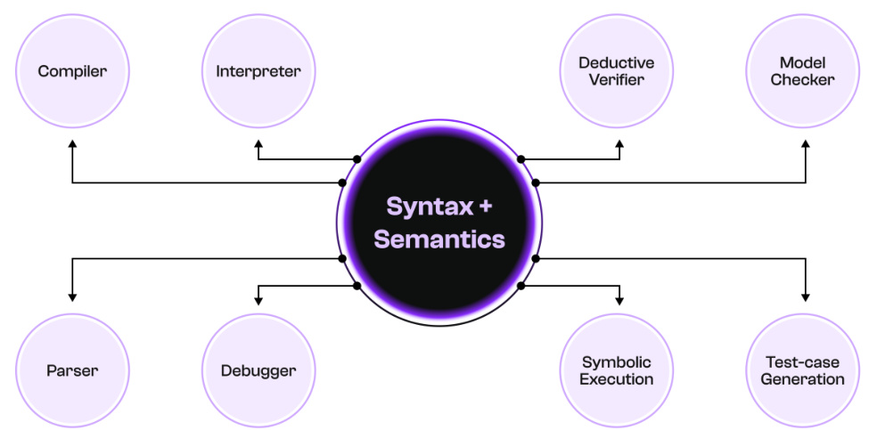

# Semantics-Based Execution and the LLVM Backend of the K Framework

Pi Squared Inc.  

February 2025  

It is suggested that the reader first read “The Pi Squared Whitepaper”

The link to this paper is https://pi2.network/papers/llvm-k-whitepaper.

# Abstract  

The K framework is a semantics-based approach to language design and implementation. From a single defnition of a language’s syntax and operational semantics, a full set of tools can be extracted automatically, including a concrete interpreter for programs in that language. In this paper, we identify the most critical performance bottleneck for such interpreters: compiling fast decision trees for a subset of associativecommutative pattern-matching problems. We demonstrate a decision tree-based compilation algorithm that substantially extends existing methods with support for fast runtime collection data structures. We show that LLVM-based interpreters generated by $\mathbb{K}$ perform comparably to ones written by hand for interpreted languages such as EVM and are practical for real-world adoption. Moreover, we show that optimizations that are only possible in the presence of a formal language semantics make Compositional Symbolic Execution (CSE), in fact, outperform manuallywritten language implementations. Automatically generating efcient and correct-by-construction language implementations from formal semantics is the holy grail of the programming language feld; after more than two decades of sustained innovation and engineering, $\mathbb{K}$ is proudly almost there.  

# Table of Contents  

1 Introduction 3  

# 2 Related Work 5  

2.1 Semantic Frameworks 5   
2.2 Rewrite Engines 5   
2.3 Pattern Matching Compilation 6  

# 3 A Running Example of K 6  

3.1 IMP Syntax Defnition . 8   
3.2 IMP Semantics Defnition 8   
3.2.1 Confgurations 8   
3.2.2 Rewrite Rules . 8   
3.2.3 The K Frontend 8  

# 4 LLVM-K Backend: A High-Level Overview 9  

4.1 KORE ASTs 10   
4.2 Decision Trees and Pattern Matching . . 11   
4.3 Runtime Term Representation . . . 12   
4.4 Code Generation and Rewriting . . 13   
4.5 Runtime Library . . 14   
4.6 Memory Management and Garbage Collection . 14   
5 LLVM-K Backend: Pattern Matching 16   
5.1 Pattern Matching . . 16  

# 6 Pattern Decomposition 21  

6.1 Regular Patterns 21   
6.2 List Patterns 22   
6.3 Map Patterns 23   
6.4 Set Patterns . 26  

# 7 Compiling to Decision Trees 27  

7.1 Decision Trees . 27   
7.2 Evaluation . . 27   
7.3 Compilation 29  

# 8 Heuristics  

Evaluation 31 9.1 Evaluation of KEVM against Geth . . 31 9.2 Evaluation of 1K Swaps in Diferent Programming Language Interpreters . . 32  

  
Figure 1: The central vision of the K Framework: from one formal defnition of a language’s semantics, a full suite of important tooling can be derived automatically.  

# 1 Introduction  

The $\mathbb{K}$ framework [36] is a semantic framework that allows language designers to automatically and generically derive a full suite of tools from a single formal specifcation of their language. For example, $\mathbb{K}$ can generate a parser, interpreter and symbolic deductive verifer [13] from this specifcation. The language-generic approach used by $\mathbb{K}$ is scalable; many real-world programming languages have been formalized in $\mathbb{K}$ , including C [16], Java [6], JavaScript [34], Python [20], Rust [45], x86-64 [14], the Ethereum virtual machine [22], and LLVM IR [31]. The implementations obtained are suitable for commercial applications [21; 37].  

For a programming language $L$ , the $\mathbb{K}$ defnition of $L$ consists of (1) the concrete syntax of $L$ , as a conventional BNF grammar; (2) the state maintained by each program in $L$ during execution (its confguration); and (3) the operational semantics of $L$ given as a set of rewrite rules. A rewrite rule $\varphi_{l h s}\Rightarrow\varphi_{r h s}$ specifes a transition relation over confgurations; any confguration that matches the pattern $\varphi_{l h s}$ can be rewritten into the confguration $\varphi_{r h s}$ . The $\mathbb{K}$ compiler transforms rules that act on local fragments of a confguration into efcient top-level rewrites of the entire confguration.  

A language-agnostic concrete interpreter is one of the most important tools that $\mathbb{K}$ provides. From a $\mathbb{K}$ defnition of a language $L$ , the $\mathbb{K}$ compiler generates an interpreter for programs in $L$ . It takes as input any confguration $\gamma$ of $L$ , and looks for a rewrite rule whose left-hand side is matched by $\gamma$ . If such a rewrite rule exists, the interpreter applies it to $\gamma$ and obtains a new confguration $\gamma^{\prime}$ as specifed by the right-hand side of the rule. Execution proceeds by repeatedly applying this process until no rewrite rules apply, in which case the execution  

terminates.  

In this paper we present LLVM-K: a language-agnostic implementation strategy for $\mathbb{K}$ concrete interpreters, where the pattern matching and rule application components of a $\mathbb{K}$ language defnition are compiled to efcient native code via LLVM IR [29].  

Much of the work done by a $\mathbb{K}$ concrete interpreter is pattern matching, where terms in $\mathbb{K}$ ’s internal term representation (KORE[25]) are matched against patterns in order to bind variables in rewrite rules. This is a well-studied problem, with solutions implemented by every mainstream functional programming language.  

An initial version of the $\mathbb{K}$ compiler (OCaml- $\mathbb{K}$ ) generated OCaml code for each $\mathbb{K}$ pattern, and relied on the OCaml compiler to provide efcient pattern matching. However, this approach failed to scale: the terms generated by $\mathbb{K}$ triggered pessimal behavior in the OCaml compiler, leading to either impractical compilation times, or slow execution. A specialized pattern matching compiler for $\mathbb{K}$ was therefore required.  

The primary contribution of this paper is an algorithm for compiling $\mathbb{K}$ pattern matching problems to efcient native code. This algorithm originates in the canonical work of Maranget [32], but is substantially extended with features specifc to $\mathbb{K}$ ; we defne pattern matching for collection data types (lists, maps, and sets) and pattern matching for conditional rewrite rules. The algorithms presented in this paper are instantiated in our implementation of LLVM-K [4], which signifcantly outperformed OCaml-K.  

We evaluated the performance of LLVM-K interpreters in two contexts: Comparing the $\mathbb{K}$ implementation of EVM, KEVM, with the Go implementation of EVM, Geth, using the Ethereum test suite [1] and evaluating both EVM implementations against the Solidity interpreter generated by LLVM- $\mathbb{K}$ with and without CSE optimization in a program that executes a thousand swap operations from the UniSwap V2 contract [3]. The frst evaluation shows that we have some room to outperform Geth, but that KEVM without any CSE is already performance-wise comparable with the most used EVM implementation around. The second experiment proved that a language-specifc interpreter generated by LLVM- $\mathbb{K}$ can outperform Geth, being 57% faster, when optimized with CSE for the UniSwap V2 contract. . The structure of this paper is as follows. First, in Section 2, we review relevant related work in pattern matching compilation and term rewriting engines. Then, to contextualize the rest of the paper, Section 3 gives a brief overview of a $\mathbb{K}$ semantics. Section 4 gives a highlevel overview of LLVM- $\mathbb{K}$ . Sections 5 to 8 detail the algorithms and technical contributions of LLVM- $\mathbb{K}$ , which are evaluated in Section 9.  

# 2 Related Work  

# 2.1 Semantic Frameworks  

There exist many semantic frameworks that allow the extraction of semantic tools from a formal defnition of a programming language. Early work on Centaur [8] compiled a typol [15] defnition of a language’s natural semantics to Prolog rules; these rules could then be queried by interactive tools such as a pretty-printer or interpreter. Even in this early work, the authors identify the performance of the underlying rule engine as a limitation of their approach, and suggest a specialized compiler for their Prolog rules as a potential solution.  

The Spoofax workbench collects a set of domain-specifc languages and tools for designing and implementing programming languages: SDF [43] for syntax descriptions and parser generation, Stratego [44] for dynamic semantics and execution strategies, and FlowSpec [39] for data-fow analysis.  

Similarly, tools developed in other workbenches such as PLT Redex [19] also rely on the performance of an underlying language or runtime environment (here, Racket). This points to performant concrete execution and interpretation as a shared point of difculty for language workbenches.  

# 2.2 Rewrite Engines  

The concrete execution strategy used by LLVM- $\mathbb{K}$ has its roots in the term rewriting literature. Maude [11] is a rewrite engine based on order-sorted membership equational logic [33]. It is a high-performance system for specifying formal and computational systems, especially concurrent applications. A key feature of Maude is its built-in unifcation algorithms that apply modulo ACUI axioms1. This ACUI reasoning capability is further improved by variant-based unifcation [17].  

ASF $^+$ SDF [42] is a general-purpose specifcation framework based on algebraic specifcations. It has been used to defne the syntax and formal semantics of programming languages, program transformations, and language transformations. An ASF $^+$ SDF defnition consists of two parts. The ASF (algebraic specifcation formalism) part specifes the formal semantics in terms of conditional rewrite rules. The SDF (syntax defnition formalism) defnes the concrete syntax of the target language. ASF $^+$ SDF supports both interpretation and compilation of the rewrite rules. The ASF2C compiler generates efcient C code that implements pattern matching and term traversal.  

As part of its suite of tools, Spoofax [28] provides a term rewriting module that allows programmable rewriting strategies, permitting context-sensitive transformations. Interpreters generated from a Spoofax defnition rely on the Trufe [46] infrastructure to perform just-in-time specialization and compilation; this approach is more complex than $\mathbb{K}$ ’s pure term-rewriting approach, and relies on a Java virtual machine rather than compiling to native code.  

1Associativity, Commutativity, Unit and Idempotence.  

# 2.3 Pattern Matching Compilation  

Much of the work in this paper deals with the compilation of pattern matching, one of the frst accounts of which is given by Cardelli [9] in the context of an ML compiler; the subsequent work discussed in this section deals exclusively with similar ML-style patterns. The fundamental problem of ordering is introduced here: how should the compiler decide the order in which to address the subcomponents of a pattern matching problem to produce efcient code?  

As well as the ordering of sub-problems, generating efcient code from these structures is addressed by Augustsson [5], who demonstrates an approach based on backtracking automata. That is, it is possible for the code they generate to proceed down an infeasible path, then be forced to re-examine part of the term being scrutinized. While doing so is clearly suboptimal, it is possible to ameliorate the performance impact of doing so through carefully chosen optimizations [30].  

The potential for backtracking can be avoided entirely by compiling pattern matching to decision trees (DAG-like structures with internal sharing) [32]; doing so can potentially produce larger code, but in practice performs comparably to the backtracking approach. In this paper, the $\mathbb{K}$ compiler compiles to decision trees, and so much of the notation and terminology used is shared with Maranget [32]. Almost all pattern matching compilers perform some variant of decision tree compilation; the underlying approach is fexible enough to be adapted to contexts such as extensible languages [40], analysis of complex functional programming features [27], and dependently-typed languages [12].  

# 3 A Running Example of K  

In this section, to provide context for the rest of the paper, we show a $\mathbb{K}$ defnition of IMP; a minimal, prototypical imperative language. IMP has arithmetic and boolean expressions, assignment statements, conditional statements, loops, and sequential composition of statements.  

Listing 1: Syntax module of the $\mathbb{K}$ defnition of IMP, a simple imperative programming language. Syntax is defned as a familiar BNF grammar.  

module IMP−SYNTAX imports ID imports INT−SYNTAX  

syntax AExp : : = I n t Id | AExp "/" AExp [ l e f t , s t r i c t ] > AExp "+" AExp [ l e f t , s t r i c t ] "(" AExp ")" [ bracket ]  

syntax Block : : "{" "}" "{" Stmt "}" syntax Stmt $=$ Block Id "=" AExp [ s t r i c t ( 2 ) ] "if" "(" BExp ")" Block " else " Block [ s t r i c t ( 1 ) ] "while" "(" BExp ")" Block Stmt Stmt [ l e f t ] syntax Pgm :: $=$ " int " I d s ";" Stmt syntax I d s : : $=$ L i s t Id , " ," endmodule  

Listing 2: $\mathbb{K}$ defnition of the semantics of IMP. These semantics are defned by a set of rewrite rules that transform IMP syntax, and eventually lower it into $\mathbb{K}$ ’s standard library domains.  

require "imp - syntax .k"  

module IMP imports IMP−SYNTAX imports INT imports BOOL syntax KResult $\smash{\mathrel{\mathop{:}}:=\ensuremath{\mathrm{~\tiny~I~n~t~}}}$ Bool configuration $<\!\!\mathrm{T}\!>$ <k> \$PGM:Pgm $</\mathrm{k}>$ < s t a t e $>$ .Map ${<}/$ s t a t e> $</\mathrm{T}>$ rule $<\!\mathrm{k}\!>\mathrm{~X}\!:\!\mathrm{I}\mathrm{d}\;\Rightarrow\mathrm{~I~}\;\cdot\;.\;.<\!/\mathrm{k}\!>$ <s t a t e> X −> I . </ s t a t e> rule I 1 $\mathrm{~\ensuremath~{~\cdot~}~}/\mathrm{~\ensuremath~{~I~2~}~}\Longrightarrow\mathrm{~\ensuremath~{~I~1~}~}$ / I n t I 2 requires ${\mathrm{I}}{\mathrm{2}}~=/{=}{\mathrm{In}}\,\mathrm{t}$ 0 rule $\mathrm{~I1~+~I2~}\Rightarrow\mathrm{~I1~+Int~\I2~}$ rule $\mathrm{~I1~+~I2~}\Rightarrow\mathrm{~I1~+Int~\I2~}$ rule $\mathrm{~I1~}\ll=\mathrm{~I2~}\Rightarrow\mathrm{~I1~}\ll=\mathrm{In}\tan$ I 2 r u l e $!\qquad\mathrm{T}\implies$ notBool T rule true && $\mathrm{~B~}\Longrightarrow\mathrm{~B~}$ rule f a l s e && $\Rightarrow$ f a l s e rule $\{\}\ =\!\!>$ rule $\{\mathrm{S}\}\;\Rightarrow\;\mathrm{S}$ rule $<\!\mathrm{k}\!>\mathrm{~X}\;=\;\mathrm{I}:\mathrm{I}\ln\mathrm{t}\;;\;\Rightarrow\;\;.\quad.\;.\;.<\!/\mathrm{k}\!>$ < s t a t e> . . . X $|->$ $\mathbf{\Sigma}_{-}\implies\mathrm{~I~}$ </ s t a t e> rule S1 : Stmt S2 : Stmt $\Rightarrow$ S1 > S2 rule i f ( t r u e ) S e l s e $\mathrm{~\boldmath~\Omega~}_{-}\implies\mathrm{~S~}$ rule i f ( f a l s e ) e l s e $\mathrm{\DeltaS}\implies\mathrm{\DeltaS}$ rule while (B) $\mathrm{~S~}=>$ i f (B) {S w h i l e (B) S} e l s e {} rule $<\mathrm{k}>$ i n t $\mathrm{(x,Xs~\Rightarrow~Xs)}$ ) ; $</\mathrm{k}>$ <s t a t e> Rho : Map ( . $\mathrm{{Map}\:\Rightarrow\:X|\!-\!>\!0}$ ) ${<}/$ s t a t e> requires notBool (X i n k e y s (Rho) ) rule i n t . I d s ; $\mathrm{~S~}\Rightarrow\mathrm{~S~}$   
endmodule  

# 3.1 IMP Syntax Defnition  

The $\mathbb{K}$ defnition of IMP is shown in Listing 1 and Listing 2. It consists of two modules: IMP-SYNTAX that defnes the formal syntax of IMP, and IMP that defnes the operational semantics of IMP using $\mathbb{K}$ rewrite rules. K syntax defnitions are BNF grammars, with terminals represented by double-quoted strings (e.g. "if", "while"), and non-terminals by capitalized words (e.g. AExp, Int, Id). Each syntax defnition can be associated with attributes in square brackets; these attributes encode additional syntactic and semantic information. For example, [left] denotes left-associativity, while [strict] means that the production has a strict evaluation order: $\mathrm{E1}~+~\mathrm{E2}$ is evaluated by frst evaluating E1 and E2, and only then evaluating the addition operation. if (B) S1 else S2 has attribute [strict(1)], so only the condition B is evaluated before the top-level term. As you can see, strict attribute uses a 1-based indexing approach.  

# 3.2 IMP Semantics Defnition  

The module IMP defnes the confgurations and formal semantics of IMP.  

# 3.2.1 Confgurations  

A confguration is a snapshot of a complete state of a machine that runs IMP, including the program being executed and any additional information required. We organize this information into XML-like cells, which can be nested. An IMP confguration has two important cells: the <k/> cell contains the current computation, and the <state/> cell contains a mapping from IMP variables to their values.2 Complex languages have many more cells than this; for example, $\mathbb{K}$ confgurations for C [16] have more than 120 cells.  

# 3.2.2 Rewrite Rules  

$\mathbb{K}$ uses rewrite rules to defne the formal operational semantics of IMP; in Listing 2, rules are declared by the keyword rule. The most basic $\mathbb{K}$ rules have the form LHS $\Rightarrow$ RHS, meaning that for any term matching the $\mathbb{K}$ pattern LHS, we can rewrite it to RHS.  

For example, the semantics of the while loop in IMP is defned by rewriting: while $\mathrm{~B~\{~S~\}~}\Rightarrow\mathrm{~i~f~\mathrm{~B~\{~S~\while~\mathrm{~B~\{~S~\}~}\}~}~e~l~s~e~\{~\}~}$  

That is, the rewrite rule unfolds a single iteration of the loop.  

# 3.2.3 The K Frontend  

As well as matching and rewriting a single term in the current computation (i.e. the $<\!\mathtt{k}/\!>$ cell), $\mathbb{K}$ supports more advanced rules that locally rewrite the confguration. For example, consider the rule for variable lookup in an IMP program (where X $|\mathbf{\mu}_{->}\mathtt{\mu}_{\mathtt{I}}$ means $^{\circ}\mathbf{X}$ maps to I” in the <state/> cell):  

Here, the rewrite arrow occurs inside the <k/> cell. The $\mathbb{K}$ compiler frontend performs a series of de-sugaring transformations to lift this rule into a more consistent (but less convenient to read and write) top-level rewrite. The ellipses at the end of cell patterns are replaced by explicit patterns, and the top-level <T/> cell is made explicit. Additionally, the entire confguration is repeated:  

<k> X: Id > REST−K </k> < s t a t e $>$ X −> I REST−STATE </ s t a t e> $</\mathrm{T}>$ <T> <k> I > REST−K </k> <s t a t e> X |−> I REST−STATE </ s t a t e> </T>  

These transformations make it convenient to write $\mathbb{K}$ code, while also inducing a conceptually simple internal structure for $\mathbb{K}$ defnitions. Internally to $\mathbb{K}$ , confguration cells are themselves just terms in an extended language syntax. This means that a top-level confguration rewriting rule as above is simply a single large pattern-matching and rewriting problem; it is therefore intuitive why pattern matching must be made as efcient as possible in a LLVM- $\mathbb{K}$ interpreter. Further discussion of the user-level $\mathbb{K}$ language is out of the scope of this paper, which is concerned only with the internal details of how a $\mathbb{K}$ pattern-matching problem should be compiled and the efciency of our approach in real-world applications. The readers interested in learning $\mathbb{K}$ are encouraged to start with the $\mathbb{K}$ Tutorial.  

# 4 LLVM-K Backend: A High-Level Overview  

In this section, we give a high-level overview of LLVM- $\mathbb{K}$ . We will detail its various subsystems and the ways in which they interact to create the semanticbased compiler that is LLVM- $\mathbb{K}$ .  

LLVM- $\mathbb{K}$ does not operate directly on K defnitions. Rather, it operates on KORE [25], a simplifed internal representation of $\mathbb{K}$ . This KORE defnition is produced by the $\mathbb{K}$ frontend and can be compiled by the LLVM- $\mathbb{K}$ backend into a native interpreter binary that efciently implements the rewrite system specifed by that defnition. Alternatively, the KORE defnition can be compiled into a dynamic or static library that provides similar rewriting functionalities.  

LLVM- $\mathbb{K}$ comprises the following subsystems and data structures:  

• KORE AST data structures: Data structures that represent the KORE AST in memory.   
• Decision tree data structures and generator: Data structures representing decision trees used for pattern matching purposes and a generator that converts KORE ASTs to decision trees.   
• Runtime terms: Data structures representing KORE terms during execution.   
• Code generator: The main compiler that translates decision trees into an interpreter that can rewrite KORE terms according to the given KORE defnition.   
• Runtime library: Libraries and hooks implemented in C/C++ and LLVM IR that are linked with the generated interpreter to provide performance-focused runtime utilities.   
• Memory management and garbage collector: Memory allocator and garbage collector for runtime terms.  

In the following subsections, we give more details on each of the above items.  

# 4.1 KORE ASTs  

The input to the LLVM- $\mathbb{K}$ backend is a KORE defnition [25], which is an internal representation of a $\mathbb{K}$ semantic defnition, produced by the $\mathbb{K}$ frontend. A KORE defnition (similarly to a $\mathbb{K}$ defnition) contains sort and symbol declarations, as well as various axioms on terms constructed by said symbols, including axioms that specify rewriting a term that matches a specifc pattern to another term. For a formal defnition of the syntax of a KORE defnition, see [26].  

The KORE AST is represented internally in the backend by a collection of C++ data structures that include classes for KORE defnitions, axioms, patterns, sorts, symbols, etc.  

The KORE data structures guide the compilation of the KORE defnition into a decision tree that implements pattern matching to select which rewrite rule to apply to a given term. They also guide the code generation that implements the said rewrites, i.e. the generation of code that rewrites a given term to a new one according to a rewrite rule that matched. As such, they provide the following important functionalities:  

• The data structures form an abstract syntax tree (AST) that can be traversed for the purposes of decision tree and code generation. For example, a KORE defnition data structure points to the various sort and symbol declarations it contains, as well as the various axioms that represent toplevel and function rewrite rules. A KORE pattern data structure points to the KORE symbol data structure for the constructor of the pattern, as well as to other KORE pattern data structures for the arguments of the constructor symbol. • Parsing from textual KORE and outputting as textual KORE. • Serialization and deserialization into two diferent binary formats, one that focuses on optimizing storage size for large KORE terms, and another that focuses on optimizing serialization/deserialization times.  

• A mapping between KORE symbols and arithmetic tags, that will be useful for translating said symbols into the more efcient runtime term representation.   
• Various utilities such as hashing, applying a substitution into a term, expanding macros, etc.  

The LLVM- $\mathbb{K}$ backend compiler walks a given KORE defnition and generates a decision tree that can be used to pattern-match any given term of said defnition and choose a corresponding rewrite rule from that defnition to apply. The compiler does that for the top-level KORE defnition as well as for all functions in that defnition. Note that both K top-level rules and function rules correspond to KORE axioms.  

# 4.2 Decision Trees and Pattern Matching  

The compiler of the LLVM- $\mathbb{K}$ backend needs to generate code that, for any given term that is well-formed according to a KORE defnition, selects a rewrite rule from said defnition that matches the term. Rewrite rules comprise a pattern (also known as the left-hand side of the rule) and a rewrite term (also known as the right-hand side of the rule). The pattern is a KORE term that contains variables and can be matched against a given concrete KORE term. The rewrite term is also a KORE term that contains the same variables found in the pattern. In the process of matching, the variables of the pattern are given concrete values according to the sub-terms of the concrete term that they matched. This mapping from pattern variables to concrete terms is called a substitution. After the pattern has been matched and we have a substitution, we can rewrite the given concrete term into the rewrite term of the matched rule by applying the substitution to the rewrite terms to get a new concrete term.  

The pattern matching code generated by the compiler needs to handle large KORE defnitions with potentially thousands of rewrite rules to select from. The code should do that in the most efcient way possible in terms of both code size and number of branches. Pattern matching is a common and well-studied problem for compilers of functional languages. In the LLVM-K backend, we employ a modifed version of an existing published algorithm for code generation of efcient pattern matching, described in [32]. The algorithm represents the patterns of the left-hand side of rewrite rules as matrices, and processes these matrices into a decision tree data structure: Starting from the root of the tree, each node is a check on a specifc position of the given term and the children of the node represent how to continue checking given the result of the parent’s check. A leaf node corresponds to a specifc rewrite rule that matches when the leaf node is reached through a series of checks on the given term. The algorithm is designed to be customized with various heuristics in order to lead to generation of decision trees that minimize the number of checks needed to match a given term.  

As mentioned, the LLVM- $\mathbb{K}$ backend uses a modifed version of the algorithm. There are two main modifcations in our pattern matching algorithm:  

• New heuristics that we have found lead to better decision trees for the kinds of patterns found in KORE defnitions.   
• New types of internal decision tree nodes to represent functionality specifically found in KORE term patterns that are not covered by the patterns considered by the original algorithm, e.g. patterns that match an element of a set, or the i-th element of a list.  

Our modifcations to the pattern matching algorithm are documented in detail in Sections 5 to 8.  

# 4.3 Runtime Term Representation  

The KORE AST terms contain a lot of information that is not needed during execution and are therefore not ideal to use at runtime. Rather, the LLVM-K backend uses block as the common data structure to represent KORE symbol terms at runtime. The block datatype is defned as:  

using block $=$ struct block { blockheader h; uint64_t \* children [];   
};  

The children feld contains data that points to children of this block, i.e. the arguments of the KORE symbol that corresponds to this block. These can be other block pointers or any of the native runtime types described below.  

The blockheader is a struct containing only one 64-bit value that we use to encode all metadata related to the block. That includes its size, layout, and tag:  

• The size metadata contains the size of the block, in words.   
• The layout metadata is an index to the layout table (generated by the code generator). The layout table contains information about the layout of the block, such as the number of children for this block, the ofset in bytes from the start of the block where we can fnd the data related to each child, as well as whether each child is another block or one of the native runtime types.   
• The tag metadata is a unique identifer for the symbol that is used instead of the symbol name during runtime, because comparing integers is more efcient than comparing strings.   
• There are also a number of bits in the blockheader that provide metadata related to the memory management system and the garbage collector.  

The LLVM- $\mathbb{K}$ backend implements some KORE sorts as native types rather than regular blocks in order to be able to hook builtin functionality that should be available for these sorts into native C++ libraries that give signifcant performance benefts. The following sorts have their own implementation on the backend: machine integers, arbitrary precision integers, foating point numbers, strings and bytestrings, and collection sorts (maps, sets, lists, and rangemaps).  

# 4.4 Code Generation and Rewriting  

The code generator is responsible for generating code that implements the pattern matching as directed by the decision tree, as well as the rewriting that should occur when a leaf node is reached in the tree, which corresponds to a rewrite rule. The main loop of execution is as follows:  

1. Given a KORE term, walk the decision tree to reach a leaf node. 2. Apply the rewrite rule that corresponds to the reached node to the KOR term. 3. Repeat for the new KORE term we get after applying the rewrite rule.  

The execution terminates if, in step 1, we fail to fnd a match, i.e. we end up in a special node of the decision tree that represents a pattern matching failure.  

Before we start the execution loop, we need code that converts the input KORE term, which was parsed as a KORE data structure, into a Runtime Term. The code generator generates a variety of utility functions and tables to that end, including:  

• Functions that convert between tags and symbol names. Tags are used by runtime terms because they can be compared more efciently than strings.   
• A table that describes the layout of a runtime term that corresponds to a certain tag.   
• A table that provides the sort of the for a runtime term that corresponds to a certain tag.   
• A table that provides the argument sorts (if any) for a runtime term that corresponds to a certain tag.   
• A visitor function that recursively calls a given lambda on the children of a given runtime term.  

Using these utilities, the backend runtime provides a function that constructs the initial runtime term from a given KORE pattern data structure. These utilities are also useful for various other runtime functions, such as serializers of runtime terms and conversion from runtime terms back to KORE AST data structures.  

Beyond emitting utility code for converting and handling runtime terms, the code generator is responsible for generating code that performs steps 1 and 2 of the main execution loop, as described above. Specifcally, for step 1, the code generator implements the decision tree as a nested switch statement that switches on the tags of the constructor symbol as well as the various tags of the symbols found in argument positions in the runtime term. The order of nesting is dictated by the decision tree and is optimized for minimizing the number of checks, as discussed in the decision tree section.  

The case blocks for the fnal switch correspond to leaf nodes of the decision tree and thus, the code generator needs to fll them with code that implements the rewrite of the rule for said leaf node. For rules with side conditions, the side condition function also needs to be evaluated before we can confrm that the rule matched. The code generator produces code that creates a new runtime term as dictated by the right-hand side of the matching rule, applying all the necessary substitutions using subterms of the original runtime term that matched. This is how step 2 of the main execution loop is code-generated by the compiler.  

Note that each function (including functions for side conditions) needs to be processed in the same way by the code generator. In other words, for each function, we need to create a decision tree according to the rewrite rules of the function and code-generate a similar execution loop as the top-level execution loop that rewrites top-level terms.  

# 4.5 Runtime Library  

The LLVM- $\mathbb{K}$ backend comes with a runtime library written in C/C++ (and some parts in LLVM IR) that contains initialization and termination code, utilities that operate on runtime terms, and hooked implementations for $\mathbb{K}$ functions that provide standard APIs for KORE sorts with native implementations. All this functionality is linked with the generated code to create the interpreter binary (or the static/dynamic library) for the input KORE defnition.  

The runtime library contains the main function that parses the various input fags and arguments to the interpreter, parses the initial KORE term into a runtime term, initiates the execution rewrite loop, and fnally outputs the fnal runtime term as a KORE term.  

It also contains utilities that operate on runtime terms, such as traversing the children of a term, serializing/deserializing a KORE term, pretty-printing a KORE term, etc.  

Finally, the runtime library contains the implementation for various functions that come as builtin support with specifc KORE sorts, e.g. appending elements to a list, checking membership in a set, inserting a key/value pair in a map, etc. All of these operations are implemented natively, in C/C++, using optimized libraries and algorithms. The native implementations are hooked to the corresponding KORE function symbols: The code generator knows to call the native function for such a KORE symbol application instead of code generating of the function body from rewrite rules which happens normally for function symbols.  

Memory management and garbage collection are also part of the runtime library. However, they are treated as a separate subsystem due to their complexity.  

# 4.6 Memory Management and Garbage Collection  

During execution, there is a need to allocate and keep in memory various runtime terms. In addition, after every rewrite step it is likely that some subterms of the old runtime term are not needed for the new term (due to rewrites), and thus it would be desirable to deallocate such terms to reduce memory usage. Both the allocation of new terms and the garbage collection of useless terms are handled by the memory management subsystem of the LLVM-K backend’s runtime.  

The allocator of the memory management subsystem ofers convenient allocation APIs for runtime terms that correspond to KORE symbols, as well as to builtin types such as integers, foating-point numbers, maps, lists, sets, etc. The allocator is a bump allocator: it keeps a pointer to the next available memory location and every time memory of certain size is requested, the current pointer is returned and then bumped by the requested size to get the next available location. Bump allocators are extremely fast but provide limited support for manual deallocation. For this reason, all runtime terms that are allocated through the allocator APIs are tracked and automatically deallocated at a later time by the backend’s garbage collector.  

It is important to note that subterms that correspond to constant values (known at compile time) are not allocated by the memory management subsystem’s allocators. They are rather being code-generated as LLVM IR constant structs that follow the same layout as normal runtime terms.  

The memory management subsystem utilizes 3 diferent address spaces for memory allocation in order to enable a generational garbage collection strategy [41]. These address spaces are called arenas, and they are: the young generation arena, the old generation arena, and the always collected arena. The main diference between these arenas is the frequency of garbage collection cycles:  

• Young generation arena: Collected at every garbage collection cycle. • Old generation arena: Collected every 50 garbage collection cycles (the number is confgurable, and it is possible to implement more complex logic for deciding the frequency of collection for this arena). • Always collected arena: Collected at every garbage collection cycle and everything contained in the arena is collected as garbage.  

A garbage collection cycle is initiated between rewrites (between steps 2 and 3 of the execution loop shown in Section 4.4). It is only initiated when the arena in question is approaching full capacity of allocated memory.  

Unless explicitly asked, the allocator APIs allocate memory in the young generation arena. Terms that survive a confgurable number of garbage collections (currently, this number is just 1 collection) are transferred to the old generation arena, where they will be collected more infrequently. This is done to improve the performance of the garbage collector: Terms that survive a collection cycle are more likely to remain relevant for many rewrite cycles, and it is benefcial if they are not scanned by the garbage collector at every collection cycle. Finally, the always collected arena is intended for terms that will not be used after the next rewrite.  

The garbage collector uses a copying strategy following Cheney’s algorithm for list compaction [10]. The arena being collected is divided into 2 halves, and at every point in time only one half is used for allocations. When garbage collection begins, the collector scans the active half and copies to the inactive half terms that are either pointed by some global term that is always live (such as the term corresponding to the top cell of a KORE confguration), or by some already copied term. After the whole active half has been scanned, only the terms that are reachable by a known live term have been copied. The rest of the terms are garbage to be collected. Collecting them is as simple as reversing the roles of active and inactive halves of the arena, and continuing allocations in the new active half.  

# 5 LLVM-K Backend: Pattern Matching  

In this section, we extend the decision tree-based pattern matching compilation algorithm presented by Maranget [32] with three substantial features.  

First, we defne a restricted subset of associative-commutative (AC) pattern matching [23] for the collection data types natively supported by $\mathbb{K}$ : lists, maps and sets. Maps and sets entail AC pattern matching, while lists are only associative (A). Secondly, we describe the implementation of pattern matching for conditional rules (those that have boolean side conditions). This extension permits a simple implementation of non-linear pattern matching.  

Once a decision tree has been generated for a $\mathbb{K}$ rule, LLVM-K then compiles that tree to native code via LLVM intermediate code [29]. The result of matching a term against a pattern is a set of substitutions mapping variables to subterms. LLVM- $\mathbb{K}$ uses a compact runtime representation for $\mathbb{K}$ terms that allows rewrite rules to be applied efciently. Additionally, it backs lists, maps, and sets by immutable native data structures [7]; doing so is substantially more efcient than implementing them directly as terms to be rewritten.  

We additionally demonstrate a generalization of the qbaL heuristic [32; 38] that strikes a balance between compilation time and decision tree quality for the LLVM-K-specifc algorithm.  

The remainder of this section describes the pattern-matching compilation and the LLVM-K interpreter runtime in more detail.  

# 5.1 Pattern Matching  

In this subsection, we introduce the basic concepts in the LLVM-K pattern matching algorithm. Following the terminology of Maranget [32], we defne sorts, constructors, patterns, occurrences, and pattern matrices as they pertain to the $\mathbb{K}$ -specifc context of this paper.  

Terms: $\mathbb{K}$ terms are abstract syntax trees of variable arity with a constructor symbol at each node.  

Sorts: In the $\mathbb{K}$ frontend’s parsing phase, terms are sorted according to the productions in a defnition’s grammar. LLVM-K receives well-sorted terms from the frontend, and must only distinguish between $\mathbb{K}$ constructors and the three collection sorts (sets, maps, and lists). In all other respects the pattern-matching algorithm we present is unsorted.  

Constructors: We categorize $\mathbb{K}$ constructors into regular and collection constructors. Regular constructors correspond to user-defned programming language constructs, and resemble ML terms. Additionally, $\mathbb{K}$ defnes built-in regular sorts with an infnite family of zero-arity constructors (for example, the integer literal 0 is a constructor for the Int sort).  

Collection constructors represent partial collection structure against which we can pattern-match. The constructor $\mathsf{L e n}(l)$ matches lists of length $\iota$ , while Empty matches an empty map or set. Maps and sets also permit two additional constructors: $\mathsf{K e y}(k)$ matches a map or set containing precisely the key $k$ , and Choice matches an arbitrary element of a map or set. The Set sort can be understood as a degenerate Map, where every key maps to the unit value; they permit the same constructors and, unless specifed, are treated identically throughout.  

Patterns: Patterns are defned inductively over a set of unsorted variables, regular constructors, and collections. We write $p$ , $q$ for patterns, $c$ for regular constructors, and $X$ , $Y$ for variables. The grammar for patterns over regular sorts is as follows:  

$$
{\begin{array}{r l r l}&{p:=X}&&{{\mathrm{~variable}}}\\ &{\qquad|\,c(p_{1},\dots,p_{n})}&&{\qquad\qquad{\mathrm{~regular~constructor}}}\\ &{\qquad|\,p\;{\mathrm{as}}\;X}&&{{\mathrm{~as-binding}}}\\ &{\;|\,p\vee q}&&{{\mathrm{~disjunction}}}\end{array}}
$$  

We extend this grammar of patterns to collection sorts as follows:  

$$
{\begin{array}{r l r l}&{p:=p_{1};\ldots;p_{n}}&&{{\mathrm{Iist~pattern~}}(n\geq0)}\\ &{\qquad|\,p_{1};\ldots;p_{n};L;q_{1};\ldots;q_{m}}&&{{\mathrm{binding~list~pattern~}}(m+n\geq1)}\\ &{\qquad|\,p_{1}\ldots\,p_{n}}&&{{\mathrm{set~pattern~}}(n\geq0)}\\ &{\qquad|\,p_{1}\ldots\,p_{n}\,S}&&{{\mathrm{binding~set~pattern~}}(n\geq1)}\\ &{\qquad|\,p_{1}\mapsto q_{1}\,\ldots\,p_{n}\mapsto q_{n}}&&{{\mathrm{map~pattern~}}(n\geq0)}\\ &{\qquad|\,p_{1}\mapsto q_{1}\,\ldots\,p_{n}\mapsto q_{n}\,M}&&{{\mathrm{binding~map~pattern~}}(n\geq1)}\end{array}}
$$  

For each collection sort, we defne a “binding” and “non-binding” pattern production. The binding productions contain variables $L$ , $S$ and $M$ (for lists, sets and maps, respectively), which represent the remainder of the collection after the explicit pattern components have matched. For example, the pattern $p;L;q$ matches a list whose prefx matches $p$ and sufx matches $q$ , binding the variable $L$ to the “middle” of the list after removing those frst and last elements. Sets and maps are commutative, and so their patterns are not explicitly ordered.  

This grammar does not express full AC matching, as binding patterns must contain exactly one collection variable. This restriction allows our matching algorithm to be more efcient than a classical rewriting engine with full AC matching (such as Maude [11]). In practice, the semantics of many real-world languages can be defned easily without full AC matching, and so this restriction is not critical. Additionally, we restrict binding patterns to contain at least one pattern other than the collection variable; if this restriction was relaxed, such patterns would simply be sort-categorized variable patterns.  

Conditional patterns: Let $p$ be a pattern and $b$ be a boolean expression whose variables all occur in $p$ . We write conditional patterns as $p\wedge b$ . From now on, we assume that all patterns $p$ are linear; a nonlinear pattern can be easily desugared to a linear conditional pattern. For example, $c(x,x,y,y)$ desugars to $c(x,x^{\prime},y,y^{\prime})\wedge x=x^{\prime}\wedge y=y^{\prime}$ . We therefore sufer no loss of generality.  

Actions: We identify a set of actions, each representing the result of a successful pattern match. These actions are simply distinct integers identifying a particular $\mathbb{K}$ rewrite rule to be applied.  

Occurrences: Occurrences represent either subterms of a run-time term being matched, or another run-time value relevant to the evaluation of a pattern match; we defne them as fnite sequences of tokens, where each token is:  

# $o t:=n\in\mathbb{N}\mid{\mathsf{s i z e}}\mid{\mathsf{k e y}}\mid{\mathsf{v a l}}\mid{\mathsf{r e m}}\mid{\mathsf{i t e r}}\mid{\mathsf{f r e s h}}(a c t)\mid{\mathsf{p a t}}(p)$  

The precise semantics of each of these tokens with respect to a particular term is explained later in this section, when the compilation of pattern matching over collections is defned. For now, a rough intuition is sufcient: an integer $n$ is the $n$ th child of a regular or list constructor, size represents the size of a collection at run-time; key and val are the key and value stored in maps (c.f. sets), and rem is the remainder of a collection after a matched element is removed. iter is a run-time iterator into a collection; $\mathsf{f r e s h}(a c t)$ is the result of a rule’s side condition, and pat $(p)$ tracks the original element of a map or set to which another token refers.  

Pattern matrices: We maintain pattern-matching state in a $m\times n$ matrix of patterns. We additionally track the occurrence against which each pattern matrix entry is currently being matched, the (partial) matching solutions, the corresponding actions, side conditions (if any), and auxiliary information for collection sorts such as lists, maps, and sets. The pattern matrix $\mathbb{P}$ has the following basic form:  

$$
\mathbb{P}=\left(\begin{array}{c c c c c}{\mathbb{P}[1,1]}&{\mathbb{P}[1,2]}&{\cdots\cdot}&{\mathbb{P}[1,n]}\\ {\mathbb{P}[2,1]}&{\mathbb{P}[2,2]}&{\cdots\cdot}&{\mathbb{P}[2,n]}\\ &&{\vdots}&&{\vdots}\\ {\mathbb{P}[m,1]}&{\mathbb{P}[m,2]}&{\cdots\cdot}&{\mathbb{P}[m,n]}\end{array}\right)\quad\leftarrow\mathbb{P}[2,*]
$$  

$$
\begin{array}{r l r l r}{\uparrow}&{{}}&{\uparrow}&{{}\cdots}&{\uparrow}\\ {\mathbb{P}[*,1]}&{{}\mathbb{P}[*,2]}&{\cdots}&{{}\mathbb{P}[*,n]}\end{array}
$$  

Individual patterns in $\mathbb{P}$ are written $\mathbb{P}[i,j]$ . We write $\mathbb{P}[i,*]$ to denote the $i$ th row vector and $\mathbb{P}[*,j]$ the $j$ th column vector in $\mathbb{P}$ . Along with the current matrix of patterns, we maintain a tuple of additional information $\langle\mathbb{P},\succeq,[o_{j}],[s_{j}],$ sol, act, cond, ranges⟩, where  

1. $\succeq$ is a partial ordering on the rows of $\mathbb{P}$ , corresponding to the priorities of the rewrite rules. If $i_{1}\succeq i_{2}$ , row $i_{1}$ has higher priority than row $i_{2}$ . If both rows can be matched, row $i_{1}$ will be applied because it has higher priority.  

Typically, in functional languages such as ML, exactly one rule is matched, and textual priority is used to enforce the order in which matching is attempted. However, in $\mathbb{K}$ , it is often the case that multiple rules can match a term with equal priority; it is possible to extend our algorithm to generate the set of all possible matches rather than choosing exactly one.  

2. $\{o_{j}\}_{j=1}^{n}$ and $\{s_{j}\}_{j=1}^{n}$ are lists of $n$ occurrences and sorts, respectively, corresponding to the $n$ columns of $\mathbb{P}$ .  

3. For the $i$ -th row of $\mathbb{P}$ $!\,{\underline{{\boldsymbol{1}}}}\leq i\leq m$ ):  

(a) $\mathsf{s o l}[i]$ is a (partial) solution, which is a mapping from variables to occurrences.   
(b) $\mathsf{a c t}[i]\;\in\;\mathrm{ACT}$ is an action, which is the action to take if row $i$ is matched.   
(c) cond[i] is a boolean side condition.   
(d) ranges[i] is a list of tuples, each of the form $\langle o,s,n_{1},n_{2}\rangle$ with $n_{1},n_{2}\in$ $\mathbb{N}$ and $n_{1}\leq n_{2}$ . These represent the sections of a list that are bound by a particular row.  

Column signatures: We defne the signature of a column $\mathbb{P}[*,j]$ as the set of constructors that must be considered when pattern matching the term corresponding to $o_{j}$ . First, we defne the function patsig over regular patterns:  

$$
\begin{array}{c}{{\mathsf{p a t s i g}(X)=\emptyset}}\\ {{\mathsf{p a t s i g}(c(p_{1},\ldots,p_{a}))=\{c\}}}\\ {{\mathsf{p a t s i g}(p\;\mathsf{a s}\;X)=\mathsf{p a t s i g}(p)}}\end{array}
$$  

This defnition is extended for collection patterns:  

$$
\begin{array}{c}{\mathsf{p a t s i g}(p_{1};\ldots;p_{n})=\{\mathsf{L e n}(0),\ldots,\mathsf{L e n}(n)\}}\\ {\mathsf{p a t s i g}(p_{1};\ldots;p_{n};L;q_{1}\ldots q_{m})=\{\mathsf{L e n}(0),\ldots,\mathsf{L e n}(m+n)\}}\\ {\mathsf{p a t s i g}(p_{1}\mapsto q_{1}\ldots p_{n}\mapsto q_{n})=\{\mathsf{E m p t y}\}}\end{array}
$$  

$$
{\begin{array}{r l r}{{\mathsf{p a t s i g}}(p_{1}\mapsto q_{1}\dots p_{n}\mapsto q_{n})=\{\mathsf{K e y}(p_{1}),\dots,\mathsf{K e y}(p_{n})\}}&{}&{{\mathrm{~if~}}n>0}\\ {{\mathsf{p a t s i g}}(p_{1}\mapsto q_{1}\dots p_{n}\mapsto q_{n}\ M)=\{\mathsf{K e y}(p_{1}),\dots,\mathsf{K e y}(p_{n})\}}\\ {{\mathsf{p a t s i g}}(p_{1}\,\dots\,p_{n})=\{\mathsf{E m p t y}\}}&{}&{{\mathrm{~if~}}n=0}\\ {{\mathsf{p a t s i g}}(p_{1}\,\dots\,p_{n})=\{\mathsf{K e y}(p_{1}),\dots,\mathsf{K e y}(p_{n})\}}&{}&{{\mathrm{~if~}}n>0}\\ {{\mathsf{p a t s i g}}(p_{1}\,\dots\,p_{n}\ S)=\{\mathsf{K e y}(p_{1}),\dots,\mathsf{K e y}(p_{n})\}}&{}&{{\mathrm{~if~}}n>0}\end{array}}
$$  

We can then defne the pattern signature for a column $j$ with sort $s$ in terms of the signature of the individual patterns in that column:  

$$
\begin{array}{r l r l}&{\mathsf{p a t s i g}^{\prime}(s,j)=}&{\bigcup_{1\le i\le m}\mathsf{p a t s i g}(\mathbb{P}[i,j])}\\ &{\mathsf{p a t s i g}(s,j)=\{\mathsf{E m p t y}\}}&&{\mathrm{if~}s\mathrm{~is~a~map~or~set~sort,~and~}\mathsf{E m p t y}\in\mathsf{p a t s i g}^{\prime}(s,j)}\\ &{\mathsf{p a t s i g}(s,j)=\{\mathsf{B e s t K e y}(j)\}}&&{\mathrm{if~}s\mathrm{~is~a~map~or~set~sort,~and~}\mathsf{E m p t y}\notin\mathsf{p a t s i g}^{\prime}(s,j)}\\ &{\mathsf{p a t s i g}(s,j)=\mathsf{p a t s i g}^{\prime}(s,j)}&&{\mathrm{otherwise}}\end{array}
$$  

The function $\mathsf{B e s t K e y}(j)$ is a customization point for heuristics; it returns either Choice or some $\mathsf{K e y}(k)\in\mathsf{p a t s i g}(s,j)$ , specifying how the map should be decomposed. A precise defnition will be given later.  

Canonical variables: Typically, we identify pattern variables as names. However, in some contexts, we need to refer to the actual occurrences bound by those variables. For a given row of the clause matrix, the substitution sol[i] maps variables to occurrences. To canonicalize a pattern $p$ , we replace all named variables with their bindings in sol[i]. A pattern is bound if its named variables have a binding in sol[i].  

We additionally adopt the standard defnition of unifcation for patterns with named variables; two patterns unify if there exists a binding for all their named variables such that substituting that binding into both patterns produces the same pattern.  

Initialization: Given a set of rewrite rules, we initialize $\mathbb{P}$ to a one-column, $m$ -row matrix:  

$$
\mathbb{P}=\left(\begin{array}{c}{L H S[1]}\\ {\vdots}\\ {L H S[m]}\end{array}\right)
$$  

where each pattern $L H S[i]$ is the left-hand side of the $i$ -th rewrite rule. The rows of $\mathbb{P}$ are sorted according to the partial ordering $\succeq$ induced by the original $\mathbb{K}$ defnition. For this single column matrix, $o_{1}=\epsilon$ and $s_{1}=s$ , where $s$ is the sort of the term being matched.  

The lists act and cond are initialized straightforwardly from the right-hand side and side condition of the underlying $\mathbb{K}$ rules. Then, sol[i] and ranges $[i]$ are initialized to the empty set and empty list respectively.  

# 6 Pattern Decomposition  

To compile a pattern matrix into efcient code, we decompose the patterns in each row into smaller components, while keeping track of the variable bindings produced by doing so, and the subterm currently being scrutinized by each pattern. Following Maranget [32], we do so by defning two operations on pattern matrices: specialization and default decomposition.  

Specialization transforms a pattern matrix under the assumption that the subterm being scrutinized has a particular head constructor. We write $S(\mathbb{P},c,j)$ for the matrix obtained by discarding any rows of $\mathbb{P}$ that are known not to have a pattern with constructor $c$ in column $j$ , and reducing rows that do to their sub-patterns. Conversely, the default decomposition (written $\mathcal{D}(\mathbb{P},j)$ ) transforms $\mathbb{P}$ under the assumption that the current subterm will not match any constructor patterns in column $j$ (i.e. its head constructor does not match any of the constructors in the column). Formal defnitions of these operations are given later in this section.  

This subsection is divided into several parts for clarity. First, in Section 6.1, we defne our instantiation of pattern matrix decomposition for regular constructors only, largely following the terminology of Maranget [32]. Then, in Sections 6.2 to 6.4, we extend these defnitions substantially to account for collection sorts.  

Disjunction patterns $(p\vee q)$ are expanded into a row with the same action and priority group for each disjoint pattern in the disjunction. By doing so pairwise across all components of the disjunction, we eliminate these patterns with no loss of generality and do not consider them further in this section.  

# 6.1 Regular Patterns  

# Defnition 6.1. Specialization on regular patterns.  

Our specialization procedure for regular patterns follows Maranget [32]: at a high level, the specialized matrix $S(\mathbb{P},c,j)$ is obtained by either expanding or removing rows of $\mathbb{P}$ based on the head constructor of $\mathbb{P}[i,j]$ and the constructor $c$ . If the head constructor is $c$ , then $\mathbb{P}[i,j]$ is replaced by its arguments (expanding the row); if it is not $c$ , then the row is removed.  

Additionally, we extend this procedure with an accumulated variable binding environment. If $\mathbb{P}[i,j]$ is a variable $x$ , then we update the binding state:  

$$
{\mathsf{s o l}}[i]:={\mathsf{s o l}}[i]\cup\{x\mapsto(o_{j},s_{j})\}\quad{\mathrm{(bind~}}x{\mathrm{~to~the~occurrence~being~matched)}}
$$  

If $\mathbb{P}[i,j]$ is $p$ as $X$ , then we proceed by specializing on $p$ , and similarly binding $X$ to the current occurrence and sort.  

After applying this process to each row, the pattern matrix has $n-1+a$ columns; it may also have fewer rows if any did not match the constructor $c$ . To account for the new structure, we must also update the lists $[o_{j}]$ and $\left[s_{j}\right]$ so that they remain consistent. The following elementwise updates to the lists are performed, replacing the elements $o_{j}$ and $s_{j}$ with vectors:  

$$
o_{j}\rightarrow(1\cdot o_{j},\dotsc,a\cdot o_{j})
$$  

$$
s_{j}\rightarrow(s_{1}^{c},\ldots,s_{a}^{c})
$$  

where each $s_{i}^{c}$ is the sort of the $i^{\mathrm{th}}$ argument of constructor $c$ .  

Defnition 6.2. Default decomposition on regular patterns.  

The default decomposition is dual to the specialization matrix; rather than assuming that the term $o_{j}$ has precisely constructor $c$ , we assume that it has a constructor not contained in patsig $(s_{j},j)$ . This means that any constructor patterns in column $j$ will not match the current term, and that any variable patterns will match the term without needing to match any further subterms. We defne row-wise rewrites similar to the specialization matrix, including variable bindings.  

The resulting pattern matrix will have $n-1$ columns, and may also have fewer rows. We update $[o_{j}]$ and $[s_{j}]$ to account for the change in structure by simply deleting the elements $o_{j}$ and $s_{j}$ from their respective vectors.  

# 6.2 List Patterns  

# Defnition 6.3. Specialization on list patterns.  

List collections permit one constructor: $\mathsf{L e n}(l)$ , representing the family of all lists of length $l$ . Specializing the pattern matrix against this constructor amounts to ensuring that the pattern $\mathbb{P}[i,j]$ being scrutinized can match a list with $\it\iota$ elements, and that if the pattern binds a list-sorted variable $L$ , the correct middle slice of the object term is bound. We defne $\mathbb{P}[i$ , front] to be the sequence $\mathbb{P}[i,1],\ldots,\mathbb{P}[i,j-1]$ , and $\mathbb{P}[i,\mathtt{t a i l}]$ to be (analogously) $\mathbb{P}[i,j+1],\dots,\mathbb{P}[i,n]$ , and proceed:  

1. If $\mathbb{P}[i,j]$ is the non-binding list pattern $p_{1};\ldots;p_{l}$ , then rewrite the current row to:  

$$
(\mathbb{P}[i,\mathsf{f r o n t}],p_{1},\ldots,p_{l},\mathbb{P}[i,\mathsf{t a i l}])
$$  

2. If $\mathbb{P}[i,j]$ is the non-binding list pattern $p_{1};\ldots;p_{k}$ where $k\neq l$ , then delete the current row (a list of exactly $l$ elements cannot match a pattern with $k$ elements).  

3. If $\mathbb{P}[i,j]$ is $p_{1};...;p_{h};L,q_{1};...;q_{t}$ , and $l\,>\,h\,+\,t$ , then there are excess list elements to bind to the variable $L$ . We therefore introduce new fresh variables $y_{1},\ldots,y_{l-(h+t)}$ to bind each of these elements, and rewrite the current row to:  

$$
\left(\mathbb{P}[i,{\mathsf{f r o n t}}],p_{1},\ldots,p_{h},y_{1},\ldots,y_{l-(h+t)},q_{1},\ldots,q_{t},\mathbb{P}[i,{\mathsf{t a i l}}]\right)
$$  

We additionally update the state as follows:  

$$
\begin{array}{r}{\mathsf{s o l}[i]:=\mathsf{s o l}[i]\cup\{L\mapsto(l+1\cdot o_{j},s_{j})\}}\\ {\mathsf{r a n g e s}[i]:=\mathsf{r a n g e s}[i]::(l+1\cdot o_{j},s_{j},h,t)}\end{array}
$$  

where :: is list concatenation. The contents of the ranges $[i]$ list are used later to ensure that the variable $L$ binds the correct subterms.  

4. If $\mathbb{P}[i,j]$ is $p_{1};...;p_{h};L,q_{1};...;q_{t}$ , and $l=h+t$ , then there are no excess list elements to be bound to $L$ , and so we rewrite the current row to:  

$$
(\mathbb{P}[i,\mathsf{f r o n t}],p_{1},\ldots,p_{h},q_{1},\ldots,q_{t},\mathbb{P}[i,\mathsf{t a i l}]])
$$  

and perform the same state update as above:  

$$
\begin{array}{r}{\mathsf{s o l}[i]:=\mathsf{s o l}[i]\cup\{L\mapsto(l+1\cdot o_{j},s_{j})\}}\\ {\mathsf{r a n g e s}[i]:=\mathsf{r a n g e s}[i]::(l+1\cdot o_{j},s_{j},h,t)}\end{array}
$$  

5. Finally, if $\mathbb{P}[i,j]$ is $p_{1};...;p_{h};L,q_{1};...;q_{t}$ , and $\mathit{l}<h+t$ , then the pattern has too many elements to match the list constructor being scrutinized. We therefore delete the current row.  

As for regular constructors, specializing on a list constructor entails updates to the occurrence and sort vectors $\left[o_{j}\right]$ and $[s_{j}]$ . The individual elements $o_{j}$ and $s_{j}$ are replaced by vectors:  

$$
\begin{array}{l}{{o_{j}\rightarrow(1\cdot o_{j},\ldots,l\cdot o_{j})}}\\ {{s_{j}\rightarrow(s_{e},\ldots,s_{e})}}\end{array}
$$  

where $s_{e}$ is the element sort of $s_{j}$ .  

Defnition 6.4. Default decomposition on list patterns.  

For list constructors, the default decomposition can be defned conveniently in terms of specialization. Recall that the default decomposition transforms the pattern matrix under the assumption that none of the patterns in the current column match the constructor currently being scrutinized. Let $l_{h e a d}$ and $l_{t a i l}$ be the lengths of the longest list pattern head and tail in $\mathbb{P}$ . We know that the list being scrutinized must be longer than any pattern in the column being decomposed, and so specializing on ${\mathsf{L e n}}(l_{h e a d}{+}l_{t a i l})$ guarantees that no elements in between can be referenced by any submatrix. This produces the default decomposition in terms of specialization.  

# 6.3 Map Patterns  

In order to maximize efciency, $\mathbb{K}$ does not implement fully general AC pattern matching for maps or sets. Instead, the grammar of map and set patterns (see Section 5.1) is restricted to two specifc cases that can be compiled efciently and sufce in practice. The frst, when the key of the map element being matched is bound, is called a lookup. The second, when the key is not bound, is called a choice. Additionally, patterns may match the empty map or set.  

Defnition 6.5. Specialization on map patterns.  

To defne specialization for maps and sets, we must therefore defne it separately for each of their constructors. First, let us consider the empty map (i.e. the constructor Empty), retaining the defnitions used previously for $\mathbb{P}[i$ , front] etc.:  

1. If $\mathbb{P}[i,j]$ is the map pattern with $n=0$ , then rewrite the current row to:  

$$
(\mathbb{P}[i,{\sf f r o n t}],\mathbb{P}[i,{\sf t a i l}])
$$  

This is intuitive: the map pattern with no sub-patterns should only match the empty map constructor, and so we are free to discard the pattern $\mathbb{P}[i,j]$ .  

2. If $\mathbb{P}[i,j]$ is a non-binding map pattern with $n\geq1$ (i.e. $p_{1}\mapsto q_{1}\,.\,.\,.\,p_{n}\mapsto$ $q_{n}$ ), then we delete the current row.  

3. Similarly, for any binding map pattern, we delete the current row (recall from Section 5.1 that the grammar for map patterns enforces $n\geq1$ for binding patterns, to distinguish them from ordinary variable patterns).  

Now, consider the $\mathsf{K e y}(k)$ constructor, which represents a known-key lookup in a map. The specialization procedure here is somewhat more complex than for Empty. Intuitively, three new columns are created to replace the pattern $\mathbb{P}[i,j]$ being scrutinized. These correspond to, in order, the value bound to key $k$ , the map pattern after removing $k$ from the map, and the original map. We retain the original map as the third column because the set of keys may difer across rows, and for rows that may not contain $k$ , we should do no work and must specialize on the entire remaining map.  

In this section, we write $\vec{p_{s}}\mapsto\vec{q_{s}}$ as shorthand for the pattern syntax $p_{1}\mapsto$ $q_{1}\ldots p_{n}\mapsto q_{n}$ . With that in mind, the specialization procedure for $\mathsf{K e y}(k)$ is as follows:  

1. If $\mathbb{P}[i,j]$ is a non-binding map pattern $\vec{p_{s}}\mapsto\vec{q_{s}}$ , then we rewrite the current row to:  

$$
(\mathbb{P}[i,\mathsf{f r o n t}],q_{x},\vec{p_{s}^{\prime}}\mapsto\vec{q_{s}^{\prime}},Y,\mathbb{P}[i,\mathsf{t a i l}])
$$  

if there exists a pattern $p_{x}$ in $\vec{p_{s}}$ such that $p_{x}$ is bound, and the canonicalized $p_{x}=k$ , where $Y$ is a fresh anonymous variable that does not appear in the current substitution, and $\vec{p_{s}^{\prime}}\mapsto\vec{q_{s}^{\prime}}$ is $\vec{p_{s}}\mapsto\vec{q_{s}}$ with $p_{x}\mapsto q_{x}$ removed. When this case applies, we must further scrutinize the value bound by $k$ , and the reduced remaining map, but will do no further examination of the rest of the map because of the anonymous variable $Y$ .  

2. Similarly, if $\mathbb{P}[i,j]$ is the binding map pattern $\vec{p_{s}}\mapsto\vec{q_{s}}\;M$ , then we rewrite the current row to:  

$$
(\mathbb{P}[i,\mathsf{f r o n t}],q_{x},\vec{p_{s}^{\prime}}\mapsto\vec{q_{s}^{\prime}}~M,Y,\mathbb{P}[i,\mathsf{t a i l}])
$$  

under the same side condition and fresh variable introductions as above.  

3. If $\mathbb{P}[i,j]$ is a non-binding map pattern $\vec{p_{s}}\mapsto\vec{q_{s}}$ , then we rewrite the current row to:  

$$
(\mathbb{P}[i,\mathsf{f r o n t}],Y,Z,\mathbb{P}[i,j],\mathbb{P}[i,\mathsf{t a i l}])
$$  

if there is a $p_{x}$ in $\vec{p_{s}}$ such that the canonicalized $p_{x}$ unifes with $k$ , but $k$ is not in the canonicalized $p_{x}$ .  

4. Similarly, if $\mathbb{P}[i,j]$ is a non-binding map pattern $\vec{p_{s}}\,\mapsto\,\vec{q_{s}}\,\,M$ , then we rewrite the current row to:  

$$
(\mathbb{P}[i,\mathsf{f r o n t}],Y,Z,\mathbb{P}[i,j],\mathbb{P}[i,\mathsf{t a i l}])
$$  

if $k$ is not in the canonicalized $p_{x}$ .  

5. Finally, if none of the cases above apply to $\mathbb{P}[i,j]$ (i.e. for all $p_{x}$ , either $p_{x}$ is not bound, or its canonicalized form does not unify with $k$ ), we remove the current row.  

Finally, we can consider the Choice constructor, corresponding to the case where the map key being scrutinized is not known. Once again, specializing on this constructor generates three new columns in the pattern matrix, corresponding to the key pattern and value pattern that are matched, as well as the remainder of the map after they are removed.  

1. If $\mathbb{P}[i,j]$ is a binding map pattern $p\mapsto q~M$ , then we rewrite the current row to:  

$$
(\mathbb{P}[i,\mathsf{f r o n t}],p,q,M,\mathbb{P}[i,\mathsf{t a i l}])
$$  

2. If $\mathbb{P}[i,j]$ is a binding map pattern $p_{1}\mapsto q_{1}\,.\,.\,.\,p_{n}\mapsto q_{n}~M$ with $n\geq2$ , then we rewrite the current row to:  

$$
(\mathbb{P}[i,\mathsf{f r o n t}],p_{1},q_{1},\vec{p_{n}^{'}}\mapsto\vec{q_{n}^{'}}~M,\mathbb{P}[i,\mathsf{t a i l}])
$$  

where ${p_{n}^{\vec{\prime}}\mapsto q_{n}^{\vec{\prime}}}$ is all the remaining map pattern elements with $n>1$ .  

3. If $\mathbb{P}[i,j]$ is a non-binding map pattern $p_{1}\,\mapsto\,q_{1}\,\cdot\,\cdot\,p_{n}\,\mapsto\,q_{n}$ with $n\geq1$ then we rewrite the current row to:  

$$
(\mathbb{P}[i,{\sf f r o n t}],p_{1},q_{1},\vec{p_{n}^{\prime}}\mapsto\vec{q_{n}^{\prime}},\mathbb{P}[i,{\sf t a i l}])
$$  

only if the current row is in the topmost priority group. This restriction prevents us from failing to match the frst key tried, then immediately dropping down to lower-priority groups (i.e. the pattern could still match, even if a particular key failed to). Details of the compilation algorithm presented later ensure that lower-priority groups are actually tried in practice.  

4. If $\mathbb{P}[i,j]$ is an empty map pattern, we delete the current row (it is impossible to choose an element from an empty map).  

5. For any row $i$ not in the topmost priority group, we delete that row. As above, this action is safe because of properties of the later compilation step.  

As for regular and list patterns, we update the sort and occurrence vectors $\left[s_{j}\right]$ and $[o_{j}]$ when specializing over map constructors. For the Empty constructor, we simply erase $s_{j}$ and $o_{j}$ respectively. For $\mathsf{K e y}(k)$ , we replace those elements with vectors:  

$$
\begin{array}{r l}&{o_{j}\rightarrow(\mathsf{v a l}\cdot\mathsf{p a t}(k)\cdot o_{j},\mathsf{r e m}\cdot\mathsf{p a t}(k)\cdot o_{j},o_{j})}\\ &{s_{j}\rightarrow(s_{j}^{v},s_{j},s_{j})}\end{array}
$$  

where $s_{j}^{v}$ is the value sort of the map sort $s_{j}$ . Similarly, for Choice, we rewrite as follows:  

$$
\begin{array}{l}{o_{j}\rightarrow(\mathsf{k e y}\cdot o_{j},\mathsf{v a l}\cdot o_{j},\mathsf{r e m}\cdot o_{j})}\\ {s_{j}\rightarrow(s_{j}^{k},s_{j}^{v},s_{j})}\end{array}
$$  

Defnition 6.6. Default decomposition on map patterns.  

We defne the default decomposition for columns with a map sort as follows:  

1. If $\mathbb{P}[i,j]$ is a non-binding map pattern with $n=0$ , and E $\mathsf{i m p t y}\in\mathsf{p a t s i g}(s_{j},...\,\mathsf{m p t y})$ $(s_{j},j)$ , we delete the current row.   
2. If $\mathbb{P}[i,j]$ is a non-binding map pattern with $n~>~0$ , or a binding map pattern with $n~\geq~0$ , and Empty $\in\mathsf{p a}$ tsig $(s_{j},j)$ , we do not rewrite the current row.   
3. If $\mathbb{P}[i,j]$ is a non-binding map pattern $\vec{p_{s}}\mapsto\vec{q_{s}}$ , or a binding map pattern with $n\geq0$ , and $\mathsf{K e y}(k)\in\mathsf{p a t s i g}(s_{j},j)$ , but the canonicalized $\vec{p_{s}}$ does not contain $k$ , we do not rewrite the current row.   
4. If $\mathbb{P}[i,j]$ is not an empty pattern (i.e. it is binding, or is non-binding with $n\,>\,0$ ), Choice $\in\mathsf{p a t s i g}(s_{j},j)$ , and row $i$ is not in the topmost priority group, then we do not rewrite the current row.  

5. In all other cases, we delete the current row.  

# 6.4 Set Patterns  

Defnition 6.7. Specialization and default decomposition on set patterns.  

The specialization and default decompositions for set sorts are almost identical to those for map sorts, and so for brevity we avoid a full defnition. The only substantive change is that wherever a column corresponding to a mapped value is generated for map decompositions, no column is generated for sets. For example, the occurrence vectors that replace $o_{j}$ for $\mathsf{K e y}(k)$ and Choice respectively for set sorts are:  

$$
\begin{array}{l}{o_{j}\rightarrow(\mathsf{r e m}\cdot\mathsf{p a t}(k)\cdot o_{j},o_{j})}\\ {o_{j}\rightarrow(\mathsf{k e y}\cdot o_{j},\mathsf{r e m}\cdot o_{j})}\end{array}
$$  

# 7 Compiling to Decision Trees  

We have now defned specialization and default decompositions for collection sorts. Again following the style of Maranget [32], we now defne a decision tree structure that represents the actual runtime decisions made when decomposing a pattern matrix. A decision tree can be interpreted to produce an action identifer and a set of variable bindings (if the corresponding pattern matching problem is successful); the actual implementation used by LLVM-K generates equivalent machine code from a tree structure for efciency.  

# 7.1 Decision Trees  

Decision trees are specifed by the following term grammar:  

$$
\begin{array}{r l}&{D T:=F\mathsf{a i l}}\\ &{\phantom{|}|\mathsf{S u c c e s s}(a,[(o,s)])}\\ &{\phantom{|}|\mathsf{S w i t c h}(o,s,[(c,D T)],D T?)}\\ &{\phantom{|}|\mathsf{C h e c k N u l l}(o,s,D T,D T)}\\ &{\phantom{|}|\mathsf{\ F u r c i o n}(o,f,[(o,s)],s,D T)}\\ &{\phantom{|}|\mathsf{\nabla\mathrm{pattern}}(o,s,p,D T)}\\ &{\phantom{|}|\mathsf{\nabla\mathrm{ltern}}|\mathsf{a s N e x t}(o,s,D T,D T)}\end{array}
$$  

where $a$ is an action identifer (i.e. an integer), $o$ is an occurrence, $\boldsymbol{s}$ is a sort, $c$ is a constructor, $p$ is a pattern, and $f$ is a function. [...] represents lists, and ? is an optional argument to a term.  

# 7.2 Evaluation  

The exact semantics of decision trees is given in Algorithm 1, but a brief summary is as follows: Fail and Success are leaf nodes, where a pattern has either failed to match a term, or has succeeded and produces an action to be taken (here, an integer representing a $\mathbb{K}$ rewrite rule to be applied to the term being scrutinized). Switch is the basic unit of control fow for regular sorts in decision trees, representing an $n$ -ary case split across a set of constructors.  

CheckNull dispatches to one of two sub-trees depending on whether an occurrence bound to an optional value is None. Function is used to capture a particular function to be evaluated when the decision tree itself is (e.g. to return the length of a list argument), and bind the result into the substitution. Pattern, similarly, binds a particular pattern to an occurrence. Finally IterHasNext is used to implement backtracking through map and set collections.  

The Evaluate algorithm is largely responsible (at a high level) for ensuring that occurrences are bound to the correct concrete patterns or iterators before case splits are performed on the top-level term. Backtracking is implemented by maintaining a stack of resumption points from which evaluation can continue should matching fail. This backtracking is used when choosing elements from  

Algorithm 1 Evaluation semantics for our decision tree structure. The type Subst is a mapping from occurrences to either concrete patterns or iterators into maps and sets. Any occurrences not explicitly set in the substitution map to None. The initial substitution $S$ maps the empty occurrence $\epsilon$ to the top-level pattern. The Parent function returns the parent node of a decision tree node; for the IterHasNext case, this will be a Function node that retries the matching process with the next element in the collection.  

1: function Evaluate(DT $d t$ , Subst $S$ , $[(\mathrm{DT},\,\mathrm{Subst})]\ c h o i c e s)\to(\mathrm{Action},\,\mathrm{Subst})?$   
2: case dt   
3: Success $(A,..)\rightarrow$ return $(A,S)$   
4: Fail $\rightarrow$   
5: case choices   
6: $[]\rightarrow$ return None   
7: $(d t^{\prime},S^{\prime})::t a i l\rightarrow\mathbf{return}\mathrm{~EvALUATE}(d t^{\prime},S^{\prime},t a i l)$   
8: end case   
9: Switch(o, s, cases, default) →   
10: $c\gets$ the constructor of $S[o]$   
11: if $c\in c a s e s$ then   
12: for $i=1$ to $\mathrm{ARITY}(a)$ do   
13: $S[i\cdot o]\gets i^{\mathrm{th}}$ child of $S[o]$   
14: end for   
15: return Evaluate(decision tree for $c,S,c h o i c e s)$ )   
16: else   
17: return Evaluate(default, S, choices)   
18: end if   
19: C ${\bf\lambda}={\bf k}\mathsf{N u I l}(o,s,c a s e_{t r u e},c a s e_{f a l s e})\rightarrow$   
20: dt′ ← S[o] is None ? casetrue : casefalse   
21: return Evaluate $(d t^{\prime},S,c h o i c e s)$ )   
22: Function $(o,f,a r g s,s,d t^{\prime})\rightarrow$   
23: $S[o]\leftarrow f([S[a]\mid a\in a r g s])$   
24: $\mathbf{return}\mathrm{~EVALUATE}(d t,S,c h o i c e s)$   
25: Pattern(o, s, pat, dt′)   
26: $S[o]\gets p a t$ substituted using $S$   
27: return Evaluate(dt, S, choices)   
28: IterHasNext(o, s, casetrue, casefalse) →   
29: if $S[o]$ is None then   
30: return Evaluate $\langle c a s e_{f a l s e}$ , S, Parent(dt) :: choices)   
31: else   
32: return Evaluate(casetrue, S, choices)   
33: end if   
34: end case   
35: end function  

maps and sets: if the chosen element causes matching to fail, then prepending the parent node means that the match can be resumed with the next element in the collection. This algorithm is abstract; for efciency, our implementation of LLVM- $\mathbb{K}$ instead transforms a decision tree into native code.  

# 7.3 Compilation  

With this defnition of decision trees in hand, we can now defne a compilation algorithm from the initial pattern matrix (given in Section 5.1) to a decision tree. This algorithm follows the structure suggested by Maranget [32]; if there is a topmost-priority row with only variable patterns (i.e. one that will always match), we compile that row and remove it. Otherwise, we heuristically select a column and decompose it. The extensions described in Section 6 require additional state for variable binding and runtime collections be maintained while doing so. This section provides a high-level overview of this procedure.  

# Lists  

Lists in LLVM- $\mathbb{K}$ behave similarly to regular constructors in the CC function described by Maranget, but require a run-time check to establish their length before they can be matched. Additionally, we must ensure that sufcient elements are available at their head and tail to bind the relevant variables. These run-time checks correspond to Function nodes in a decision tree that retrieve those elements at run-time.  

# Maps and sets  

The main difculty in decomposing a map is that we may need to backtrack through the collection if the constructor Choice appears in the current column signature. To do so, we construct an iter occurrence and bind it to the correct run-time part of the collection. Additionally, we bind occurrences for the key and value selected, along with the remainder of the collection after removing that key. If there is no Choice in the column signature, but there is a $\mathsf{K e y}(k)$ , no backtracking (and therefore binding of iterators) is required, but we must check whether that key is present at run time (this check is analogous to determining whether a list has sufcient elements at run-time to match a pattern).  

The decomposition procedure for sets is very similar; it does not require that values are bound to occurrences (only keys, remainders and iterators), and instead of extracting values from a map, membership tests for a key are sufcient.  

# 8 Heuristics  

Two important heuristic choices remain in our decision tree compilation procedure. Maranget [32] details several methods by which the decomposition column $j$ should be chosen frst; for LLVM- $\mathbb{K}$ , we adapt the qbaL heuristic from that work. While we have not evaluated it formally, our experience of implementing LLVM- $\mathbb{K}$ suggests that this choice strikes an appropriate balance between ease of implementation, compilation time and performance of generated code.  

One small modifcation to the q (constructor prefx) heuristic was required. Because row priority in LLVM- $\mathbb{K}$ is not a total ordering, our defnition of q does not stop counting after the frst non-constructor row. Rather, we also count any constructor patterns in the same group as that row (efectively stopping after the frst group with a wildcard entry). The b, a and L heuristics could be used unmodifed.  

# Key selection  

In Section 6.3, our defnition of patsig relied on the BestKey function to compute the signature of a map- or set-sorted column. Before we can identify the best column $j$ to decompose on, we must identify the best key $k$ to form the column signature for maps and sets. The high-level principle by which we select keys is that we want to avoid set and map choices; these operations can cause the decision tree to backtrack, which can be potentially very slow. Instead, we prefer to specialize on bound key lookups where possible.  

We therefore defne BestKey as follows:  

$$
\begin{array}{r l r l}&{\mathsf{B e s t K e y}(j)=\mathsf{C h o i c e}}&&{\quad\mathrm{if~no~bound~keys~in~column}\;j}\\ &{\mathsf{B e s t K e y}(j)=\mathsf{a r g m i n}_{j}\;c(j)}&&{\quad\mathrm{otherwise}}\end{array}
$$  

where $c(j)$ is the qbaL heuristic cost function described in the next section, and argmin will return the value of $j$ for which $c(j)$ is lowest.  

# Priority inversion  

Consider the following partial pattern matrix, with the second row giving the hypothetical heuristic scores for the remainder of each column:  

$$
\left(\begin{array}{c c c}{{a(X)}}&{{X\mapsto Y}}&{{b\mapsto d}}\\ {{c(1)=1}}&{{c(2)=9}}&{{c(3)=6}}\\ {{\dots}}&{{\dots}}&{{\dots}}\end{array}\right)
$$  

Here, column 2 has $\{{\mathsf{C h o i c e}}\}$ as its pattern signature, because it does not have any map keys that are bound, and so will not be selected for decomposition ahead of columns 1 and 3. However, it has the best heuristic score, and so would produce the smallest compiled tree.  

We can see that while decomposing on column 1 has the lowest heuristic score, doing so would produce a binding for $X$ that would allow column 2 to be selected. This is an instance of priority inversion: column 2 is waiting for column 1 to be decomposed. To address this, we set the score of each column to be the highest score of any column that depends on it. A column $j$ depends on a column $k$ if there exists a row $i$ and variable $X$ such that $X$ occurs in $\mathbb{P}[i,k]$ , and $X$ occurs in a key position in $\mathbb{P}[i,j]$ .  

# 9 Evaluation  

Our goal when designing and implementing LLVM- $\mathbb{K}$ was to produce a fast termrewriting backend for $\mathbb{K}$ ’s core language. In this section, we evaluate our success by benchmarking interpreters for specifc programming languages generated by $\mathbb{K}$ using LLVM- $\mathbb{K}$ in two benchmarks: the Blockchain Tests from the Ethereum test suite [1] and a synthetic benchmark with 1,000 swap operations on an ERC20 token [24]. Our results are surprisingly positive; we fnd that:  

1. The K implementation of EVM [22] currently can reach only 1.35x slower execution than Geth, the Go ofcial implementation of EVM [2] which is the most adopted Ethereum client, widely used by the community [18]. 2. The language interpreters generated through LLVM-K have the potential to be as good as the top and widely used Ethereum clients. By using Compositional Symbolic Execution (CSE) it is possible to outperform Geth by 1.575x.  

All experiments were conducted on a machine with a 13th Gen Intel $^\mathrm{(R)}$ Core $|\;\mathsf{M}$ i9-13900K 24-Core CPU (32 threads), with Intel $^\mathrm{\textregistered}$ UHD Graphics 770 (Integrated with CPU) and 64 GB RAM.  

# 9.1 Evaluation of KEVM against Geth  

To evaluate the performance of LLVM-K as the primary tool for implementing programming languages, we frst considered the Ethereum Virtual Machine (EVM) bytecode language. The Ethereum Virtual Machine is a stack-based virtual machine used as the execution layer for the Ethereum blockchain.  

We used LLVM- $\mathbb{K}$ to generate an EVM interpreter from a state-of-the-art $\mathbb{K}$ defnition of the language: KEVM [22]. We compared the performance of the generated KEVM interpreter against the most used EVM client: Geth – the ofcial Go implementation of EVM.  

Each interpreter ran a selected set of tests from the ofcial Ethereum test suite. The ofcial test suite features three test primary categories:  

• Blockchain tests for testing the verifcation of a sequence of blocks.  

• State transition tests for testing the verifcation of a single transaction.  

• VM tests for testing the functionality of the EVM in isolation.  

The ofcial blockchain category groups general state tests into 58 subcategories. We took 58 of these tests to evaluate the performance of each interpreter, comparing the overall wall time and VM time, the actual time spent executing EVM opcodes. We only dropped the ‘vmPerformance‘ tests from ‘VMTests‘ for the sake of reproducibility.  

We also evaluated the implementations on a performance-focused subset of the Blockchain test, for which the results are shown in Table 2 and Table 1.  

Each of the implementations provides a diferent interface for testing; we used the default test runner for each implementation to produce these results.  

• For KEVM, we used the poetry pytest implementation to execute the 58 GeneralStateTests from the Blockchain directory.   
• For Go Ethereum, we used an instrumented version of the ‘go test‘ command to execute the same set of tests from the Blockchain directory in a single thread.  

We used an instrumented version of KEVM v1.0.675 with K v7.1.99 and Geth v1.13.14 to execute all tests.  

<html><body><table><tr><td>Benchmark</td><td>Wall time</td><td>VM time</td></tr><tr><td>GeneralStateTests</td><td>1072.95s</td><td>531.40</td></tr></table></body></html>  

Table 1: Performance of the KEVM interpreter generated with LLVM- $\mathbb{K}$ on Ethereum BlockchainTests  

The Go implementation of EVM has more than one execute mode, we decided to execute all and present all results here for the same of transparency.  

<html><body><table><tr><td colspan="2"></td><td>Wall time</td><td>VM time</td></tr><tr><td>Hash Mode</td><td>Snapshotter No Snapshotter</td><td>415.348s 460.063s</td><td>199.015s 201.575s</td></tr><tr><td>Path Mode</td><td>Snapshotter No Snapshotter</td><td>406.074s 446.882s</td><td>197.926s 392.253s</td></tr></table></body></html>  

Table 2: Performance of the Geth interpreter on Ethereum GeneralStateTests from BlockchainTests  

In the best case of Geth, KEVM performs 2.68x slower, whereas in the worst case, KEVM is only 1.35x slower than the most used EVM client considering the VM time of execution for both interpreters.  

# 9.2 Evaluation of 1K Swaps in Diferent Programming Language Interpreters  

The second benchmark we used to evaluate the performance of LLVM- $\mathbb{K}$ generated interpreters uses an implementation of the UniSwap V2 [3] contract. In particular, we measure the performance of 4 diferent executions of the swap operation between 2 diferent ERC20 tokens using this contract.  

1 contract UniswapV2SwapTest { 2 3 UniswapV2Swap private _uni ; 4 WETHMock private _weth ; 5 DAIMock private _dai ; 6 USDCMock private _usdc ; 7   
8 function testSwapLoop () public {   
9 _weth $=$ new WETHMock ();   
10 _dai $=$ new DAIMock ();   
11 _usdc $=$ new USDCMock ();   
12 _uni $=$ new UniswapV2Swap ( address ( _weth ), address ( _dai ), address ( _usdc ));   
13 for (uint i $=~0$ ; i < 1000; $_{\textrm{i++}}$ ) {   
14 testSwapSingleHopExactAmountIn ();   
15 }   
16 }   
17   
18 function testSwapSingleHopExactAmountIn () public {   
19 uint256 wethAmount $=$ 1e18;   
20   
21 _weth . deposit { value : 2\* wethAmount }() ;   
22 _weth . approve ( address ( _uni ), $^{2\ast}$ wethAmount );   
23 _dai . mint ( address ( this ), wethAmount );   
24 _dai . approve ( address ( _uni ), wethAmount );   
25   
26 _weth . transfer ( _uni . router (). get_local_pair ( address ( _weth ) , address ( _dai )), wethAmount );   
27 _dai . transfer ( _uni . router (). get_local_pair ( address ( _weth ), address ( _dai )), wethAmount );   
28   
29 _uni . router (). sync_local_pair ( address ( _weth ), address ( _dai ));   
30   
31 uint256 daiAmountMin = 1;   
32 uint256 daiAmountOut $=$ _uni . swapSingleHopExactAmountIn ( wethAmount , daiAmountMin );   
33   
34 assert ( daiAmountOut $>=$ daiAmountMin );   
35 }   
36 }  

# Listing 3: UniswapV2SwapTest Solidity Code  

The UniswapV2SwapTest Solidity Code uses 3 ERC20 tokens and the UniswapV2Swap contract and implements 2 tests:  

• testSwapSingleHopExactAmountIn responsible for testing a single swap operation between the ERC20 tokens weth and dai. • testSwapLoop responsible for instantiating 3 ERC20 tokens and the UniswapV2Swap contract with them to call the test above 1,000 times.  

The testSwapLoop is the main test we use for measuring performance in this benchmark.  

As mentioned, in this experiment we are measuring 4 approaches:  

• Geth: The Go Ofcial implementation of EVM   
• KEVM: The K ofcial implementation of EVM.   
• K-Solidity without CSE: The $\mathbb{K}$ implementation of the solidity semantics, K-Solidity, without the CSE optimization.   
• K-Solidity with CSE: The same K-Solidity semantics, but with the CSE optimization.  

# The CSE — Compositional Symbolic Execution  

Optimization Technique in $\mathbb{K}$ is originally used by Kontrol in its Symbolic Summarizer to identify common paths taken multiple times that can be saved as an axiom to be proved only once and then used to compose other proofs, saving several execution steps.  

In the context of concrete semantic-based execution, we use this idea in a bottom-up approach to compose multiple small execution steps, or “rewrite rules”, into a single step, that always performs the same operations as the underlying small steps would, regardless of the input. This single step becomes a new rewrite rule in the programming language semantics. Including these rules in the semantics results in fewer steps needed during program execution when these rules match, and thus to increased performance.  

For this experiment, we manually searched for opportunities to apply this technique to compose semantics rules that correspond to multiple steps of the original semantics rules. All opportunities that were able to compose at least 30 execution steps into one single rule were taken. This can and will be automated.  

Using CSE, we will show that we can now outperform Geth execution for the benchmark of 1,000 swaps by more than 1.57x. One of the most amazing characteristics of this technique is that it is language-agnostic, so all future semantics developed using the $\mathbb{K}$ Framework and executed within the LLVM- $\mathbb{K}$ can use it for optimizing its execution.  

Table 3: Performance of diferent approaches to execute 1K Swaps   

<html><body><table><tr><td>Implementation</td><td>Time to run 1K swaps</td><td>Overhead</td><td>Speed</td></tr><tr><td>Geth</td><td>0.241s</td><td>1x</td><td>100%</td></tr><tr><td>K[Solidity] with CSE</td><td>0.153s</td><td>0.63x</td><td>157.5%</td></tr><tr><td>K[Solidity]</td><td>0.266s</td><td>1.10x</td><td>90.6%</td></tr><tr><td>KEVM</td><td>8.787s</td><td>36.5x</td><td>0.03%</td></tr></table></body></html>  

Section 9.2 shows the performance of the four diferent approaches to running testSwapLoop. We considered Geth as the baseline, and we can see that in this test KEVM doesn’t deliver the same performance we observed in the Ethereum test suite; we considered this an outlier example. The Solidity semantics, on the other hand, reaches a comparable performance with Geth even without the CSE optimization. Finally, the Solidity semantics with CSE show us the outstanding potential that only the semantics-based execution through the LLVM-K is able to deliver to the users by outperforming the most used Ethereum client, being 57.5% faster than it!  

These tests were executed in the same machine with a 13th Gen Intel $^\mathrm{\textregistered}$ Core $\mid\mathsf{M}$ i9-13900K 24-Core CPU (32 threads), with Intel $^\mathrm{(R)}$ UHD Graphics 770 (Integrated with CPU) and 64 GB RAM.  

Geth experiments were conducted using its 1.13.14 version and Go v1.22.0. Solidity and KEVM experiments were conducted using Kv7.1.166. KEVM used its version 1.0.678.  

# 10 Conclusion  

The $\mathbb{K}$ framework is a powerful method for semantics-based language development; a full suite of specialized tools can be extracted automatically by $\mathbb{K}$ from a single defnition of a language’s formal operational semantics. One of these tools is a concrete interpreter, for which execution performance is an important goal for $\mathbb{K}$ .  

This paper has provided a high-level overview of LLVM- $\mathbb{K}$ , the backend for compiling $\mathbb{K}$ language defnitions into fast concrete interpreters. It has also motivated and presented our innovations towards addressing one of the costliest bottlenecks for the generated interpreters’ performance: compilation of pattern matching problems to native code. The compilation method presented in this paper extends the state-of-the-art method for decision tree-based compilation with support for a practical subset of ACUI pattern matching, supporting the use of fast runtime collection data structures by $\mathbb{K}$ language defnitions. Additionally, it supports conditional patterns and variable bindings.  

Our bespoke decision tree-based compilation algorithm is shown to result in exceptionally performant interpreters for $\mathbb{K}$ defnitions. The generated interpreter from a $\mathbb{K}$ defnition of EVM is between 1.35x to 2.68x slower than GEth, the most widely used interpreter for EVM in production settings. Moreover, using CSE, a technique uniquely available to semantic-based execution, our generated interpreter outperforms GEth: GEth is 1.57x slower than our CSE interpreter.  

This paper does not cover the full technical depth of LLVM- $\mathbb{K}$ that has accrued over the course of our work on it. Some aspects of the tool that have not been described in detail in this paper include the efcient unsorted term rewriting engine used to execute programs, and a novel pattern-matching optimization that takes advantage of $\mathbb{K}$ -specifc knowledge to trade of space and time during the compilation process.  

# References  

[1] 2023. Ethereum Execution Tests (EVM). https://github.com/ ethereum/tests/tree/dec74b8f0c2f1c1c65e327ace9446769d21279db.   
[2] 2023. Go Ethereum. https://geth.ethereum.org/.   
[3] Hayden Adams, Noah Zinsmeister, and Daniel H. Robinson. 2020. Uniswap v2 Core. https://app.uniswap.org/whitepaper.pdf   
[4] Anonymous. 2022. LLVM-K Anonymous Code Upload; to be replaced in camera-ready submission. https://doi.org/10.5281/zenodo.7298780   
[5] Lennart Augustsson. 1985. Compiling Pattern Matching. In Functional Programming Languages and Computer Architecture (Lecture Notes in Computer Science), Jean-Pierre Jouannaud (Ed.). Springer, Berlin, Heidelberg, 368–381. https://doi.org/10.1007/3-540-15975-4_48   
[6]  Denis Bogdanas and Grigore Rosu. 2015. K-Java: A complete semantics of Java. In Proceedings of the 42nd Symposium on Principles of Programming Languages (POPL’15). ACM, Mumbai, India, 445–456.   
[7] PuenteJuan Pedro Bolı´var. 2017. Persistence for the Masses: RRB-vectors in a Systems Language. Proceedings of the ACM on Programming Languages (Aug. 2017). https://doi.org/10.1145/3110260   
[8] Patrick Borras, Dominique Cle´ment, Thierry Despeyroux, Janet Incerpi, Gilles Kahn, Bernard Lang, and V. Pascual. 1988. CENTAUR: The system. In Proceedings of the 3rd ACM SIGSOFT/SIGPLAN Software Engineering Symposium on Practical Software Development Environments (SDE’88). ACM, 14–24.   
[9] Luca Cardelli. 1984. Compiling a Functional Language. In Proceedings of the 1984 ACM Symposium on LISP and Functional Programming (LFP ’84). Association for Computing Machinery, New York, NY, USA, 208– 217. https://doi.org/10.1145/800055.802037   
[10] C. J. Cheney. 1970. A nonrecursive list compacting algorithm. Commun. ACM 13, 11 (Nov. 1970), 677–678. https://doi.org/10.1145/362790. 362798   
[11] Manuel Clavel, Francisco Duran, Steven Eker, Patrick Lincoln, Narciso Martı´-Oliet, Jose´ Meseguer, and Carolyn Talcott. 2007. All about Maude - a High-Performance Logical Framework: How to Specify, Program and Verify Systems in Rewriting Logic. Springer-Verlag, Berlin, Heidelberg.   
[12] Jesper Cockx, Dominique Devriese, and Frank Piessens. 2016/ed. Eliminating Dependent Pattern Matching without K. Journal of Functional Programming 26 (2016/ed), e16. https://doi.org/10.1017/ S0956796816000174   
[13] Andrei Stefanescu, Daejun Park, Shijiao Yuwen, Yilong Li, and Grigore Ro¸su. 2016. Semantics-based program verifers for all languages. In Proceedings of the 2016 ACM SIGPLAN International Conference on ObjectOriented Programming, Systems, Languages, and Applications (OOPSLA’16). ACM, Amsterdam, Netherlands, 74–91.   
[14] Sandeep Dasgupta, Daejun Park, Theodoros Kasampalis, Vikram S. Adve, and Grigore Ro¸su. 2019. A Complete Formal Semantics of X86-64 UserLevel Instruction Set Architecture. In Proceedings of the 40th ACM SIGPLAN Conference on Programming Language Design and Implementation (PLDI 2019). Association for Computing Machinery, New York, NY, USA, 1133–1148. https://doi.org/10.1145/3314221.3314601   
[15] Thierry Despeyroux. 1988. Typol: A Formalism to Implement Natural Semantics. Ph. D. Dissertation. INRIA.   
[16] Chucky Ellison and Grigore Rosu. 2012. An executable formal semantics of C with applications. ACM SIGPLAN Notices 47, 1 (2012), 533–544.   
[17] Santiago Escobar, Ralf Sasse, and Jose´ Meseguer. 2010. Folding Variant Narrowing and Optimal Variant Termination. In Rewriting Logic and Its Applications, Peter Csaba O¨ lveczky (Ed.). Springer Berlin Heidelberg, Berlin, Heidelberg, 52–68.   
[18] The Ethereum Network & Node Explorer. 2025. Ethereum Mainnet Statistics. https://www.ethernodes.org/.   
[19] Matthias Felleisen, Robert Bruce Findler, and Matthew Flatt. 2009. Semantics engineering with PLT Redex. Mit Press.   
[20] Dwight Guth. 2013. A Formal Semantics of Python 3.3. Master’s thesis. University of Illinois. http://hdl.handle.net/2142/45275   
[21] Dwight Guth, Chris Hathhorn, Manasvi Saxena, and Grigore Ro¸su. 2016. RV-Match: Practical semantics-based program analysis. In Proceedings of the $2\boldsymbol{\delta}^{t h}$ International Conference on Computer Aided Verifcation (CAV’16), Vol. 9779. Springer, Toronto, Ontario, Canada, 447–453.   
[22] Everett Hildenbrandt, Manasvi Saxena, Xiaoran Zhu, Nishant Rodrigues, Philip Daian, Dwight Guth, Brandon Moore, Yi Zhang, Daejun Park, Andrei Stefanescu, and Grigore Rosu. 2018. KEVM: A complete semantics of the Ethereum virtual machine. In Proceedings of the 2018 IEEE Computer Security Foundations Symposium (CSF’18). IEEE, Oxford, UK, 204–217. http://jellopaper.org.   
[23] J. M. Hullot. 1979. Associative Commutative Pattern Matching. In Proceedings of the 6th International Joint Conference on Artifcial Intelligence - Volume 1 (IJCAI’79). Morgan Kaufmann Publishers Inc., San Francisco, CA, USA, 406–412.   
[24] Pi Squared Inc. 2024. https://github.com/Pi-Squared-Inc/ devcon-2024/blob/main/src/swaps.sol.   
[25] K Team. 2025. K framework Haskell backend. https://github.com/ kframework/kore.   
[26] K Team. 2025. KORE syntax. https://github.com/ runtimeverification/haskell-backend/blob/master/docs/ kore-syntax.md.   
[27] Georgios Karachalias, Tom Schrijvers, Dimitrios Vytiniotis, and Simon Peyton Jones. 2015. GADTs Meet Their Match: Pattern-Matching Warnings That Account for GADTs, Guards, and Laziness. In Proceedings of the 20th ACM SIGPLAN International Conference on Functional Programming (ICFP 2015). Association for Computing Machinery, New York, NY, USA, 424–436. https://doi.org/10.1145/2784731.2784748   
[28] Lennart C. L. Kats and Eelco Visser. 2010. The Spoofax language workbench: rules for declarative specifcation of languages and IDEs. In Proceedings of the 25th Annual ACM SIGPLAN Conference on Object-Oriented Programming, Systems, Languages, and Applications, OOPSLA 2010. 444– 463. https://doi.org/10.1145/1869459.1869497   
[29] C. Lattner and V. Adve. 2004. LLVM: A Compilation Framework for Lifelong Program Analysis Amp; Transformation. In International Symposium on Code Generation and Optimization, 2004. CGO 2004. 75–86. https://doi.org/10.1109/CGO.2004.1281665   
[30] Fabrice Le Fessant and Luc Maranget. 2001. Optimizing Pattern Matching. ACM SIGPLAN Notices 36, 10 (Oct. 2001), 26–37. https://doi.org/ 10.1145/507669.507641   
[31] Liyi Li and Elsa L. Gunter. 2020. K-LLVM: A Relatively Complete Semantics of LLVM IR. In 34th European Conference on Object-Oriented Programming (ECOOP 2020) (Leibniz International Proceedings in Informatics (LIPIcs), Vol. 166), Robert Hirschfeld and Tobias Pape (Eds.). Schloss Dagstuhl-Leibniz-Zentrum fir Informatik, Dagstuhl, Germany, 7:1-7:29. https://doi.org/10.4230/LIPIcs.ECOOP.2020.7   
[32] Luc Maranget. 2008. Compiling Pattern Matching to Good Decision Trees. In Proceedings of the 2008 ACM SIGPLAN Workshop on ML (ML ’08). Association for Computing Machinery, New York, NY, USA, 35–46. https://doi.org/10.1145/1411304.1411311   
[33] Jos´e Meseguer. 1998. Membership algebra as a logical framework for equational specifcation. In Recent Trends in Algebraic Development Techniques, Francesco Parisi Presicce (Ed.). Springer Berlin Heidelberg, Berlin, Heidelberg, 18–61.   
[34]  Daejun Park, Andrei Stefanescu, and Grigore Rosu. 2015. KJS: A Complete Formal Semantics of JavaScript. In Proceedings of the 36th ACM SIGPLAN Conference on Programming Language Design and Implementation (PLDI ’15). Association for Computing Machinery, New York, NY, USA, 346–356. https://doi.org/10.1145/2737924.2737991   
[35] Pi Squared Inc. 2025. The Pi Squared Whitepaper. https://pi2.network/ papers/pi2-whitepaper.   
[36]  Grigore Rosu and Traian Florin Serbanuta. 2010. An overview of the K semantic framework. Journal of Logic and Algebraic Programming 79, 6 (2010), 397–434. https://doi.org/10.1016/j.jlap.2010.03.012   
[37] Runtime Verifcation, Inc. 2020. Firefy Blockchain. https:// fireflyblockchain.com/   
[38] Kevin Scott and Norman Ramsey. 2000. When Do Match-Compilation Heuristics Matter? Technical Report. University of Virginia. 21 pages.   
[39] Jef Smits and Eelco Visser. 2017. FlowSpec: Declarative datafow analysis specifcation. In Proceedings of the 10th ACM SIGPLAN International Conference on Software Language Engineering (SLE’17). ACM, 221–231.   
[40] Sam Tobin-Hochstadt. 2011. Extensible Pattern Matching in an Extensible Language. https://doi.org/10.48550/arXiv.1106.2578 arXiv:1106.2578 [cs]   
[41] David Ungar. 1984. Generation Scavenging: A non-disruptive high performance storage reclamation algorithm. SIGPLAN Not. 19, 5 (April 1984), 157–167. https://doi.org/10.1145/390011.808261   
[42] M. G. J. van den Brand, A. van Deursen, J. Heering, H. A. de Jong, M. de Jonge, T. Kuipers, P. Klint, L. Moonen, P. A. Olivier, J. Scheerder, J. J. Vinju, E. Visser, and J. Visser. 2001. The Asf+Sdf Meta-environment: A Component-Based Language Development Environment. In Compiler Construction, Reinhard Wilhelm (Ed.). Springer Berlin Heidelberg, Berlin, Heidelberg, 365–370.   
[43] Eelco Visser. 1997. Syntax defnition for language prototyping. Ph. D. Dissertation. University of Amsterdam.   
[44] Eelco Visser, Zine-el-Abidine Benaissa, and Andrew Tolmach. 1998. Building program optimizers with rewriting strategies. In Proceedings of the Third ACM SIGPLAN International Conference on Functional Programming (ICFP’98). ACM, 13–26.   
[45] Feng Wang, Fu Song, Min Zhang, Xiaoran Zhu, and Jun Zhang. 2018. KRust: A Formal Executable Semantics of Rust. In 2018 International Symposium on Theoretical Aspects of Software Engineering (TASE). 44– 51. https://doi.org/10.1109/TASE.2018.00014  

[^46] Thomas Wirthinger, Christian Wimmer, Christian Humer, Andreas WoB, Lukas Stadler, Chris Seaton, Gilles Duboscq, Doug Simon, and Matthias Grimmer. 2017. Practical Partial Evaluation for High-Performance Dynamic Language Runtimes. In Proceedings of the 38th ACM SIGPLAN Conference on Programming Language Design and Implementation (PLDI 2017). Association for Computing Machinery, New York, NY, USA, 662– 676. https://doi.org/10.1145/3062341.3062381  