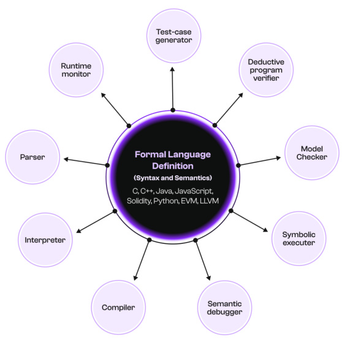
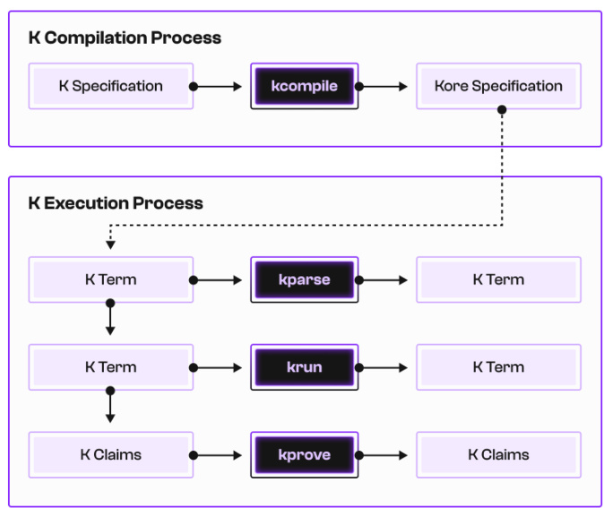
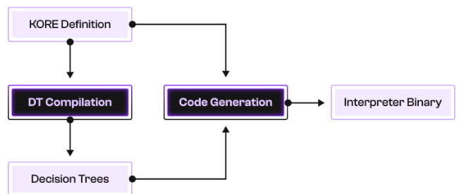
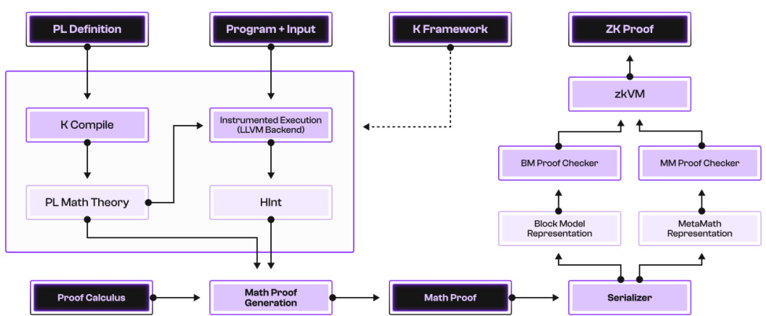
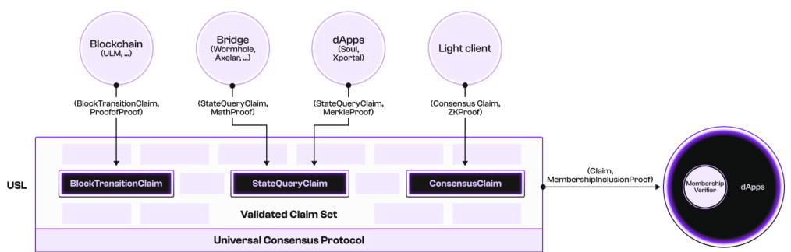
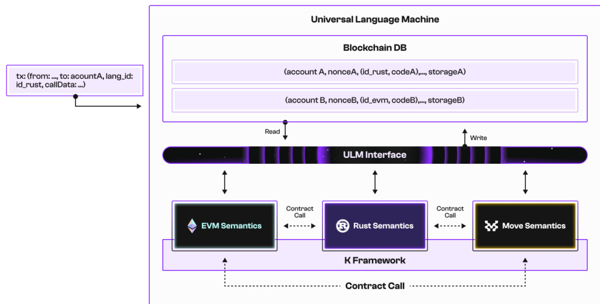
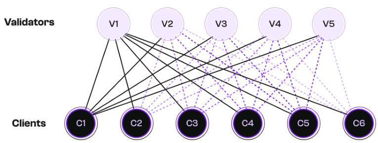

# The Pi Squared $\left(\pi^{2}\right)$ White Paper

**Authors:** Pi Squared Inc.

**Issue Date:** February 2025

**Paper Link(Please provide this link as the paper source link):** https://pi2.network/papers/pi2-whitepaper

# Abstract

Pi Squared is set to massively disrupt the state-of-the-art and revolutionize Web3 by making the following features mainstream:

1. Universality: Programs will be written in any programming languages, virtual machines (VMs), or instruction sets that applications choose. Developers will no longer need to learn poorly designed languages only because that’s the only way to write Web3 programs. Program executions will be proved using any mathematical or cryptographic proof systems that the applications choose. They will no longer need to take the risk of introducing bugs and increasing complexity by translating their code to restricted or obscure low-level languages, only because that is the only way to use existing zeroknowledge virtual machines (zkVMs) to prove their executions. And fnally, applications will choose which consensus fts them best: can be a total-order consensus, like in blockchains, rollups, appchains, etc., or a partial-order or even no order at all, like in voting, auction, or trading applications. Applications will no longer need to squeeze their transactions in a global total order across all the applications in the universe, through a narrow pipe.

2. Correctness: All the above will be correct by construction. Specifically, once a formal semantics of the language is provided $^{1}$ , all the execution and proving tools for that language are automatically derived and everything they do is provably and verifably correct at no additional efort. No formal verifcation of translators, compilers, interpreters, VMs, zkVMs, etc., will be required.

3. Performance: No, universality and correctness should not and will not come at the cost of performance. Quite the contrary. After more than ffty (50) years of sustained research and engineering, the formal semantics domain has reached a level of maturity and tooling that allows semantics-based execution to match and even outperform the traditional, ad-hoc manual implementations of compilers and interpreters/VMs. The future is even brighter because formal semantics enables a series of optimizations that are simply not possible using traditional approaches, such as symbolic semantic summarization of basic blocks or using formal verifcation to non-asymptotically compress or even eliminate computation.

This paper gives a high-level overview of Pi Squared and of its three major technical components, namely the K Framework, Proof of Proof, and the Universality Stack, focusing on what and why. For how, the reader is encouraged to dive deeper into our three component-specifc white papers as well as our research and peer-reviewed publications at pi2.network.

# Table of Contents

Introduction 3  
1.1 K Framework . 3  
1.2 Proof of Proof . . 4  
1.3 Pi Squared’s Universality Stack . . 5  
1.3.1 Universal Settlement Layer (USL) 5  
1.3.2 Universal Language Machine (ULM) . . . 6  
1.3.3 Universal Consensus Protocol (UCP) . . . . 7  
1.3.4 Putting It All Together . 7

# 2 K Framework

2.1 K Specifcations . . 8  
2.2 K Process . 9  
2.3 K Backend 10  
2.4 K Performance 11

# 3 Proof of Proof 11

3.1 Main Workfow 11  
3.2 Math Proof Generation 12  
3.3 Zero-Knowledge Proof Generation 13  
3.3.1 ZKP Generation via Existing zkVMs . . . 14  
3.3.2 ZKP Generation via Pi Squared’s Block Model . . . 14

# 4 Universality Stack 15

4.1 Universal Settlement Layer (USL) 15  
4.2 Universal Language Machine (ULM) 16  
4.3 Universal Consensus Protocol (UCP) . . 18

5 Conclusion and Further Readings 19

# 1 Introduction

Web3 infrastructure yearns for more universality and trustworthiness. Current solutions are constrained by technological limitations such as specifcity to particular computing models (e.g., programming languages, virtual machines, or instruction sets), reliance on error-prone translations among languages, lack of provable correctness, and slow performance. In this paper, we present Pi Squared and its three core technological innovations that address the above technological limitations:

• K Framework: A universal programming language framework that enables fast and correct-by-construction computation for programs written in any programming language or virtual machine. • Proof of Proof: A universal verifable computing framework designed to generate complete, rigorous, and machine-checkable proofs for the execution of programs in any programming language. • Universality Stack: The Pi Squared universal stack that consists of the following three components: the universal settlement layer (USL), the universal language machine (ULM), and the universal consensus protocol (UCP).

# 1.1 K Framework

Traditional programming and computing space are plagued by (programming) language barriers. On the one hand, we have a large and increasing number of programming languages as new domains, new applications, and new demands arise, such as the Ethereum virtual machine’s bytecode language for the Ethereum network. On the other hand, the development of the tool support of programming languages is still managed the same way as half a century ago: People develop specifc tools (compilers, interpreters, formal verifers, and ZK provers) for specifc programming languages, virtual machines, and/or architecture set instructions.

Language-specifc tools lead to language-specifc tech stacks and infrastructure, which lead to language-specifc ecosystems, and eventually, result in a huge programming language barrier in the current programming and computing space. Web2 programmers must frst learn how to write code in Solidity. Game developers must frst translate their application to a specifc zkVM implementing hundreds of thousands or lines of code that is blindly trusted, for which compilers may not even exist. Otherwise, they are efectively excluded by the emerging Web3 community. Language barriers make learning, development, deployment, and maintenance more expensive, increasing fragmentation and decreasing interoperability.

The $\mathbb{K}$ framework breaks language barriers in the programming space using formal semantics. K allows anyone to defne the formal semantics of any programming language, virtual machine, or architecture set in it. Furthermore, from the formal semantics, $\mathbb{K}$ automatically generates all the language tools in a correct-by-construction manner. This way, K fundamentally changes how the tool support of programming languages is developed. Instead of working on all the language-tool combinations, $\mathbb{K}$ separates language design and tool implementation.

K was invented at University of Illinois at Urbana-Champaign in 2003 by Prof. Grigore Rosu, the founder of Pi Squared, and has been continuously improved since then. As of today, K has been successfully applied to defne the formal semantics of C [8], Java [5], JavaScript [14], Python [7], Rust [15, 12], EVM [9], WASM [11], x86-64 [6], and more. K constitutes the infrastructural foundation of a unique approach to verifable computing, initiated and developed at Pi Squared, called Proof of Proof.

# 1.2 Proof of Proof

Verifable computing is poised to become the cornerstone of trust and correctness in decentralized Web3 infrastructure. Pi Squared’s Proof of Proof is an approach to verifable computing that puts special emphasis on universality and correct-by-construction, which we term “Verifable Computing 2.0.” Universality means that Proof of Proof is a framework that works for all programming languages, virtual machines, and instruction set architectures. Correct-by-construction means that Proof of Proof directly uses the mathematical models of the systems-being-verifed to construct the correctness certifcates, so there is no modeling gap between the systems and their certifcates. Both universality and correct-by-construction are a natural consequence of the semantics-based approach of Proof of Proof, which is directly built on top of the $\mathbb{K}$ framework and the formal semantics of various programming languages and virtual machines in it.

Proof of Proof stands for zero-knowledge (ZK) proofs of math proofs. As its name suggests, Proof of Proof involves two types of proofs: math proofs and ZK proofs. Given a program in a programming language, we frst generate a math proof that is fast to generate, easy to check, but large to store on-chain. Then, we generate a ZK proof for the said math proof as a much smaller cryptographic artifact that is more suitable for being checked and stored on-chain. Both the math proof and the ZK proof are directly based on a mathematical model of the program and the underlying language, known as their formal semantics.

The key idea of Proof of Proof is to separate three underlying concerns: computation, verifcation, and cryptography. Firstly, recent developments in executable formal semantics and $\mathbb{K}$ allow us to efciently and completely automatically reduce computation to math proofs. Proof of Proof only needs one language for encoding math proofs in order to support computations done with any programs in any programming languages (PLs) or virtual machines (VMs). Secondly, the math proofs are checked, not trusted, with a disarmingly simple and small proof checker of only a few hundred lines of code. No (usually complex and error-prone) compilers, interpreters, or even formal verifers need to be trusted, either. All become just instruments to assist the generation of math proofs. The math proofs, and not the tools that generate them, are the ultimate correctness arguments for the computations from which they were derived. Finally, recent developments in cryptography and ZK (e.g., SNARK and STARK) allow us to implement the math proof checker as a cryptographic circuit, which efectively allows us to produce ZK proofs for the integrity of the math proofs, and thus, (ZK) Proofs of (math) Proofs.

# 1.3 Pi Squared’s Universality Stack

Building on top of $\mathbb{K}$ and Proof of Proof, Pi Squared proposes the universality stack that consists of the following three components:

• Universal Settlement Layer (USL), a common layer for any applications and blockchains to submit, verify, settle, store, and use claims across platforms and ecosystems, compatible with various proof mechanisms and systems; • Universal Language Machine (ULM), a truly universal execution layer that allows developers to write and deploy smart contracts in all programming languages, including Bring Your Own Language (BYOL), and enables interactions among the smart contracts; • Universal Consensus Protocol (UCP), a fast and novel consensus protocol that enables nodes to agree on a set of independent values without imposing a global total order, thereby facilitating massively parallel processing and validation.

# 1.3.1 Universal Settlement Layer (USL)

Pi Squared’s USL aims to address the issue of fragmentation and interoperability in Web3. The current monolithic design of blockchains means that a blockchain handles all the core tasks on the same layer, including providing consensus and security, guaranteeing data availability, and executing transactions. It makes communication within the blockchain easy and convenient, but communication across various blockchains difcult and expensive. Each blockchain becomes an isolated information island.

USL is a common layer that brings together various applications running on diferent blockchains and ecosystems, using claims. Claims are a core mathematical concept. They refer to anything provable or verifable. Transaction execution is captured by computation claims. State queries are captured by state query claims. Consensus validation is captured by consensus claims. Vetted information (e.g., knowledge or data) is captured by information claims. In short, all statements are formally represented as claims, and they are submitted to the USL together with their corresponding proofs for verifcation, settlement, storage, and usage.

Diferent types of claims have diferent types of proofs, and the USL is compatible with any proof mechanisms. Computation claims can be verifed against their math and/or ZK proofs, generated by any zkVMs at the choice of the users, or by re-executing the code using a trusted software confguration and hardware setup. State query claims can also be verifed against their math proofs, ZK proofs, or by re-executing the corresponding pure/view functions. Consensus claims can be verifed by validating the blockchain’s block headers. Information claims can be verifed using digital signatures. The USL nodes are thus confgurable and compatible with any of the above proof mechanisms.

A remarkable and unique characteristic of the USL claims is that they are self-contained and can be verifed independently. Neither the verifcation process nor the verifcation result of a USL claim depends on any data, information, or state that is not given within the claim itself.

Claims are the minimal self-contained and self-dependent verifcation unit. Therefore, once a claim is verifed and settled by a USL node, it is added to the “valid claim set” maintained by the USL node, which constitutes the node’s runtime state. The valid claim set is a monotonic set that only increases as time passes by, which gives birth to a faster consensus protocol which we term as the Universal Consensus Protocol (UCP).

Any application running on any blockchain can query the USL about the claims about any other application on any other blockchain. If a claim has been verifed, settled, and stored on the USL, the USL returns a corresponding membership proof, which proves that the said claim indeed belongs to the valid claim set maintained by the USL node. No computation or complex consensus mechanism matters here, because the membership proof is simply a verifable certifcate for the simplest mathematical structure—a set—and the simplest mathematical relation—whether an object (claim) belongs to a set. Membership proofs are one of the simplest and most succinct verifable certifcates to verify and store on-chain.

USL addresses the issue of Web3 fragmentation and interoperability by proposing a novel topological structure among blockchain ecosystems. Instead of building ad-hoc bridging-like solutions for any two blockchains and/or applications, the USL imposes a spoke–hub distribution paradigm that connects and interconnects various blockchains and ecosystems via claims and membership proofs, in a uniform and universal way.

# 1.3.2 Universal Language Machine (ULM)

Pi Squared’s ULM aims to leverage the universality of $\mathbb{K}$ and Proof of Proof and bring this universality to Web3, to engage with a much larger community of Web2 developers who are not necessarily familiar with particular Web3 programming languages and technology stacks.

The ULM is an open-source execution layer that enables developers to create, deploy, and interact with smart contracts written in any programming language. Unlike existing blockchain systems that require all contracts to be written in a single prescribed language, the ULM natively supports multiple languages. Furthermore, the ULM can be dynamically extended and allows adding new programming languages on-the-fy. This way, the ULM enables diverse language ecosystems to coexist and interoperate on a single platform. This not only empowers developers to use the most suitable language for their projects; it also makes smart contract development more accessible to the millions of developers who are unfamiliar with existing Web3 languages.

Pi Squared is building the ULM platform because we are convinced that its universal, formally grounded approach represents a signifcant advancement in the blockchain space that improves fexibility, developer experience, and security. At the same time, it paves the way for future innovation in decentralized applications, fostering a more universal approach to blockchain programming.

# 1.3.3 Universal Consensus Protocol (UCP)

Pi Squared’s UCP is a natural innovation in consensus mechanisms based on the unique characteristics of the USL, especially its self-contained and independently-verifable claims. Traditional counterparts in the current blockchain systems have focused on ordering transactions or blocks, introducing complexity and constraints that are often unnecessary for many decentralized applications. The UCP, on the other hand, enables nodes to agree on a set of independent values (i.e., claims) without imposing an order, thereby facilitating massively parallel processing and validation, which are critical for scalability and efciency.

Pi Squared’s UCP decouples core consensus from application-specifc requirements, particularly application-specifc safety properties. These include the absence of forks in blockchain histories, prevention of doublespending in payment systems, ensuring only valid bids in auctions, or counting valid votes in voting systems. Such properties are the responsibility of the application to prove and are independent of the core consensus mechanism. This separation enables the design of a universally generic consensus protocol that serves as a unifying framework for diverse applications, including blockchain-based smart contracts, distributed databases, scientifc computation validations, and multi-agent coordination systems. Furthermore, it facilitates the creation of scalable systems unbounded by any constraints imposed by the underlying protocol.

# 1.3.4 Putting It All Together

Pi Squared aims to empower Web3 developers to build interoperable and trust-minimized applications across all blockchain environments and ecosystems. By leveraging the $\mathbb{K}$ framework, Proof of Proof, and the Universality Stack, dApp builders can unlock new possibilities for decentralized applications, move beyond the current silos of blockchain networks, and embrace an emerging new paradigm for trustless computing in crypto applications and beyond. Through Verifable Computing 2.0, Pi Squared is paving the way for a more unifed, secure, and scalable future for Web3 infrastructure, and will continue playing a pivotal role in shaping the next generation of decentralized computing.

Due to space limits, more technical details, experiments, analyses, and discussions are given in our technical whitepapers (see Section 5).

# 2 K Framework

$\mathbb{K}$ framework is a formal programming language semantics framework that lies at the core infrastructure of Pi Squared. It enables two things. Firstly, $\mathbb{K}$ allows to defne, in a uniform and executable way, the formal semantics of any programming language. Secondly, from the formal semantics of a language, $\mathbb{K}$ automatically generates fast execution tools for that language.

The formal semantics of a programming language is a mathematical defnition of that language and of all the behaviors of all the programs in that language. Therefore, if one has the formal semantics of a programming language, then one has, in theory, all the information needed to execute any program written in that language. A formal semantics is similar to a language specifcation in that both describe the expected behaviors of the programs. The diference is that formal semantics is also mathematically rigorous and unambiguous, and thus can be directly used for formal reasoning and proving.

  
Figure 1: K Framework

Using their formal semantics, $\mathbb{K}$ unifes programming languages. As shown in Figure 1, the center bubble represents the formal semantics of an arbitrary programming language, and the bubbles around represent the language tools that are automatically generated directly from the formal semantics by $\mathbb{K}$ . This way, $\mathbb{K}$ enables a separation of concerns between programming language design and programming language tool implementation. Language designers can laser focus on designing and defning their languages (and tools) rigorously, and let $\mathbb{K}$ automatically generate all the tools needed to execute and reason about programs.

# 2.1 K Specifcations

The primary input into the entire $\mathbb{K}$ framework is a formal semantics of a programming language, represented as a $\mathbb{K}$ specifcation. At the highest level, K defnes a programming language using three diferent pieces:

• System primitives: The base datatypes used during system operation, such as numbers, lists, maps, and so on. • System confguration: A nested tuple or record over the system primitives that gives a complete snapshot of the running system at any given runtime moment; can be seen as a semantic core dump.

  
Figure 2: K Framework Process

• System behavior: A set of rules that modularly specify all possible evolutions and behaviors of the system.

As a result, the $\mathbb{K}$ specifcation of a programming language is organized by a collection of declarations that correspond to the three pieces above:

• Syntax declarations encode the system primitives.  
• Confguration declarations encode the system confgurations.  
• Context and rule declarations encode the system behavior.

$\mathbb{K}$ has been successfully applied to defne the formal semantics of C [8], Java [5], JavaScript [14], Python [7], Rust [15, 12], EVM (the bytecode language of Ethereum VM) [9], WASM [11], x86-64 [6], and many others.

# 2.2 K Process

Once we obtain the $\mathbb{K}$ specifcation of the formal semantics of a programming language, we pass it to $\mathbb{K}$ as the primary input to generate all the language tools. For efciency, the $\mathbb{K}$ spec is frst desugared into an intermediate representation called Kore. The Kore spec is used to do:

• Parsing and pretty-printing. • Concrete and symbolic program execution using the $\mathbb{K}$ specifcation. • Symbolic reasoning, theorem proving and formal verifcation, i.e., proving claims about programs against the $\mathbb{K}$ specifcation.

The above $\mathbb{K}$ process is shown in Figure 2.

  
Figure 3: LLVM-K Architecture

# 2.3 K Backend

LLVM-K is a backend of $\mathbb{K}$ that powers the $\mathbb{K}$ execution process in Figure 2, specialized for concrete (non-symbolic) program execution. It enables fast and correct-by-construction program execution for all languages, by using their formal semantics.

As shown in Figure 3, the LLVM-K backend generates fast, native interpreter binaries in LLVM IR for programming languages from their formal semantics in $\mathbb{K}$ . The input to the LLVM-K backend is the Kore specifcation of a programming language, obtained by compiling the $\mathbb{K}$ specifcation of the language, where Kore is the internal intermediate representation format of $\mathbb{K}$ . The output of the LLVM-K backend is an efcient interpreter for the programming language as an LLVM IR.

$\mathbb{K}$ is a rewrite-based system. Formal semantics are given in terms of rewrite rules, which specify how to go from the current confguration to the next confguration. This process is called rewriting, and is driven by pattern matching. For any given confguration, a rewrite rule is selected that matches the said confguration. During pattern matching, the variables of the rewrite rules are given concrete values according to the confguration that they are matched against. This mapping from variables to concrete terms is called a substitution. After the pattern has been matched and we have a substitution, we can rewrite the current confguration to the next one by applying the substitution to the rewrite rule.

The LLVM-K backend implements a high-performance pattern matching algorithm that is specialized to handle large formal semantics of programming languages with potentially thousands of rewrite rules to select from. The core algorithm is based on a modifed version of an existing algorithm for code generation of efcient pattern matching, described in [13]. The algorithm represents the left-hand sides of the rewrite rules as matrices, and processes these matrices into a decision tree. Starting from the root of the tree, each node is a check on a specifc position of the given term and the children of the node represent how to continue checking given the result of the parent’s check. A leaf node corresponds to a specifc rewrite rule that matches when the leaf node is reached through a series of checks on the given term. The algorithm is designed to be customized with various heuristics in order to lead to generation of decision trees that minimize the number of checks needed to match a given term.

# 2.4 K Performance

Semantics-based execution is fast. The interpreters that are automatically generated by LLVM-K can reach comparable performance against handwritten interpreters. Furthermore, semantics-based execution enables a number of optimization technologies that are simply not possible in a traditional compiler-based approach.

A typical example is compositional symbolic execution (CSE). Given a formal semantics of a programming language $L$ and a program $P$ , the CSE automatically derives a new semantics $L[P]$ , which is the partial evaluation of $P$ using the semantics of $L$ . In other words, $L[P]$ is a new language and a new semantics that is specialized, and thus optimized, with respect to the program $P$ . All the basic blocks of $P$ that require multiple rewrite rules to execute using the semantics $L$ will be automatically summarized into their corresponding rewrite rules in $L[P]$ , and thus each basic block is executed in one step, using the new CSE-ed version of the semantics.

We have evaluated the performance of LLVM-K on two benchmark set: the blockchain tests in the Ethereum test suite [1] and the execution of 1,000 swap operations on an ERC20 token [10]. Our results are preliminary but positive. We fnd that on EVM, K without CSE is merely $1.35\mathrm{x}$ slower than geth, the ofcial implementation of EVM [2] in Go and the most adopted Ethereum client. Furthermore, if we enable the CSE, the language interpreters generated by $\mathbb{K}$ outperform geth by $1.58\mathrm{x}$ .

# 3 Proof of Proof

Proof of Proof is a universal verifable computing framework for all programming languages. Its universality comes from $\mathbb{K}$ and formal semantics, and the usage of mathematics and proofs in specifying and reasoning about programs and languages. In other words, computation $i s$ proof:

$$
\boxed{\mathrm{Computation}}=\boxed{\mathrm{Proof}}
$$

# 3.1 Main Workfow

Figure 4 shows the entire Proof of Proof workfow. It has two phases. In the frst phase, we generate a mathematical proof that verifes that a given execution trace of a program is indeed correct with respect to the formal semantics of the programming language. Formally,

$$
\Pi\colon\Gamma^{L}\vdash\varphi_{P}\qquad\mathrm{where}
$$

• $\mathrm{11}$ is the mathematical proof  
• $\Gamma^{L}$ is the formal semantics of some programming language $L$  
• $\varphi_{P}$ is the logical formula that specifes the correctness (w.r.t. $L$ ) of an execution trace of a program $P$ .

  
Figure 4: Proof of Proof Workfow

The symbol “⊢” is called the entailment relation. Equation (1) thus states that the mathematical proof $\mathrm{11}$ verifes the execution trace of program $P$ as specifed by $\varphi_{P}$ with respect to the underlying formal semantics $\Gamma^{L}$ . The process of generating the mathematical proof $11$ is called Math Proof Generation, and is depicted at the bottom left of Figure 4.

In the second phase of Proof of Proof, we generate a zero-knowledge proof (ZKP) that verifes the (constructive) existence of a mathematical proof, for a given program execution claim. Formally,

$$
\pi\colon\mathrm{~there~exists~}\Pi\mathrm{~such~that~}\Pi\colon\Gamma^{L}\vdash\varphi_{P}
$$

In other words, we regard Equation (1) as a ternary relation among $\mathrm{11}$ , $\Gamma^{L}$ , and $\varphi_{P}$ , and regard $11$ is a private argument. The zero-knowledge proof $\pi$ verifes the existence of a mathematical proof for a given execution trace of a given program, and thus forms an indirect certifcate to computation.

Proof of Proof is thus an approach to verifable computing via two phases and two diferent types of proofs: mathematical proofs frst, followed by zero-knowledge proofs. In this order, not mixed. Mathematical proofs are generated for the target execution traces based on formal semantics, and zero-knowledge proofs are generated to show the existence of the mathematical proofs. Hence, we name the approach “Proof of Proof”:

$$
\scriptstyle\left[{\mathrm{{Proof~of~Proof}}}\right]\scriptstyle=\left[{\mathrm{{ZK~Proof~of~Math~Proof}}}\right]
$$

# 3.2 Math Proof Generation

Math Proof Generation is the process of generating the mathematical proofs for a given execution trace of a program using directly the formal semantics of the underlying programming language. The execution of the program is carried out by $\mathbb{K}$ and the LLVM-K backend, as explained in Section 2. Math Proof Generation consists of four main components:

1. A universal logical foundation.

2. Proof hints.

3. Proof generation procedures.

4. Math proof checkers.

The universal logical foundation that powers Proof of Proof is matching logic [3]. All $\mathbb{K}$ specifcations correspond to logical theories of matching logic and all $\mathbb{K}$ tools, including the LLVM-K backend, are formally specifed by matching logic formulas — and this process is automatic.

Proof hints are the necessary information that $\mathbb{K}$ generates on-the-fy to facilitate the generation of the mathematical proofs, including the complete execution trace with all the intermediate confguration snapshots as well as the information about how the rewrite rules have been matched and applied. Proof hints are logs of the execution of the $\mathbb{K}$ -generated interpreters. Once generated, proof hints are passed into the proof generation procedures to generate the corresponding mathematical proofs.

Suppose the execution trace has the form $\varphi1,\varphi2,\ldots,\varphi_{n}$ . Here, we write $\varphi_{1},\varphi_{2},\ldots,\varphi_{n}$ to mean the intermediate confgurations that constitute the entire execution trace. The corresponding mathematical proof $\Pi\colon\Gamma^{L}\vdash\varphi_{1}\Rightarrow\varphi_{n}$ consists of four components:

1. The formalization of matching logic and its entailment relation “⊢”.
2. The formalization of the formal semantics $\Gamma^{L}$ .
3. The proofs of all one-step executions, i.e., $\Gamma^{L}\vdash\varphi_{i}\Rightarrow\varphi_{i+1}$ for all $i$ .
4. The proof of the target trace $\Pi\colon\Gamma^{L}\vdash\varphi_{1}\Rightarrow\varphi_{n}$ .

It should be noted that the mathematical proof as shown above has a linear structure that enables proof checking in parallel. Indeed, the formalization of matching logic and its entailment relation is general, and is not specifc to a programming language or a program, so it can be proved once and for all. The formalization of the formal semantics $\Gamma^{L}$ can be reused for all programs written in the language $L$ .

A math proof checker is a program that checks whether a mathematical proof indeed verifes a mathematical claim. As shown in Figure 4, we support two proof checkers for two proof formats. The frst is a math proof checker based on Metamath, which has only 200 lines of code and thus forms a minimal trust base of Proof of Proof. The second is a custom math proof checker based on our recent block model format, which is specialized for the most efcient generation of ZK proofs.

# 3.3 Zero-Knowledge Proof Generation

Recall that zero-knowledge proof (ZKP) generation is the process of generating a ZKP $\pi$ as shown below:

$$
\pi\colon\mathrm{~there~exists~}\Pi\mathrm{~such~that~}\Pi\colon\Gamma^{L}\vdash\varphi_{P}
$$

In other words, we are generating ZKPs for the existence of a mathematical proof of a given, public mathematical claim.

A generic ZK proof system designed to verify a particular computation typically requires that the computation be specifed via arithmetization. This reduces the computation into some ZK primitives, such as a system of algebraic equations or polynomials over a fnite feld. On the other hand, a zero-knowledge virtual machine (zkVM) verifes computations described by a program that runs on a virtual machine, and thus allows programs written in higher-level languages, even programs not initially designed with verifable computing in mind, to be used in ZKP systems.

Pi Squared pursues both approaches at the same time and enables ZKP generation via both existing zkVMs for best compatibility and via our own block model for best arithmetization efciency. We discuss both.

# 3.3.1 ZKP Generation via Existing zkVMs

zkVMs are a type of software that supports producing ZKPs of execution for some target language, for example, RISC-V or the Ethereum VM instruction set. By implementing the math proof checkers (see Figure 4) in a zkVM, we obtain an instance of Proof of Proof whose output verifable certifcates can be directly produced and checked by the zkVM.

We have implemented the same Metamath-based math proof checker in seven diferent zkVMs: Cairo, Jolt, Lurk, Nexus, RISC Zero, SP1, and zkWASM. Each consists of a guest program that runs on a specifc virtual machine and a host program, which is our interface to run the guest, providing input for it and processing its output.

Among the seven zkVMs, fve of them, namely Jolt, Nexus, RISC Zero, SP1 and zkWASM provides a Rust compiler. For these Rust-based systems, we have developed and used a shared library. Cairo and Lurk use domain-specifc languages, namely the Cairo language and LISP. We have implemented the same Metamath-based math proof checker in Cairo and Lurk, but their code base was developed independently of the Rust code base and independent of each other.

Among the seven zkVMs, four of them have dedicated GPU support, namely RISC Zero, zkWASM, SP1, and Cairo. At the time of writing, January 2025, we were able to enable the GPU support on RISC Zero, SP1 and zkWASM. GPU support on Cairo is a work in progress.

Our implementation and experiments are based on the following versions of the zkVMs:

• Cairo (the lambdaworks prover): Main branch, commit a591186  
• Jolt: Main branch, commit 3b14242  
• Lurk: Main branch, commit 57c48b9  
• Nexus: Version 0.2.3  
• RISC Zero: Version 1.0.5  
• SP1: Dev branch, commit 2c78683  
• zkWASM: Main branch, commit f5acf8c

# 3.3.2 ZKP Generation via Pi Squared’s Block Model

Generating ZKPs via zkVMs inevitably introduces extra complexity and overhead, due to encoding, translation, and compilation. A theoretically more efcient approach is to develop a ZK front-end that is specialized in math proof checking. Pi Squared’s block model is an approach for more effciently ZK-proving math proofs. The block model design is documented in the “Proof of Proof white paper” while its related tool support is a work in progress.

  
Figure 5: Universal Settlement Layer (USL) Architecture

Pi Squared’s block model is an intermediate computation model that is suitable for expressing mathematical proof systems and can be implemented in an AIR/Plonkish arithmetization. It also targets at connections with R1CS-native backends, and recursive SNARKs, and folding schemes. The key observation of the block model is that lookup arguments can more directly support the task of checking that the hypotheses of math proof steps are conclusions of other steps, without building up a full RAM (or ROM) abstraction as for a zkVM. Initial estimates based on theoretical and practical modeling of our math custom ZK circuit put it at about $1000\times$ faster than the of-the-shelf zkVM approach.

# 4 Universality Stack

On top of $\mathbb{K}$ and Proof of Proof, Pi Squared proposes the universality stack that consists of Universal Settlement Layer (USL), Universal Language Machine (ULM), and Universal Consensus Protocol (UCP).

# 4.1 Universal Settlement Layer (USL)

Pi Squared’s USL is a distributed service that allows users to submit, verify, store, settle, and use claims, as shown in Figure 5. The central component of the USL is that of claims. Claims can be anything mathematically provable and can be proved by any type of proof. Users submit a claim and its corresponding proof to the USL, and the nodes of the USL validate the claim by checking its proof. The USL is compatible with any proof mechanism. It allows validation-by-re-execution, which is the canonical computation validation approach in most of the state-of-the-art layer-1 blockchains. It allows validation-by-proof-certifcates, where the certifcates can be the math/ZK proofs generated by Proof of Proof or any zkVMs. This way, the USL enables verifable computing, open or secure, for the whole Web3 world through a versatile set of proofs.

At runtime, a node in the USL network maintains a set of claims that have been validated and settled. Because claims are self-contained statements that can be validated independently of each other, the USL node only needs to maintain all the validated claims as a set and not as an ordered sequence or list. There are two important characteristics of the claim sets within the USL nodes:

• Atomicity. Claims are the smallest verifable atom in the USL. Each claim is self-contained and includes all the information for it to be verifed independently from the other claims.  
• Timelessness. Claims, once verifed, continue staying valid regardless of time. Timelessness is a natural corollary of atomicity. A time-sensitive or state-sensitive claim can be turned into a timeless/stateless claim by incorporating the time and/or the state as an argument of the claim.  
• Monotonicity. The set of claims maintained by a USL node only increases, and never decreases, as time passes. Monotonicity is a natural corollary of timelessness. Since valid claims continue staying valid, the USL node does not need to bother re-verifying claims and removing those that are no longer valid.

This way, the USL opens the door to a more generalized and efcient Universal Consensus protocol because unlike traditional blockchains, the USL network does not enforce the total ordering of its claims (the USL “transactions”).

Any applications or users can submit claims to the USL for verifcation and settlement. Depending on their use cases and the needs, these claims can have various types, such as transaction claims (i.e., computation claims), state query claims, consensus claims, and/or vetted information claims. Every claim must be associated with a corresponding proof, and thus forms a pair $\langle c,\pi\rangle$ , where $c$ is the mathematical representation of the claim and $\pi$ is a proof that can be verifed by the USL node.

# 4.2 Universal Language Machine (ULM)

The Universal Language Machine (ULM) is an open-source execution layer platform that enables developers to create, deploy, and interact with smart contracts written in any programming language. Unlike existing blockchain systems that require all contracts to be written in a single prescribed language, the ULM natively supports multiple languages. This way, the ULM enables diverse language ecosystems to coexist and interoperate on a single platform, which not only empowers developers to use the most suitable language for their projects but also makes smart contract development accessible to a much larger developer base.

Pi Squared’s ULM is based on K and formal semantics and thus adopts a mathematically grounded approach to language support. It uses $\mathbb{K}$ and the formal semantics of programming languages to execute smart contracts written in any programming language in a correct-by-construction manner. The ULM is a signifcant advancement in fexibility, developer experience, and security, and it paves the way for future innovation in decentralized applications, fostering a more universal approach to Web3 development.

  
Figure 6: Universal Language Machine (ULM) Architecture

The overview architecture of the ULM is depicted in Figure 6. The core component is a semantics-based execution layer, powered by the $\mathbb{K}$ framework and the formal semantics. This semantics-based execution layer is loosely connected to and actively interacting with an external consensus layer. The modular design of the ULM enables it to interact with a variety of consensus algorithms and schemes, including BFT protocols. In the future, we expect and look forward to making the ULM compatible with more consensus protocols. At present, we are collaborating with the Common Prefx team to connect the ULM to a POD-like weak/generalized consensus protocol for faster fnality of the ULM transactions.

The ULM allows smart contracts written in diferent programming languages to coexist. When a contract is deployed or called, ULM determines the correct semantics module to execute the contract code. All smart contracts are able to modify the same blockchain state thanks to a single universal API that provides access control and allows each semantics to update the storage of its own namespace only. A language semantics can only modify the contract storage under its own namespace. This namespace access control policy prevents malicious semantics from harming the storage of contracts written in other languages.

The LM is a truly universal framework because all smart contracts written in any programming languages are directly and natively executed using the formal semantics, without compilation, thus avoiding compiler bugs. Furthermore, the ULM architecture, as shown in Figure 6, is extensible and enables dynamic addition of new programming languages. Smart contracts written in various programming languages are connected to the $\mathbb{K}$ framework as modules. Users are able to plug and play their programming languages, even their own customized languages, as long as the formal semantics have been defned in $\mathbb{K}$ . This way, the ULM fosters continuous innovation in smart contract development.

  
Figure 7: Universal Consensus Protocol (UCP) Connection Topolo

# 4.3 Universal Consensus Protocol (UCP)

In the ULM and the USL, claims are the core of validation and consensus. A claim can represent various types of assertions and is independently evaluated for correctness without relying on the order of processing. This contrasts with traditional blockchain consensus, which requires agreement on a globally ordered sequence of transactions to prevent conficts and maintain consistency.

Pi Squared’s UCP is a novel distributed consensus algorithm specifcally designed to operate on claims. The UCP enables achieving agreement on the validity of claims in a permissionless, decentralized network. At its core is the concept of set consensus, where the focus shifts from ordering values to achieving agreement on a set of independent claims. Instead of requiring a strict sequence, users propose claims in parallel, and the goal of the network is to agree on the valid subset of those claims by verifying their proofs. This enables concurrent validation, reducing the complexity and overhead associated with traditional blockchain systems.

Clients are nodes responsible for: (1) providing claims that require validation and (2) maintaining an up-to-date view of the network’s state. Validators, on the other hand, are nodes tasked with individually verifying these claims to ensure that only claims that are verifed as correct (i.e., their provided proofs check) are maintained by the protocol.

Inspired by POD [4], the UCP uses a broadcast model that is based on a communication topology of a complete bipartite graph of clients and validators, as illustrated in Figure 7. Importantly, validators do not need to communicate with one another as they maintain local logs of verifed claims. Clients maintain streaming and stateful connections to all validators. Validators are identifed by public keys registered in a public key infrastructure (PKI). They sign all outgoing messages with digital signatures, providing cryptographic assurance of message authenticity and integrity since signatures cannot be forged.

The UCP is designed to tolerate Byzantine nodes that act arbitrarily or deviate from the protocol rules. As in POD [4], we assume a limit on the resilience threshold $\beta$ , which is the number of malicious validators (typically $(n-1)/3$ where $_n$ is the total number of validators). There is no inherent assumption about the honesty of clients.

The UCP has the following key advantages:

• Order independence: Set consensus does not enforce an ordering of values, not even partial, allowing for parallel validation and processing.  
• Scalability: By eliminating the need for ordering, set consensus supports higher throughput and lower latency, unlike blockchain systems that sacrifce scalability for order and consistency.  
• Separation of concerns: The validity of claims is evaluated independently from application-specifc safety properties, such as transaction order or state transition requirements. This fexibility allows the consensus protocol to support diverse use cases, from decentralized exchanges requiring strict ordering to voting systems where order does not matter.

The security of the UCP is established through key theorems. The correctness theorem ensures that invalid claims are never fnalized in the view of an honest client, though they may temporarily appear as pending. The view consistency theorem guarantees that during partial synchrony with a network delay $\delta$ , if a claim is observed as fnalized by one honest client, it will be observed as fnalized by all honest clients within $u\ =\ 2\delta$ , ensuring consistent views. Finally, the fnalization theorem ensures that valid claims are fnalized within $w\,=\,2\delta+\tau$ during partial synchrony, where $\tau$ is an upper bound on claim verifcation time, ensuring the progression of fnalized claims in honest client views.

# 5 Conclusion and Further Readings

We have introduced Pi Squared and its three major technological innovations: the $\mathbb{K}$ framework, Proof of Proof, and the 3-component Universality Stack that consits of the Universal Settlement Layer (USL), the Universal Language Machine (ULM), and the Universal Consensus Protocol (UCP). By leveraging these core technologies, Pi Squared will empower Web3 developers to build interoperable and trust-minimized applications across multiple blockchain environments and paving the way for a more unifed, secure, and scalable future for Web3 infrastructure.

We have only outlined the major technology building blocks in this umbrella white paper. Deeper technical white papers, as well as several research and peer-reviewed papers, are available on pi2.network, in particular:

• K Framework  
• Proof of Proof  
• Pi Squared’s Universality Stack (USL + ULM + UCP)

# References

[1] Ethereum execution tests (EVM). https://github.com/ethereum/ tests/tree/dec74b8f0c2f1c1c65e327ace9446769d21279db, 2023.  
[2] Go Ethereum. https://geth.ethereum.org/, 2023.  
[3] Matching logic homepage. https://matching-logic.org/, 2025.  
[4] Orestis Alpos, Bernardo David, and Dionysis Zindros. Pod: An Optimal-Latency, Censorship-Free, and Accountable Generalized Consensus Layer. Unpublished Manuscript, 2025.  
[5] Denis Bogdanas and Grigore Ro¸su. K-Java: A complete semantics of Java. In Proceedings of the 42nd Annual ACM SIGPLAN-SIGACT Symposium on Principles of Programming Languages, POPL ’15, pages 445–456, New York, NY, USA, 2015. ACM.  
[6] Sandeep Dasgupta, Daejun Park, Theodoros Kasampalis, Vikram S. Adve, and Grigore Ro¸su. A complete formal semantics of x86-64 user-level instruction set architecture. In Proceedings of the 40th ACM SIGPLAN Conference on Programming Language Design and Implementation (PLDI’19), pages 1133–1148. ACM, June 2019.  
[7] Dwight Guth. A formal semantics of Python 3.3. Master’s thesis, University of Illinois at Urbana-Champaign, 8 2013.  
[8] Chris Hathhorn, Chucky Ellison, and Grigore Ro¸su. Defning the undefnedness of C. In Proceedings of the 36th ACM SIGPLAN Conference on Programming Language Design and Implementation, PLDI ’15, pages 336–345, New York, NY, USA, 2015. ACM.  
[9] Everett Hildenbrandt, Manasvi Saxena, Xiaoran Zhu, Nishant Rodrigues, Philip Daian, Dwight Guth, Brandon Moore, Yi Zhang, Daejun Park, Andrei Stefanescu, and Grigore Rosu. KEVM: A complete semantics of the Ethereum virtual machine. In Proceedings of the 31st IEEE Computer Security Foundations Symposium (CSF’18), pages 204–217, Oxford, UK, 2018. IEEE. http://jellopaper.org.  
[10] Pi Squared Inc. https://github.com/Pi-Squared-Inc/ devcon-2024/blob/main/src/swaps.sol, 2024.  
[11] Runtime Verifcation Inc. KWasm: Semantics of WebAssembly in K. https://github.com/runtimeverification/wasm-semantics, 2025.  
[12] Shuanglong Kan, David Sanan, Shang-Wei Lin, and Yang Liu. KRust: An executable formal semantics for Rust, 2018.  
[13] Luc Maranget. Compiling pattern matching to good decision trees. In Proceedings of the 2008 ACM SIGPLAN Workshop on ML, ML ’08, pages 35–46, New York, NY, USA, September 2008. Association for Computing Machinery.  
[14] Daejun Park, Andrei Stefanescu, and Grigore Rosu. KJS: A complete formal semantics of JavaScript. In Proceedings of the 36th ACM SIGPLAN Conference on Programming Language Design and Implementation, PLDI ’15, pages 346–356, New York, NY, USA, 2015. ACM.

[15] Feng Wang, Fu Song, Min Zhang, Xiaoran Zhu, and Jun Zhang. KRust: A formal executable semantics of Rust. In Proceedings of the $I{\mathcal{Q}}^{t h}$ International Symposium on Theoretical Aspects of Software Engineering (TASE’18), pages 44–51, Guangzhou, China, Aug 2018. IEEE.
