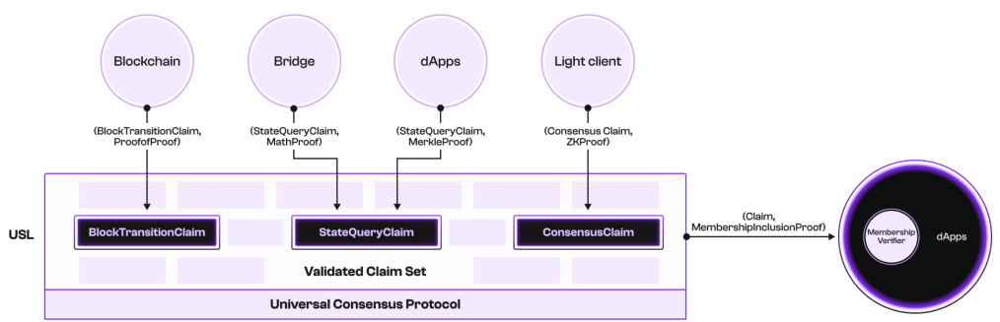
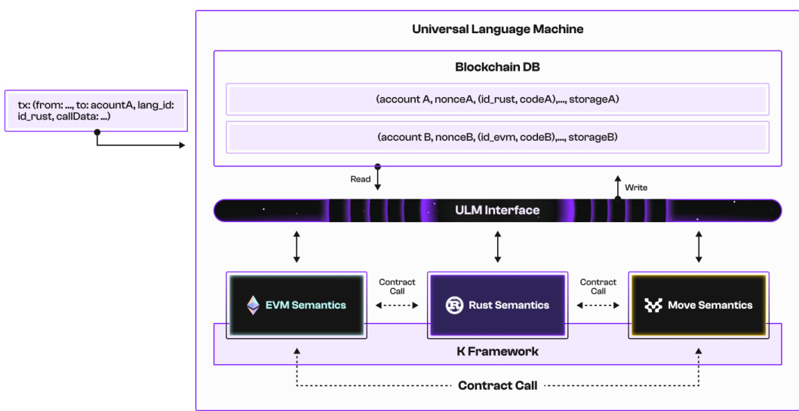
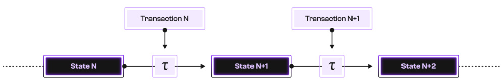
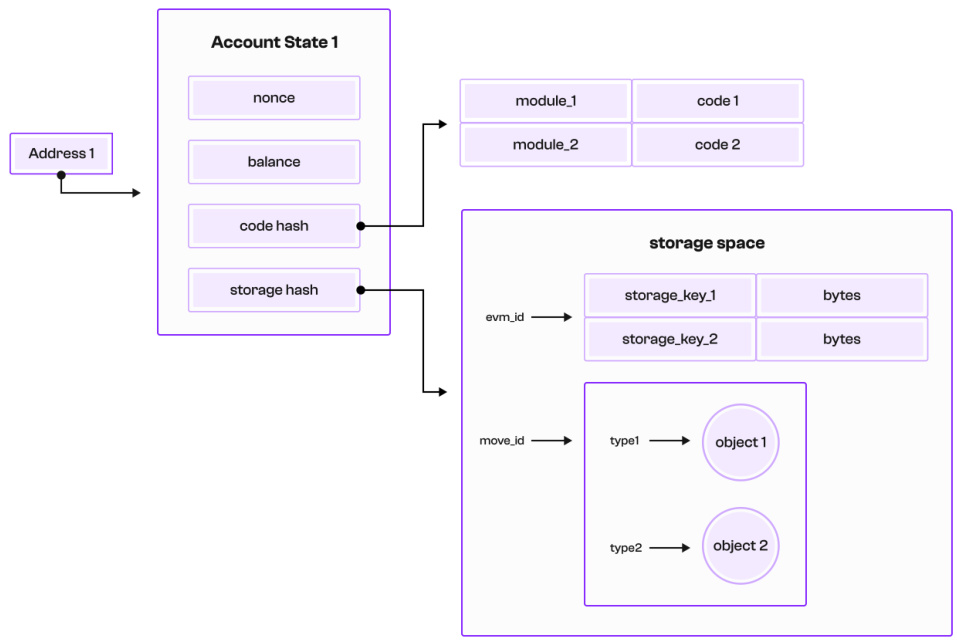
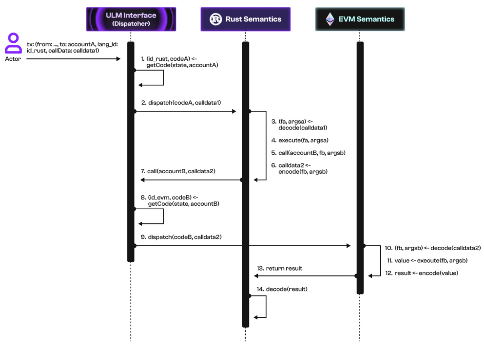
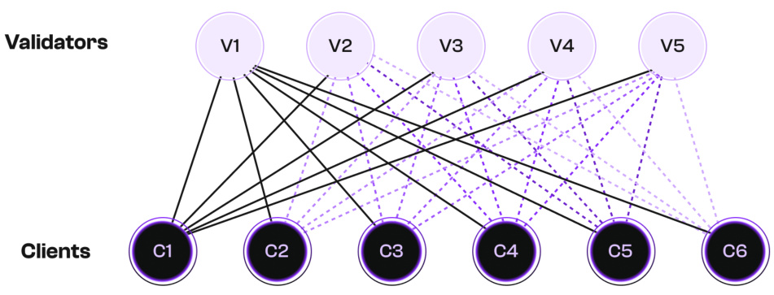
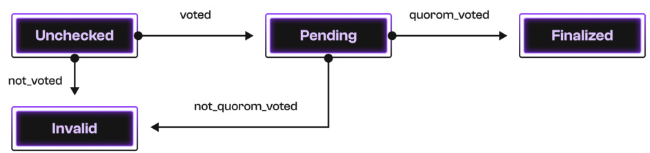

# Pi Squared’s Universality Stack Version 1.0  

Pi Squared Inc.  

February 2025  

It is suggested that the reader frst read “The Pi Squared Whitepaper” [7].  

# Abstract  

Blockchain systems have faced persistent challenges related to fragmentation, inefciency, and limited interoperability. The monolithic architecture of existing blockchains tightly couples execution, settlement, consensus, and data, leading to scalability bottlenecks and isolated ecosystems. Developers are restricted by language-specifc environments, while cross-chain interactions rely on insecure and inefcient bridging mechanisms. These limitations stife innovation, increase costs, and create security vulnerabilities, preventing the seamless development and deployment of decentralized applications across multiple blockchain networks.  

To address these issues, Pi Squared introduces the Universality Stack, a three-tiered architecture comprising the Universal Settlement Layer (USL), the Universal Language Machine (ULM), and the Universal Consensus Protocol (UCP). The USL provides a unifed settlement layer based on verifable claims, eliminating the need for traditional cross-chain bridges The ULM enables smart contract development in any programming language, breaking the constraints of ecosystem-specifc virtual machines. The UCP redefnes consensus by allowing agreement on unordered, independent values, unlocking massive parallelism and improving scalability.  

By integrating the USL, the ULM, and the UCP, Pi Squared’s Universality Stack creates a fexible, efcient, and secure foundation for nextgeneration blockchain applications. This framework enhances interoperability, empowers developers with efcient execution of smart contracts in any languages or VMs, and introduces a scalable consensus model that moves beyond traditional ordering constraints. As a result, it enables a more inclusive and adaptable Web3 ecosystem, fostering innovation and broadening access to decentralized applications across diverse platforms.  

# Table of Contents  

1 Introduction 3  

# 2 Universal Settlement Layer 5  

2.1 USL Claims . 5   
2.2 USL Architecture . 6   
2.3 USL-Powered Applications . 7  

# 3 Universal Language Machine 8  

3.1 ULM Architecture Overview . . 9   
3.1.1 Language Modules . . 10   
3.2 ULM Mathematical Overview . 11   
3.3 Universal Interfaces . . 13   
3.3.1 Unifed Account Model 14   
3.3.2 Unifed Invocation API 15   
3.3.3 Unifed Gas Model . 17   
3.4 Putting It All Together 18  

# 4 Universal Consensus Protocol 20  

4.2.1 Setup 22   
4.2.2 Construction 23   
4.2.3 Correctness 27   
4.2.4 UCP vs. Pod 27   
4.3.1 Fast Set Reconciliation . . 28   
4.3.2 Coding for Full BFT Agreement 29   
4.3.3 Efcient Decentralized Data Dissemination 29   
4.4.1 Extreme Scalability 30   
4.4.2 Supporting Application-Specifc Properties 31  

# 5 Conclusion  

6 Demo  

# 1 Introduction  

Web3 has struggled with fragmentation and interoperability challenges for the past decade. These challenges arise from the monolithic architecture of blockchains, where execution, settlement, consensus and data are all tightly coupled within the same layer. Additionally, blockchain networks operate in isolated silos, relying on ad hoc or incomplete solutions for interoperability. Furthermore, blockchains enforce transaction serialization by design, which has consistently limited their scalability. While this traditional design may be adequate for a narrow range of applications, it presents several critical challenges:  

• Complexity and security: Blockchains operate in isolation, requiring bridges or third-party solutions for interoperability. These introduce latency, high costs, and security vulnerabilities, as seen in bridge exploits. Cross-chain transactions demand complex infrastructure, increasing failure and attack risks.   
• Inefciency and cost: Monolithic blockchain architectures force interchain operations through redundant consensus, execution, and verifcation layers, leading to excessive fees, slow fnality, and inefcient transaction serialization.   
• Fragmented state: Assets and information remain siloed across chains, requiring cumbersome wrapping mechanisms and intermediary trust. This reduces capital efciency, complicates multi-chain applications, and increases security risks.   
• Siloed development: Each blockchain has distinct rules, languages, and execution environments, making cross-chain interoperability difcult. Developers must build for specifc ecosystems (e.g., Solidity for Ethereum, Rust for Solana), creating steep learning curves and limiting application portability.   
• Language and VM infexibility: Developers are locked into ecosystemspecifc technology stacks, restricting innovation and excluding those profcient in other languages like Python, JavaScript, or Haskell from smart contract development.   
• Scalability bottleneck: Traditional blockchains enforce global transaction ordering, even when unnecessary, leading to inefcient serialization. This limits scalability for applications that could process transactions in parallel, such as of-chain computation verifcation and multi-agent coordination.  

To tackle these challenges, we introduce in this paper the Pi Squared Universality Stack, a three-tiered architecture comprising the Universal Settlement Layer (USL), the Universal Language Machine (ULM) and the Universal Consensus Protocol(UCP).  

The Universal Settlement Layer (USL) introduces a unifying layer that connects applications across diferent blockchains using claims, which represent provable or verifable statements. Various types of claims—such as computation, state queries, consensus validation, and vetted information—are submitted to the USL with corresponding proofs for verifcation and settlement. The system supports multiple proof mechanisms, including mathematical proofs, ZK proofs, re-execution, and digital signatures, making it fexible and universally compatible. Once verifed, claims are added to the valid claim set, a monotonic structure that only grows over time.  

Applications on any blockchain can query the USL for verifed claims about other chains and receive membership proofs, verifable certifcates confrming claim inclusion in the valid claim set. This eliminates the need for complex consensus mechanisms, as membership proofs are succinct and efciently stored on-chain. By replacing ad-hoc blockchain bridges with a spoke–hub model, the USL creates a standardized, universal framework for cross-chain interoperability, ensuring a more scalable and efcient Web3 ecosystem.  

The Universal Language Machine (ULM) brings the universality of the K framework and Proof of Proof to Web3, making blockchain development accessible to a broader community of Web2 developers unfamiliar with Web3- specifc languages and stacks. As an open-source blockchain execution layer, the ULM enables smart contract development in any programming language, unlike traditional blockchains that enforce a single prescribed language. It also supports dynamic extensibility, allowing new languages to be added on-the-fy, fostering a diverse and interoperable language ecosystem. This fexibility empowers developers to use their preferred languages while lowering entry barriers for millions unfamiliar with existing Web3 languages. Pi Squared is building ULM because its formally grounded, universal approach enhances fexibility, security, and developer experience, paving the way for future innovation in decentralized applications and a more inclusive blockchain ecosystem.  

The Universal Consensus Protocol (UCP) is a breakthrough in consensus design, leveraging the self-contained and independently verifable nature of the USL claims to redefne how decentralized systems achieve agreement. Unlike traditional consensus mechanisms that focus on ordering transactions or blocks—introducing unnecessary complexity — the UCP allows nodes to agree on unordered, independent values (claims), enabling massive parallelism for scalability and efciency. By decoupling core consensus from application-specifc safety properties, such as fork prevention in blockchains or double-spending prevention in payment systems, the UCP shifts the responsibility of proving these properties to the applications themselves. This separation results in a universal and fexible consensus framework, adaptable across diverse applications, from blockchain-based smart contracts to distributed databases, scientifc computation verifcation, and multi-agent coordination. As a result, the UCP enables scalable, unconstrained systems that are no longer bottlenecked by traditional ordering-based consensus mechanisms.  

In summary, the challenges of fragmentation and inefciency that have long plagued Web3 can be overcome with the innovative approach introduced by Pi  

Squared’s Universality Stack. By unifying cross-chain interoperability through the USL, enabling fexible development environments with the ULM, and providing scalable consensus with the UCP, Pi Squared is transforming the landscape of decentralized systems. This new framework empowers developers, improves scalability, and enhances security, fostering a more inclusive, efcient, and adaptable ecosystem.  

The remainder of this paper is structured as follows. Section 2 introduces the USL claims and describes the USL architecture. This is followed in Section 3 by a description of the ULM, detailing its architecture and providing an overview of its mathematical foundations. After that, Section 4 presents the UCP, discussing the set consensus problem, protocol algorithms, and potential extensions. Finally, Section 5 concludes with a summary and a future outlook.  

# 2 Universal Settlement Layer  

The Universal Settlement Layer (USL) is a distributed network with confgurable validation nodes to accept, verify, settle, and store claims, submitted and used by all dApps and blockchains across ecosystems. The USL serves as a common layer that connects the computation and information islands in the current Web3 space following the spoke-hub distribution paradigm, as a solution to the interoperability issue that is plaguing the blockchain space.  

# 2.1 USL Claims  

Claims are a mathematical concept that plays a vital role in the USL. In short, claims are anything provable. We give some typical examples of claims in the following.  

• Computation: The execution of any program in any programming language and/or virtual machine (VM) forms a claim of the form $\langle s_{p r e},P,s_{p o s t}\rangle$ where $s_{p r e},s_{p o s t}$ are the runtime states before and after executing the program $P$ .   
• State queries: State query functions, such as the view functions of the Ethereum network, returns the current state of a given blockchain, which forms a claim of the form viewFunc $(s)=r$ .   
• Consensus: Given a block header, whether or not it belongs to the longest header chain is an important consensus problem and forms a consensus claim.   
• Vetted knowledge: Data that is available either on-chain or via a data availability layer can be vetted by their stakeholders, which form a claim of vetted knowledge and/or information.  

Diferent types of claims may be verifed by diferent types of proof mechanisms and the USL is compatible with all proof mechanisms. Computation claims and state query claims are related to the execution of some programs or functions, so their proofs can be generated using a verifable computing framework such as a zero-knowledge virtual machine (zkVM) or the Pi Squared’s Proof of Proof framework. They can also be generated via the straightforward validation-by-reexecution scheme. Consensus claims can be verifed by the cryptographic consensus proofs. Vetted knowledge and information can be verifed by digital signature schemes. In short, the USL allows nodes to be confgurable and to use the appropriate and desired proof mechanisms based on the types of the claims that are being verifed and settled.  

  
Figure 1: Universal Settlement Layer (USL) Architecture  

# 2.2 USL Architecture  

We present the USL architecture in Figure 1. The USL network is a distributed topological structure that consists of many USL nodes, connected among each via the Pi Squared’s Universal Consensus protocol.  

Any applications or users can submit claims to the USL for verifcation and settlement. Depending on their use cases and the needs, these claims can have various types, such as transaction claims (i.e., computation claims), state query claims, consensus claims, and/or vetted information claims. Every claim must be associated with a corresponding proof, and thus forms a pair $\langle c,\pi\rangle$ , where $c$ is the mathematical representation of the claim and $\pi$ is a proof that can be verifed by the USL nodes.  

Internally, a USL node maintains its state as a set of claims that have been verifed and settled. This set forms the state of a USL node. There are two important characteristics of the claim sets within the USL nodes:  

• Atomicity: Claims are the smallest verifable atom in the USL. Each claim is self-contained and includes all the information for it to be verifed independently from the other claims. • Timelessness: Claims, once verifed, continue staying valid regardless of time. Timelessness is a natural corollary of atomicity. A time-sensitive or state-sensitive claim can be turned into a timeless/stateless claim by incorporating the time and/or the state as an argument of the claim.  

• Monotonicity: The set of claims maintained by a USL node only increases, and never decreases, as time passes. Monotonicity is a natural corollary of timelessness. Since valid claims continue staying valid, the USL node does not need to bother re-verifying claims and removing those that are no longer valid.  

The above characteristics of atomicity, timelessness, and monotonicity yield a new consensus protocol for the USL network, which we call the Universal Consensus Protocol (UCP). UCP is a novel protocol designed to achieve agreement on the validity of independent claims in the USL. UCP generalizes the process of validation, enabling concurrent and unordered agreement on claims, and makes it a foundational protocol capable of supporting diverse applications with varying requirements, from high-throughput transaction systems to domain-specifc computations. The reader is recommended to read the dedicated technical report [9] for more details.  

Once claims are submitted to and verifed by the USL node, they are added to the set of valid claims, ready to be used. A user can query the USL about whether a given claim $c$ has been verifed and settled, and the USL should respond either yes or no. If the answer is yes, the USL should also output a special membership proof that is succinct and efciently verifable. The user verifes the claim against its membership proof and (a commitment to) the valid claim set by a membership verifer that runs the membership proof verifcation algorithm that is lightweight and fast to implement as a smart contract.  

# 2.3 USL-Powered Applications  

We discuss three representative applications that can be powered or enhanced by the USL.  

# USL and the ULM.  

The frst and foremost application that benefts from the USL is the ULM. By connecting the ULM to the USL, we increase its security and trustworthiness by using the USL to verify and settle claims for the block transitions carried out on the ULM against their corresponding proofs. Furthermore, the USL enables communication and interactions between the smart contracts on the ULM and the smart contracts on the other blockchains. The ULM states are incorporated into verifable claims on the USL that can be directly queried and used by the applications on the other blockchains, and thus improving the overall interoperability.  

# USL and Wormhole’s Native Token Transfer Framework.  

The USL can be used to settle cross-chain messages. We have collaborated with the Wormhole and integrate the USL with the Wormhole’s Native Token  

Transfer (NTT) framework, which is an open, fexible, and modular token transfer mechanism facilitating secure asset transfers across numerous blockchain environments, securing tens of billions of dollars in value across the blockchain sphere. By integrating the USL as a custom Transceiver in the NTT framework that handles the sending and receiving of NTT messages with the USL’s fexible approach to claim verifcation, we obtain a new approach to cross-chain messaging with bleeding-edge innovations, including better scalability via the independent claim verifcation and a more fexible trust model. See the demo of the USL-Wormhole integration.  

# USL and Light Clients.  

The USL can be used to replace the implementation of on-chain light clients for cross-chain applications. Currently, the one-way communication from a source blockchain to a target blockchain relies on the implementation of a light client of the source chain as an online smart contract on the target chain. On-chain light clients have to be implemented for each combination of the blockchains and/or ecosystems, leading to signifcant workload and duplicated work. The USL and its spoke–hub distribution paradigm provides a more economic solution, where the light client (for each source chain) only needs to be implemented once and for all on the USL, which is available to be used by all target blockchains and/or applications.  

In the above, we give an overview of three representative and ongoing applications building on top of the USL: the ULM, the Wormhole’s NTT framework, and on-chain light clients. We are looking forward to collaborating with the community and identifying and enabling more high-demanding applications that can directly beneft from the verifability, security, and interoperability provided by the USL.  

# 3 Universal Language Machine  

The Universal Language Machine (ULM) is an open-source blockchain execution layer that enables developers to create, deploy, and interact with smart contracts written in any programming language. Unlike existing blockchain systems that require all contracts to be written in a single prescribed language, the ULM natively supports multiple languages. In this way, the ULM enables diverse language ecosystems to coexist and interoperate on a single platform. This not only empowers developers to use the most suitable language for their dApps; it also makes smart contract development more accessible to the millions of developers who are unfamiliar with existing Web3 languages.  

At its core, the ULM leverages the formal semantics of programming languages to securely execute smart contracts in a correct-by-construction manner. This is all thanks to the $\mathbb{K}$ framework, a proven system for formally defning programming languages backed by decades of research and extensive industry use. As further discussed in the sequel, by submitting a $\mathbb{K}$ specifcation of a programming language $L$ , the ULM can be dynamically extended to support any language. At launch, Pi Squared will provide an initial set of prebuilt programming languages modules available for immediate use, with plans for additional modules to be made available at a later date.  

  
Figure 2: Universal Language Machine (ULM) Blockchain Architecture  

# 3.1 ULM Architecture Overview  

As mentioned in the introduction, an important facet of the ULM design is its native multi-language support. By plugging in new language modules, developers can dynamically extend the ULM’s set of on-chain programming languages. This enables developers to build and interact with smart contracts written in any programming language. We provide an overview of a ULM-based blockchain architecture, including language modules, in Figure 2.  

A key design decision enabling correct multi-language transaction execution is the ULM’s semantics-based execution. By semantics-based, we mean that on-chain programming languages are executed directly, without compilation, using correct-by-construction interpreters derived from their formal semantics. By formal semantics of some language $L$ (e.g., Rust), we mean a mathematical defnition of $L$ that gives a precise meaning to all well-formed $L$ programs (e.g., all Rust programs).  

Since designing a semantics-based execution platform from scratch is an enormous and error-prone undertaking, the ULM platform relies on the $\mathbb{K}$ framework for specifying and executing formal language semantics. This means that the ULM language module for language $L$ (e.g. Rust) is just the formal semantics of $L$ specifed in $\mathbb{K}$ . Aside from reinventing the wheel, another important reason why Pi Squared chose to rely on $\mathbb{K}$ is because the $\mathbb{K}$ framework is mature, production-ready programming language development toolchain that has been in use for over a decade. Lastly, one other beneft of working with $\mathbb{K}$ is its expressive power. Given a formal operational semantics of a language $L$ , $\mathbb{K}$ can generate a full suite of correct-by-construction $L$ -specifc tools including parsers, interpreters, debuggers, theorem provers, etc. all without additional tool-specifc code.  

# 3.1.1 Language Modules  

A language module is a formal specifcation, defned using the $\mathbb{K}$ framework, of a programming language’s syntax and semantics. Since $\mathbb{K}$ can generate correctby-construction language-specifc parsers and interpreters, this means the ULM can rely on $\mathbb{K}$ to correctly validate and execute input programs. In fact, the ULM derives its universality from $\mathbb{K}$ language modules, since these modules permit developers to securely extend the ULM’s set of on-chain executable languages. Furthermore, using $\mathbb{K}$ provides a secondary beneft; by defning a language module for a language $L$ (e.g. Solidity), we can execute $L$ programs in $\mathbb{K}$ directly, without intermediate compilation! In this section, we describe in further detail how language modules operate in the ULM platform.  

From a smart contract developer’s perspective, a language module $M o d(L)$ can be understood as a special kind of $L$ interpreter. However, since arbitrary language modules can be added to the ULM platform dynamically, the ULM executes each language module instance in a secure sandbox. This sandbox prevents the code in $M o d(L)$ from infuencing the behavior of other system components, including other language module instances.  

Now, we are ready to examine the structure of a language module. Every language module contains:  

1. Syntax: Rules that defne well-formed $L$ programs.  

2. Confguration: Defnitions of internal, ephemeral state items managed by an $L$ interpreter.  

3. Semantics: Rules that describe how to execute $L$ programs.  

4. ULM primitives: Defnitions of the ULM-specifc interfaces  

Recall that language modules are just a special kind of $\mathbb{K}$ defnition suitable for use by the ULM. By suitable, we mean that $M o d(L)$ provides all necessary ULM primitives, i.e., satisfes the ULM application programming interface (API). The current set of primitives $^{1}$ includes:  

1. Initialization: Deserialize and load an $L$ program plus its initial arguments.  

2. Finalization: Serialize and return a value (if one exists).  

1In the future, Pi Squared may develop and release additional primitives in order to provide new functionality to on-chain languages or improve performance.  

3. Invocation∗: Serialize program arguments in order to call another contract.  

4. Storage $^*$ : Read from/write to the ULM’s persistent blockchain state.  

Where starred primitives are optional. $^2$  

Aside from providing a universal interface between language modules and the ULM, the ULM primitive API ensures blockchain security by mediating access control policy decisions.  

We end this section with a few highlights:  

1. When a contract is deployed/invoked, the ULM determines the correct $\mathbb{K}$ language module to load based on the transaction’s associated language ID; this allows contracts in diferent languages to coexist.   
2. Each language module is executed by the ULM in a secure sandbox so that malicious actors cannot infuence system behavior via custom language modules.   
3. Contracts deployed to the ULM are executed by the $\mathbb{K}$ framework, which ensures verifable, correct-by-construction executions.   
4. All language modules must access/modify persistent blockchain state throug the ULM API, i.e., a tiny set of ULM primitives; the API also mediates access control policy to ensure blockchain security (e.g., each language module can only directly update the storage under its own namespace).  

# 3.2 ULM Mathematical Overview  

Formally, we can view a blockchain as a transition system where states are blockchain states and transitions are transaction executions. In other words, the execution layer defnes the state transition function. In particular, the execution layer enables the blockchain state to evolve over time, letting it represent dynamic quantities like a token balance, NFT ownership, earned interest, or even an online game status.  

In this section, we will provide an overview of the ULM’s execution layer state transition function. For brevity, we let the Greek letter $\tau$ refer to this function, which has the following type:  

# $\tau:S t a t e\times T r a n s a c t i o n\rightarrow S t a t e$  

where we let State and T ransaction denote local blockchain state and blockchain transactions, respectively.  

In plain English, the ULM state advances by executing transactions that produce successor states. An important requirement of the function $\tau$ is that it is both total and deterministic, i.e., it produces a valid and unique result for all possible argument combinations. The totality requirement ensures liveness;  

  
Figure 3: Universal Language Machine (ULM) State Evolution  

in particular, this means malicious actors cannot execute a denial of service (DOS) attack by exhausting all resources or crashing the ULM using ill-formed inputs (see Section 3.3.3 for important details about how this property depends on a suitably chosen gas model). The determinism requirement ensures that any ULM node at state $N$ , when executing transaction $N$ , produces a unique successor state $N+1$ , giving rise to the ULM blockchain’s eponymous chain-like structure $_3$ shown in Figure 3.  

In the ULM, all blockchain transactions share a common transaction envelope but come in three distinct classes: call transactions, contract deployment transactions, and language deployment transactions. A BNF grammar describing this transaction structure is shown below.  

$$
\begin{array}{r l}&{T r a n s a c t i o n::=\ T x n(S i g,S e n d e r,F e e A m t,L a n g I d,T x n T y p e)}\\ &{\quad\;T x n T y p e::=\ C a l l(S e n d A m t,D e s t,P r o g r a m A r g s)}\\ &{\quad\;\;\;\;\;\;\;\;\;\;\;\;|\ D e p l o y C o n t r a c t(S e n d A m t,C o n t r a c t C o d e,P r o g r a m A r g s)}\\ &{\quad\;\;\;\;\;\;\;\;\;\;|\ D e p l o y L a n g(L a n g M o d u l e)}\end{array}
$$  

Regardless of transaction type, the outer transaction envelope contains several common elements:  

1. A sender address with a corresponding public key.   
2. A declared amount of tokens to be used to pay transaction fees.   
3. A language ID that specifes the on-chain language to be used.   
4. A digital signature generated by the private key for the sender’s public   
key.  

The ULM’s call and contract deployment transactions largely follow standard conventions, which we briefy review here; we describe the language ID feld and language deployment transaction in more detail below.  

Contract deployment and call transactions contain two additional shared felds:  

1. A declared amount of tokens to be transferred to the destination address.  

# 2. Zero or more program arguments.  

The key diference between the two transaction types lies in how the destination address is computed. In contract deployment transactions, the destination address is generated during the transaction execution, the embedded code is stored at the generated address, and fnally, the code’s initializer function, if it exists, is invoked with the given program arguments. In call transactions, the destination address is specifed directly; then, the program deployed at the specifed address is loaded and invoked with the given program arguments. Note that, like many blockchains, call transactions are overloaded to transfer currency when the recipient address is not a contract account.  

Unlike other blockchains, transaction envelopes also contain a language ID feld. When a contract deployment or call transaction with language ID $L$ is executed, the ULM loads a fresh instance of $M o d(L)$ to parse and execute any code. The language ID feld also appears in language deployment transactions. In response to a valid $T x n(...,L,D e p l o y L a n g(M o d(L)))$ transaction, the ULM uses $\mathbb{K}$ to validate, compile, and store $M o d(L)$ under identifer $L$ .  

We can now fully specify the language-specifc transaction execution requirements that we elided in our overview above. When validating a transaction with language ID $L$ of the form $D e p l o y C o n t r a c t(...,C o n t r a c t C o d e,P r o g r a m A r g s)$ or $C a l l(...,D e s t,P r o g r a m A r g s)$ ), the execution layer must verify:  

1. Language ID $L$ points to a language module $M o d(L)$ .  

3. Dest points to a program stored with language ID $M o d(L)$ .  

4. P rogramArgs are well-typed w.r.t. ContractCode.  

If any of the above assertions fail, the transaction will abort.  

# 3.3 Universal Interfaces  

As a blockchain executor, the ULM requires an input transaction format and an on-chain programming language format. Of course, in a blockchain context, we also require an account/address scheme, gas model, value serialization format, and storage layer interface. Additionally, language universality requires a dynamically loadable representation of a programming language, which we refer to as a language module. Separately, universality imposes additional requirements. Specifcally, language-specifc gas, address, and storage schemes (where they exist) must be mapped into a unifed model that respects the security properties of the underlying language. In particular, cross-language contract calls require additional interface support.  

In this section, we fll in some omitted details regarding how language modules interact with the ULM and interoperate with each other. The descriptions here refect how language modules’ semantics must be mapped into the ULM’s underlying blockchain model.  

  
Figure 4: Universal Language Machine (ULM) Account Model  

# 3.3.1 Unifed Account Model  

Accounts in a blockchain serve multiple roles: as on-chain identities (facilitating access-control policies), digital wallets (storing and transferring digital currency), and storage regions (grouping data owned by their corresponding identity). For this reason, when designing a new blockchain, its account model must be carefully considered. However, due to the ULM’s universality, we must also consider the case where a contract in language $L_{\mathrm{1}}$ calls a contract in language $L_{2}$ in a single transaction. Since the ULM allows multiple languages to coexist and interoperate in the same transaction, we additionally require that the account model (if it exists) of each participating language be respected. When designing the ULM’s account model, our goal was to generalize existing popular models so that they could be easily embedded into our model.  

In general, the ULM partitions each account $A$ into one of three AccountT ypes:  

1. Non-executable Accounts: these accounts have corresponding public/private key pairs which can be used to authorize transactions that spend money and use data owned by this account;  

2. Executable Accounts: these accounts have associated on-chain code in language $L$ that is authorized to spend money and use/modify data owned by this account;   
3. Idle Accounts: these accounts have neither associated on-chain code nor corresponding public/private key pairs; all accounts initially have this type.  

As a security precaution, the ULM enforces the following restriction on account types:  

1. An idle account may transition to another account type;  

2. The type of a non-idle account can never change;  

3. If an executable account contains an $L_{\mathrm{1}}$ program, it can never contain $L_{2}$ programs where $L_{1}\neq L_{2}$ .  

These restrictions ensure that on-chain identities are consistent and malicious actors cannot confuse on-chain programs by arbitrarily updating account types. Additionally, each account $A$ has an associated group of storage regions $S t o r a g e_{A}$ with the following structure:  

$$
S t o r a g e_{A}:[L a n g I d\times B y t e s\rightarrow B y t e s]
$$  

Then each storage region $S t o r a g e_{A}(L,K)$ represents data that is owned by account $A$ that:  

1. is associated with key $K$ ;  

2. is only readable by on-chain programs with language ID $L$ .  

The ULM does not prescribe the structure of storage keys $K$ or the the exact format of $S t o r a g e_{A}(L,K)$ . Instead, the ULM account model enables each language module $M o d(L)$ to control the structure of its associated storage regions (up to a maximum storage key and region size limit) and their access control policies.  

# 3.3.2 Unifed Invocation API  

In the ULM, multiple language modules can interact in the same transaction via cross-language calls. These kinds of calls are the blockchain equivalent of a foreign function interface. To handle this situation, the ULM defnes a unifed API for cross-language contract invocation. For the remainder of this section, we assume that a contract in language $L_{1}$ is invoking an entry point $f(p_{1},\ldots,p_{n})$ on contract in language $L_{2}$ where $L_{1}\neq L_{2}$ with arguments $u_{1},\ldots,u_{k}$ and where each $\!\,\!p_{1},\ldots,p_{n}$ are parameter types. Our unifed invocation API consists of several parts:  

1. Function selector: A byte string that identifes the $L_{2}$ contract entry point $f(p_{1},\ldots,p_{n})$ to be invoked; in some cases, the function selector must be qualifed, i.e., prefxed by a non-empty list of module names starting from the destination address’s root namespace. The structure of this selector is specifed by the target language module (up to a ULMspecifed maximum size limit).  

2. Native types: A set of datatypes4, denoted by NativeT ypes, that can be passed between language modules; currently, this set includes addresses, variable-length byte strings, and variable-width integers.  

3. Parameter encoding: A unifed, typed serialization format defned for each supported language $L$ as a pair of partial, injective maps; let $S e r_{L}:$ $[T y p e s(L)\rightarrow N a t i v e T y p e s]$ and its inverse $D e s_{L}$ denote the serialization and deserialization functions, respectively. The partiality of these maps means that $L$ types and native types may not fully correspond.  

From a high-level perspective, this interface may seem simple; however, in actuality, this design must navigate a number of subtle issues simultaneously, which we explore further below.  

Firstly, if the set of native types included all datatypes, it would actually nullify capabilities-as-parameters access control policies, which are actively used in some languages, e.g., Move. Secondly, to pass data between two languages, we actually interact with three separate type systems: $T y p e s(L_{1})$ , NativeT ypes, and $T y p e s(L_{2})$ ; this approach avoids bitcast-style type conversions, as these may unexpectedly change the meaning of call arguments, leading to unsound executions. Thirdly, due to the fact that (a) language modules are user-defned and (b) contract call destinations and parameter types are not statically known, cross-language calls cannot, in general, be statically validated. This means that, when a cross-language invocation occurs, the ULM must perform a dynamic validation check.  

One may wonder how the authors selected the limited set of native types for cross-language calls. By a naive analysis, it seems that supporting as many native types as possible would improve the developer experience. Unfortunately, letting native types encompass all datatypes fundamentally breaks capabilitiesas-parameters access control policies. When these policies are used, function parameters may represent unforgeable capability tokens, i.e., by acquiring the capability token, the function is authorized to perform a restricted operation. Thus, if native types included capability tokens, then other languages could arbitrarily forge them, nullifying all of their security guarantees. For this reason, the authors elected to support a minimal set of native types that is obviously secure, as opposed to a maximal set that is not obviously insecure.  

We now describe the cross-language contract invocation process including all dynamic validation checks performed by the ULM. The process proceeds as follows:  

4As the platform develops, Pi Squared may extend the set of native types.  

1. Validate that the function selector $f(p_{1},\ldots,p_{n})$ resolves to a valid function at the destination address.   
2. Validate that all arguments can be translated from $L_{\mathrm{1}}$ into $L_{2}$ types, i.e., the map $b_{i}=D e s_{L_{2}}(S e r_{L_{1}}(a_{i}))$ is defned for $1\leq i\leq k$ .   
3. Validate that the native parameter count $k$ matches the actual parameter count $n$ and that mapped native types match expected types, i.e., $T y p e(b_{i})=p_{i}$ for all $1\leq i\leq k$ .   
4. Invoke the $L_{2}$ contract by calling $f(b_{1},\ldots,b_{n})$ .   
5. If the preceding invocation produced a return value $v_{2}$ , validate that $v_{1}=$ $D e s_{L_{1}}(S e r_{L_{2}}(v_{2}))$ is defned; return $v_{1}$ from the cross-language invocation.  

Note that if any validation check fails, the entire transaction will abort. Further, observe that there are many ways that a cross-language transaction may fail, and many checks are required to make them safe. The extra expressive power of cross-language contract invocations necessarily increases their cost. However, without these additional checks, cross-language contract invocations could become unsound.  

Finally, there is one issue that we elided in our description above: what about non-local control fow constructs that cross language contexts? For example, what happens if an $L_{1}$ program invokes an $L_{2}$ program which throws an exception but does not catch it? Since $L_{1}$ may not implement exceptions itself, there is no way to safely throw exceptions across a language context. Another popular non-local control fow construct, call-with-current-continuation, requires function pointers to work correctly. However, sharing a function pointer that was created in an elevated security context is equivalent to sharing a capability token; any transitive callee that obtains the function pointer can escalate their privileges merely by invoking it. For this reason, to remain sound, the ULM aborts whenever non-local control fow passes between language contexts.  

# 3.3.3 Unifed Gas Model  

The primary purposes of a gas model are to ensure that all on-chain programs terminate and to calculate appropriate fees to be paid to blockchain validators. However, due to the ULM’s universality, i.e., that ULM language developers can add arbitrary language modules $M o d(L)$ to the ULM platform, we cannot rely on any embedded gas model in $L$ —and, in fact, $L$ may not have a gas model at all. For this reason, the ULM adopts a unifed gas model across all language modules. This unifed model not only ensures fair gas cost comparisons between languages, it also prevents bad actors from injecting malicious gas models that consume gas tokens excessively.  

To understand the unifed gas model, recall that all language modules are just $\mathbb{K}$ specifcations which satisfy the ULM API. In particular, this means that language executions are performed by correct-by-construction interpreters generated by $\mathbb{K}$ . Therefore, to decouple our gas model from any programming language semantics $M o d(L)$ , we charge gas based on the computational cost of executing single steps in $\mathbb{K}$ -generated interpreters.  

At a basic level, a $\mathbb{K}$ specifcation consists of a defnition of system state called a confguration and a series of rules describe how the confguration may evolve in response to an input program. This means that each step executed in a $\mathbb{K}$ interpreter is the result of applying some rule. When the $\mathbb{K}$ framework compiles a $\mathbb{K}$ specifcation into executable code, it derives a semantics-specifc deterministic algorithm that searches among all potentially applicable rules to quickly fnd one that applies. Once it fnds such a rule, it applies it and repeats the process. Otherwise, if no rule applies, execution halts.  

Finally, we can compute the cost of a single step as the sum of the following costs:  

1. The cost of a rule search  

2. The cost of a rule application.  

For brevity, we will not further discuss the rule search and application algorithms here; for more detail, see our whitepaper on the LLVM backend [8].  

At this point, the astute reader may still wonder, if language $L$ has an embedded gas model, how will this gas model interact with the ULM unifed model? The answer is simple: the ULM unifed gas model is ultimately used to ensure program termination and to charge gas fees; however, if $L$ has an embedded gas model, $L$ programs may abort earlier due to hitting an embedded gas limit. As a matter of course, Pi Squared recommends that language modules refrain from embedding gas models, because this may lead to confusion about how execution fees for $L$ programs should be paid.  

# 3.4 Putting It All Together  

In this section, we examine a possible multi-language transaction workfow involving a Rust and EVM contract. The overall scenario is shown in Figure 5. The workfow begins when an incoming transaction, annotated with the Rust language ID, invokes a program at account $A$ . To start, the ULM interface queries the blockchain database and loads the account state for account $A$ . It verifes that the type of account $A$ is executable and its language ID matches that of the transaction (in this example, Rust). The ULM now creates a sandboxed instance of the Rust language module $M o d(R u s t)$ which it will use to initialize the Rust program $c o d e_{A}$ . To initialize the program, the Rust module decodes the program arguments (or calldata, in Ethereum parlance) as follows:  

1. The function selector $f_{A}$ is separated from the encoded function parameters $e n c(a r g s_{A})$ ;   
2. The parameters are decoded with the module’s parameter deserialization function, i.e., $a r g s_{A}=D e s_{R u s t}(e n c(a r g s_{A}))$ .  

  
Figure 5: Universal Language Machine (ULM) Transaction Workfow  

After verifying that $f_{A}$ is a valid entrypoint selector for $c o d e_{A}$ , the Rust module invokes input program $c o d e_{A}$ at entrypoint $f_{A}(a r g s_{A})$ . Now, suppose that, during the execution of the Rust semantics, an external function $f_{B}$ at account $B$ is invoked with parameters $a r g s_{B}$ . To handle this inter-contract call, the ULM encodes the function selector and arguments into a binary calldata string using the inverse of the process described above:  

1. The parameters $a r g s_{B}$ are encoded with the module’s parameter serialization function $e n c(a r g s_{B})=S e r_{R u s t}(a r g s_{B})$ ;   
2. The function selector $f_{B}$ and $e n c(a r g s_{B})$ are concatenated into a single calldata byte string.  

At this point, the ULM interface will repeat the contract loading and initialization process for account $B$ with program $c o d e_{B}$ . In our example, we assume that account $B$ is executable and has the EVM language ID. To handle this call, the ULM will create a sandboxed instance of the EVM language module $M o d(E V M)$ which will decode the calldata and invoke the input program $c o d e_{B}$ at entrypoint $f_{B}(a r g s_{B})$ . When the EVM semantics terminates and returns value, the ULM will detect that an inter-contract return is required. To handle the return, value will be encoded using the module’s serialization function $r e s u l t\;=\;S e r_{E V M}(v a l u e)$ . Finally, the ULM will return control to the Rust module which can decode the result via its deserialization function $D e s_{R u s t}(r e s u l t)$ .  

# 4 Universal Consensus Protocol  

The Universal Consensus Protocol (UCP) is a novel, Byzantine fault-tolerant (BFT) protocol designed to achieve agreement on the validity of independent claims in a permissionless, decentralized network. Unlike traditional consensus mechanisms that focus on ordered state transitions or linear transaction logs, UCP generalizes the process of validation, enabling generic, concurrent and unordered agreement on claims.  

The UCP is being designed and developed in collaboration with the team behind Pod [1]. UCP leverages the primitives pioneered by Pod (in addition to earlier work on which Pod is based [2, 11, 3]). By building on these robust foundational elements, the UCP aims to deliver a protocol that is both highly scalable and adaptable.  

# 4.1 Set Consensus on Claims  

As described in Section 2.1, claims in the USL serve as the fundamental unit of validation and consensus. A claim represents an assertion submitted to the network for verifcation, such as the validity of a state transition induced by a transaction, a mathematical proof of a theorem, or the outcome of a computation. Claims are independent entities, meaning their validity does not inherently depend on the order in which they are processed. In the context of the UCP, we abstract claims as values that can be evaluated independently for their validity.  

The Set Consensus Problem focuses on achieving agreement among distributed nodes on a set of independent values, rather than an ordered sequence of values. In this problem, nodes (concurrently) propose individual values (claims), and the goal is for the network to collectively decide on the subset of these values that are valid (according to claim verifcation rules). Importantly, the decision process does not require imposing a any order on the values, enabling concurrent validation and processing of values.  

This approach contrasts with traditional blockchain consensus, which typically centers on achieving agreement on a linear sequence of (blocks of) transactions or, in some applications, a partially ordered set of transactions (like payment transactions). Blockchain consensus protocols ensure that all nodes agree on the exact order of transactions to prevent (application-specifc) conficts and maintain a consistent ledger state. This ordering requirement introduces additional complexity and resource overhead, as nodes must coordinate to resolve conficts over which transactions or blocks should be appended to the chain.  

We highlight below key diferences between set consensus on claims and traditional blockchain consensus on transactions.  

# Order Independence  

Set consensus does not impose any ordering on values, enabling concurrent processing, while Blockchain consensus requires a strict, globally agreed-upon (total or partial) ordering of transactions. As a result, set consensus is a simpler, more robust and more general consensus protocol design.  

# Scalability  

By avoiding the need to order values, set consensus can achieve signifcantly higher throughput and lower latency for applications that do not require value ordering. Values can be produced and settled massively in parallel. On the other hand, blockchain consensus often sacrifces scalability to ensure order and consistency.  

# Separation of Concerns  

Set consensus on claims focuses exclusively on determining the validity of individual claims, separating this process from application-specifc safety properties, such as maintaining a particular order of transactions to ensure a sequence of state transitions that satisfy absence of double-spending of a token. These properties are the application’s responsibility to prove correct, and are independent of the core consensus mechanism. This separation allows for the design of a universally generic consensus protocol that can be instantiated to support a wide variety of use cases with diferent requirements (see Section 4.4.2 for further details and some concrete use cases). In contrast, blockchain consensus enforces global transaction ordering, ensuring application-level safety but imposing unnecessary overhead on systems that do not require strict sequencing, leading to  

  

Figure 6: The connection topology of validators and clients in the UCP network. Bidirectional connections of validator V1 and client C1 are highlighted as examples.  

inefciency and reduced scalability.  

# 4.2 Protocol Description  

In the following sections, we outline the design of the UCP, detailing its operational mechanics, underlying assumptions, and the adversarial model it is designed to withstand.  

# 4.2.1 Setup  

The protocol operates within a network of nodes classifed as either validators or clients, each fulflling distinct roles in the system.  

Clients are nodes responsible for:  

1. Providing claims that require validation  

2. Maintaining a local, up-to-date view of the network’s state.  

Validators, on the other hand, are nodes tasked with individually verifying these claims to ensure that only claims that are verifed correct are maintained by the protocol.  

Similarly to pod, we assume a communication topology of a complete bipartite graph of clients and validators, as illustrated by Figure 6. Importantly, validators do not need to communicate with one another as they maintain local logs of claim verifcation results. Clients maintain streaming, stateful connections to all validators.  

  
Figure 7: The state transition of claims in the UCP. Note that “Finalized” and “Invalid” are terminal states.  

Validators are identifed by public keys registered in a public key infrastructure (PKI). They sign all outgoing messages, providing cryptographic assurance of message authenticity and integrity since signatures cannot be forged.  

We consider an asynchronous network model in which message delivery delays are fnite but unpredictable (i.e., messages are only guaranteed to be delivered eventually). However, achieving liveness necessitates a (partially) synchronous network, where the delivery delay bound is both fnite and known. Whenever this synchrony assumption is relied upon, it is explicitly stated.  

The protocol is designed to tolerate Byzantine nodes that act arbitrarily or deviate from the protocol rules. As in pod, we assume a limit on the resilience threshold $\beta$ , which is the number of malicious validators (typically $(n-1)/3$ where $n$ is the total number of validators). There is no inherent assumption about the honesty of clients.  

# 4.2.2 Construction  

In this section, as we abstract claims as values whose correctness can be checked deterministically by validators and independently by third parties according to a public verifcation procedure, verify( $m_{.}$ ), where ${\boldsymbol{r}}n$ is a claim. We assume that verify( $m$ ) is correctly implemented and that its execution takes at most $\tau$ time units.  

# Defnition 1 (claim)  

A claim m is a value that can be deterministically and independently verifed correct using the public procedure verify(m).  

In UCP, claims progress through four states: Unchecked, when newly submitted and unevaluated; Pending, after receiving an initial validation vote while awaiting consensus; Finalized, upon securing a quorum of votes; and Invalid, if it fails to gather sufcient votes within a given timeframe. The state transitions of a claim are depicted in Figure 7.  

Clients submit claims to validators, which verify and vote for them. A vote is an attestation by a validator that the claim has been verifed correct.  

# Defnition 2 (Vote)  

A vote is a tuple $(m,n,\sigma,R))$ ) consisting of:  

• ${\boldsymbol{r}}n$ , the claim for which the vote is made • $n$ , the validator’s sequence number for this vote • $\sigma$ , the validator’s digital signature of $(m,n)$ • $R$ , the validator’s identifer (public key)  

# Clients  

A client maintains in its local state three components:  

1. Public keys of all validators (replicas) $\mathcal{R}$ along with the expected next sequence number for each validator   
2. A map claim votes that defnes for each claim in the network the set of all validator votes received   
3. The current view $D=(\mathcal{M}_{f},\mathcal{M}_{p})$ , a pair of disjoint sets of fnalized and pending claims  

By construction, the view $D$ is fully derivable from the claim votes map. Specifically, each fnalized claim in $\mathcal{M}_{f}$ corresponds to an entry in claim votes that maps to a set of votes forming a quorum. Similarly, every pending claim in $\mathcal{M}_{p}$ maps to a set of votes that does not yet constitute a quorum. Note that clients do not maintain claims for which no vote was seen. The client’s state and procedures are listed in Algorithm 1. We say that a client $C$ observes that a claim $m$ is fnalized if $m\in\mathcal{M}_{f}$ in the view of $C$ .  

When a client frst joins the network, it invokes its initialization procedure init, which initializes its set of validator public keys and sends out connection requests to all validators. Upon initialization, the client starts a fresh with an empty claim votes map and an empty view. These structures are frst populated when connections are established with validators (see Algorithm 2).  

Clients receive votes from validators attesting to validity of claims. Upon receiving a vote $(m,s n,\sigma,R)$ , the client frst checks that the vote’s sequence number is the expected value for $R$ and verifes the signature $\sigma$ . Upon validation, it augments the set of votes for the claim $m$ with this vote. Note that if this is the frst vote received for claim $m$ , a new entry in the claim votes map is created.  

Similarly to Pod, clients interact with the protocol through a write-read interface to submit new claims and update the current state of claim verifcation. To write a new claim, a client sends it to validators for verifcation. As the client continuously receives votes from validators, recorded in claim votes, it reads the state by scanning claim votes. Claims with a quorum of votes are added to the set of fnalized claims $\mathcal{M}_{f}$ , while the remaining claims—those with at least one vote but not yet a quorum—are added to the set of pending claims $\mathcal{M}_{p}$ . This process ensures an up-to-date view of both fnalized and pending claims.  

<html><body><table><tr><td colspan="2">Algorithm 1 UCP Client</td></tr><tr><td>1: R: {R1,...,Rn}</td><td></td></tr><tr><td>2:nextsn:R → N</td><td>> Replicas public keys next sequence number for each validator</td></tr><tr><td>3: claim_votes : M →V</td><td> votes observed for each claim</td></tr><tr><td>4: D: (Mf,Mp)</td><td> current view of finalized and pending claims</td></tr><tr><td colspan="2">5: upon event init(R1,... , Rn) do</td></tr><tr><td>6:</td><td>R←{R1,...,Rn}</td></tr><tr><td>7:</td><td>D←(0,0)</td></tr><tr><td>8:</td><td>for R ∈ R do</td></tr><tr><td>9:</td><td>nextsn[Ri] ← -1</td></tr><tr><td>10:</td><td>send (CONNECT) to Ri</td></tr><tr><td>11:</td><td>end for</td></tr><tr><td colspan="2">12: end upon</td></tr><tr><td></td><td>13: upon receive (VOTE(m, n,o, R)) do</td></tr><tr><td>14:</td><td>if m = nextsn(R) and valid(o) then</td></tr><tr><td>15:</td><td>claim_votes.augment(m, (m, n, o, R))</td></tr><tr><td>16:</td><td>end if</td></tr><tr><td>17: end upon</td><td></td></tr><tr><td></td><td>18: function WRITE(m)</td></tr><tr><td>19:</td><td>for R E R do</td></tr><tr><td>20:</td><td>send <WRITE m) to R</td></tr><tr><td>21:</td><td>end for</td></tr><tr><td></td><td>22: end function</td></tr><tr><td colspan="2">23: function READ()</td></tr><tr><td>24:</td><td>(Mf,Mp) ← (0,0)</td></tr><tr><td>25:</td><td>for m E claim_votes.keys() do</td></tr><tr><td>26:</td><td>if |claim_votes[m]] ≥ 1 - β then</td></tr><tr><td>27:</td><td>Mf←MfU{m}</td></tr><tr><td>28:</td><td>else</td></tr><tr><td>29:</td><td>Mp ←Mp U {m}</td></tr><tr><td>30:</td><td>end if</td></tr><tr><td>31:</td><td>end for</td></tr><tr><td>32:</td><td>D←(Mf,Mp)</td></tr><tr><td>33:</td><td>return D</td></tr><tr><td colspan="2">34: end function</td></tr></table></body></html>  

# Validators  

A validator maintains a local state consisting of the set of connected clients, the next sequence number to attach to a vote, and a log of claim verifcation results for all claims it has encountered so far. Each verifcation result indicates the validator’s assessment of the claim: it is either a vote for correctness if the claim is valid or False if it is not. Recall that a vote is a tuple $(m,n,\sigma,R))$ that includes the validator’s signature $\sigma$ of the claim. The local state and procedures of a validator are listed in Algorithm 2.  

<html><body><table><tr><td colspan="2">Algorithm 2 UCP Validator</td></tr><tr><td>1: C : {Ci,...,Cn}</td><td>> all connected clients</td></tr><tr><td>2: nextsn : N</td><td> next sequence number to use</td></tr><tr><td>3: log : M → V U {False}</td><td> claim verification results</td></tr><tr><td>4: upon event init do</td><td></td></tr><tr><td>5: M ← 0, nextsn ← 0, log ← 0</td><td></td></tr><tr><td>6: end upon</td><td></td></tr><tr><td>7: upon receive (CONNECT) from C' do</td><td></td></tr><tr><td>8: C←Cu{C} for m E log.keys() do</td><td></td></tr><tr><td>9:</td><td></td></tr><tr><td>10:</td><td>if log[m] ≠ False then</td></tr><tr><td>11:</td><td>send log[m] to C</td></tr><tr><td>12:</td><td>end if</td></tr><tr><td>13:</td><td>end for</td></tr><tr><td>14: end upon</td><td></td></tr><tr><td>15: upon receive <WRITE m> do</td><td></td></tr><tr><td>16:</td><td>if m  log.keys() then</td></tr><tr><td>17:</td><td>if verify(m) then</td></tr><tr><td>18:</td><td> ← sign(m, nextsn)</td></tr><tr><td>19:</td><td>log[m] ← log[m] U (m,nextsn,o)</td></tr><tr><td>20:</td><td>for C ∈ C do</td></tr><tr><td>21:</td><td>send <VOTE(m, nextsn, o, R)) to C</td></tr><tr><td>22:</td><td>end for</td></tr><tr><td>23:</td><td>increment nextsn</td></tr><tr><td>24:</td><td>else</td></tr><tr><td>25:</td><td>log[m] ← False</td></tr><tr><td>26:</td><td>end if</td></tr><tr><td>27:</td><td>end if</td></tr><tr><td></td><td></td></tr><tr><td colspan="2">28: end upon</td></tr></table></body></html>  

Upon initialization, a validator resets its state. When a validator establishes a connection with a new client, it adds the client to its set of connected clients and shares all the votes currently stored in its log with the client.  

When a validator receives a new claim $m$ for verifcation, it executes the claim verifcation predicate verify( $\mathit{\Pi}^{\prime}\mathit{\Pi}^{\prime}\mathit{\Pi}$ ) to decide on the claim’s validity. If the claim is valid, the validator creates a new signed vote attesting to the claim’s validity, attaches to its log, forwards the vote to all connected clients and increments its nextsn counter. Otherwise, it records the verifcation failure result in the log.  

# 4.2.3 Correctness  

The security of the UCP is defned by the following theorems. Recall that a claim $m$ is valid if verify $(m)=1$ .  

Theorem 1 (Correctness): Invalid claims are never fnalized in the view of an honest client.  

Note that an invalid claim may appear as a pending claim in some views, but it is never fnalized.  

Theorem 2 (View consistency within u): During (partial) synchrony with network delay δ, if an honest client observes that a claim m is fnalized, then it will be observed as fnalized by all other honest clients within $u=2\delta$ .  

When the network is asynchronous, fnalized claims are eventually observed by all honest clients. This is a fundamental (liveness) property that guarantees consistency of honest client views with respect to fnalized claims. Note that this consistency requirement does not necessarily hold for pending claims. An important consequence of this property is that it is enough for an external user to read the state of one honest client to know with certainty whether a claim has been fnalized.  

In the following, recall that $\tau$ is an upper bound on the time needed to execute the claim verifcation procedure verify $(m)$ .  

Theorem 3 (Finalization within w): During (partial) synchrony with network delay $\delta$ , valid claims become fnalized within $w=2\delta+\tau$ .  

When the network is asynchronous, valid claims are eventually fnalized. This is a liveness property that guarantees progression of the fnalized claim set in honest client views as long as valid claims are being generated and submitted to validators.  

# 4.2.4 UCP vs. Pod  

Although the UCP’s design draws directly from the Pod framework, there are some fundamental distinctions between the two. The frst major diference is time-stamping votes. In Pod, transaction votes are timestamped, enabling the specifcation of (potential) causal dependencies between transactions. Specifcally, if the timestamp interval (minimum to maximum) of transaction $T_{1}$ entirely precedes that of $T_{2}$ , $T_{2}$ may be causally dependent on $T_{1}$ . In contrast, the UCP does not use timestamps for claim votes, making all claims concurrent and eliminating the concept of causal dependency. Conceptually, one could view UCP claim votes as being timestamped with the unbounded interval $(-\infty,\infty)$ , efectively rendering all claims concurrent, both with past and future claims.  

Another key distinction is that the notion of past-perfection in Pod degenerates into the set of fnalized claims in the UCP. In pod, the past-perfection safety property ensures that any transaction confrmed before a past-perfect round for an honest client must have already appeared in the view of that client. In other words, transactions with earlier (confrmed) timestamps cannot appear retroactively in the view of an honest client. This is an important property for causally dependent transactions. In UCP, there is no notion of causal dependency since claims are unordered. Instead of a monotonically increasing past-perfect round, we have a monotonically increasing set of fnalized claims in the UCP. Furthermore, if a claim is fnalized in an honest client view, it must eventually appear in the fnalized set of other honest clients.  

# 4.3 Optimizations and Extensions  

In this section, we highlight some optimizations and extensions relevant to the UCP as a set consensus protocol.  

# 4.3.1 Fast Set Reconciliation  

As the UCP is based on maintaining sets of validator votes, proposed claims and fnalized claims, nodes in the network will constantly have to process overlapping sets and will need to efciently identify and synchronize the diferences. For example, a client in the UCP needs to update its view periodically, which involves updating the set of validator votes it maintains for each claim in its state. Efcient ways for nodes to reconcile their sets without prior knowledge of the set diferences’ size can signifcantly reduce computational and communication overhead and improve performance and scalability.  

A recent fast set reconciliation algorithm, called Rateless Invertible Bloom Lookup Tables (Rateless IBLT) [12], efciently addresses the set reconciliation problem. At its core, this problem involves two parties, each possessing distinct sets of fxed-length bit strings, aiming to identify and exchange the difering elements between their sets.  

Rateless IBLT stands out by ofering low computational overhead and nearoptimal communication costs across a broad spectrum of scenarios. It efectively manages set diferences ranging from a single element to millions, accommodates bit strings varying from a few bytes to megabytes, and remains robust even under workloads introduced by potential adversaries.  

The core innovation of Rateless IBLT lies in its encoder, which incrementally encodes the set diference into an infnite stream of coded symbols, akin to rateless error-correcting codes. This design allows the protocol to adaptively adjust to varying set diferences without prior knowledge of their size.  

Therefore, in our context, instead of broadcasting or gossiping raw sets (e.g. votes and claims), nodes encode their state using Rateless IBLT and share these lightweight encodings. Receiving nodes decode the received encodings, extract missing elements, and update their local views without unnecessary data transfer.  

# 4.3.2 Coding for Full BFT Agreement  

Coding theory ofers a powerful set of tools to improve distributed protocols. In particular, modern rateless coding schemes designed for distributed storage [10, 5] ofer signifcant benefts spanning compression, resilience, storage efciency, and network optimization. They can potentially enable an alternative design for the UCP where full BFT consensus can be efciently achieved at a large scale.  

Compression: Rateless encoding reduces redundancy by combining state data into coded symbols, compressing information and minimizing transmission overhead based on the data’s inherent redundancy.  

Resilience: Rateless encoding enhances resilience in unreliable or Byzantine environments by using coded symbols to correct errors and maintain data integrity despite adversarial interference.  

Storage efciency: Rateless encoding enhances fault tolerance in distributed storage by enabling data reconstruction from encoded symbols, ensuring reliability despite node failures or churn, without requiring persistent storage.  

Network optimization: Rateless encoding optimizes data propagation in peer-to-peer networks by replacing inefcient fooding with coded symbol exchange, reducing message overhead and enabling faster, more efcient dissemination.  

This paper [4] demonstrates a practical application of coding techniques within a BFT consensus protocol. It leverages rateless coding to reduce the size of data that need to be exchanged in the diferent phases of the BFT protocol. This and similar work exemplify how coding-based techniques can address the dual challenges of efciency and security in decentralized consensus, making it an inspiration for adopting similar approaches in the UCP.  

# 4.3.3 Efcient Decentralized Data Dissemination  

Nodes in the UCP and other decentralized systems must efciently and reliably read and write state data when verifying claims or transactions. This ensures optimal performance and resilience across the network. Optimum [6] is a protocol that addresses this particular challenge of efcient data access and manipulation. Systems may integrate with the Optimum Network via an API or establish private networks using Flexnode Clients. For validators, the FlexNode client handles data reads (e.g., reading account balances) and data writes (e.g., updating smart contract states) efciently, decreasing the operational costs of validators.  

The underlying technology of Optimum is a novel erasure code, named Random Linear Network Coding (RLNC). RLNC divides the original data into smaller segments. Multiple segments are encoded into a number of linear combinations or blocks. The encoded blocks are transmitted independently to a subset of the other nodes in the network. Upon receiving a sufcient number of encoded blocks, nodes can reconstruct the original data by solving a system of linear equations derived from the received blocks, even if some blocks were lost or damaged in transit.  

RLNC ofers key advantages over traditional coding: it enables data reconstruction from partial encoded blocks, ensuring reliability amid failures; reduces network bandwidth by avoiding full block transmission; allows independent, parallel reconstruction without consensus, enhancing throughput; and signifcantly lowers latency, especially in high-loss networks.  

We anticipate that integrating Optimum with the UCP could potentially improve the consensus mechanism by ensuring faster and more reliable and robust data dissemination among validators.  

# 4.4 Key Challenges  

Below, we outline the key challenges we anticipate.  

# 4.4.1 Extreme Scalability  

Entities of various kinds, including blockchains, AI agents, centralized systems and humans, will be able to generate claims of varying complexities at very high rates. The USL validator network will potentially need to handle an unprecedented infux of claims—potentially millions or tens of millions per second—submitted simultaneously by diverse sources. This creates a multifaceted challenge, demanding a system that can deliver high throughput, maintain low latency, provide efcient storage, scale dynamically with load, and ensure robust security while processing claims of varying types and priorities.  

• Network optimization: Optimize the underlying network with efcient communication protocols (such as the optimizations highlighted in Section 4.3 above), routing algorithms, and redundancy measures to handle the high rate of claim submission and propagation.   
• Modular architecture: Implement a modular validator architecture where diferent modules handle specifc claim types. This specialization allows efcient processing tailored to the claim’s nature and complexity.   
• Parallelization and sharding: As claims are independent, utilize parallel processing and sharding techniques to distribute the workload across multiple validators. Each shard or processing unit can handle a subset of claims, signifcantly improving throughput.  

• Zero-Knowledge proofs: Leverage advanced cryptographic methods like Zero-Knowledge Proofs (ZKPs) to validate claims with minimal computational overhead while ensuring privacy and security. • Decentralized reputation and incentive systems: Introduce reputation and incentive mechanisms to encourage validators to process claims efciently and penalize nodes that act maliciously or are consistently slow.  

# 4.4.2 Supporting Application-Specifc Properties  

Claims are versatile structures representing various application-specifc assertions, such as token transfers, computation results, or mathematical proofs. The UCP enables consensus on verifably true claims while abstracting away their verifcation semantics. It focuses solely on claim validity, delegating applicationspecifc safety properties—such as double-spending prevention in wallets—to the application layer.  

Nevertheless, certain classes of safety properties are so critical and ubiquitous across applications that they warrant dedicated solutions built on top of the UCP. Examples include enforcing a total ordering of state transitions in a traditional blockchain system (to support swaps in a decentralized exchange, for instance), preventing double-spending in wallet applications (a partial order property), or ensuring that late votes arriving after a deadline are excluded in voting systems. These properties, while not directly handled by the UCP’s core consensus mechanism, are common enough that designing tailored solutions leveraging the UCP for their enforcement will be essential for many practical applications. To illustrate this concept, we elaborate on these three use cases below.  

# Chains (Total ordering)  

Consider an app-chain that aims to enforce a total ordering on its transactions to be able to support its decentralized exchange functionality. Such an app-chain might generate a claim asserting its current state at time $t$ as $\boldsymbol{s}$ , represented by the predicate $s t a t e(s,t)$ . The proof for this claim would rely on the validity of two prior claims:  

1. $s t a t e(s_{0},t_{0})$ , with $t_{0}<t$ : This claim states that the latest recorded application state was $s_{o}$ at time $t_{o}$ , where $t_{o}$ is the greatest timestamp among all prior state claims.   
2. transition $\iota(s_{0},\mathrm{block},s)$ : This claim asserts the transactions in block were executed to transition the app-chain from state $s_{0}$ to $\boldsymbol{s}$ , and there was no other transition claim that started at $s_{0}$ .  

Using this methodology, attempts to double-spend or manipulate the exchange rates of pools, for example, can be prevented by ensuring that validators verify that, at any given time, the app-chain has a unique claim of the form $\mathrm{state}(s,t)$ for a specifc state $\boldsymbol{s}$ . This methodology efectively simulates the chain using claim primitives ensuring that violations of safety as proved by the app-chain are not possible.  

Note that this approach requires validators to access the complete states of the app-chains they are validating. This aligns with the responsibilities of validators in existing blockchain systems, which also maintain and verify state information. Consequently, it does not place any additional burden on validators beyond what is already expected in current blockchain frameworks. However, cryptographic techniques, such as zero-knowledge proofs, could be leveraged to develop more efcient validation methods.  

# Payments (Partial ordering)  

Consider a payment application, such as a digital wallet, where accounts can send and receive payments. To ensure proper functionality, the application must enforce a partial order on transactions, preventing any account from overspending. At the same time, it should allow diferent accounts to operate independently, enabling them to spend from their individual balances without interference.  

The application may generate claims of the form $r e m i t t e d(A,\alpha,x,b,t)$ , with $A$ the account making or receiving a payment, $\alpha\in\{\mathrm{pay,receive}\}$ the remittance type, $x\geq0$ the remittance amount, $b\geq0$ the new account balance, and $t$ the time of remittance. The claim states that, at time $t$ , account $A$ paid or received an amount $x$ of tokens resulting in a new balance of $b$ . Note that with this encoding, the application will be generating claims in pairs, one for each of the source and target accounts. We chose this form of encoding for its simplicity.  

To prevent overspending, verifying a claim of the form $r e m i t t e d(A,\mathrm{pay},x,b,t)$ would require having a claim of the following form already fnalized:  

# $r e m i t t e d(A,\alpha,y,x+b,t_{0})$  

with $t_{0}<t$ and $t_{0}$ greater than the timestamps of all remittance claims fnalized for account $A$ . That is, validators would need to ensure that the account most recently made or received a payment for some amount resulting in a new balance equal to $x+b$ . Note that claims of payments for other accounts can be made in parallel and are independent of other claims for $A$ , hence the partial order on payments.  

# Voting (No ordering)  

Consider a voting application in which users may submit votes for candidates up to a prescribed deadline. Votes that arrive after the deadline are not counted. The candidate who meets the vote threshold wins (we assume ties are not possible for simplicity). Note that the order in which votes arrive is immaterial.  

The application may generate claims of the following forms:  

$v o t i n g_{-}s e s s i o n(S,\tau,\kappa)$ : The voting session identifed by $S$ with deadline $\tau$ and winning threshold $\kappa$ started.  

• voted $\ell(S,A,C,t)$ : In session $S$ , user $A$ voted for candidate $C$ at time $t$ .   
• $w o n(S,C)$ : In the voting session $S$ , the candidate $C$ won.  

To verify a winning candidate claim $w o n(S,C)$ , we require the protocol to have already achieved consensus on the following claims:  

1. $v o t i n g_{-}s e s s i o n(S,\tau,\kappa)$ , that the voting session was started before with the given parameters   
2. $|\{v o t e d(S,x,C,t)|x$ is a valid account $\wedge t\leq\tau\}\ |\ \geq\kappa$ , that the number of valid votes for candidate $C$ received by the voting session’s deadline has meet the required threshold.  

Note that the verifcation conditions do not require having the votes received in any particular order.  

# 5 Conclusion  

The Pi Squared Universality Stack introduces a novel approach to addressing the fundamental challenges of blockchain interoperability, scalability, and developer accessibility. By decoupling execution, settlement, and consensus through its three-tiered architecture—comprising the Universal Settlement Layer (USL), the Universal Language Machine (ULM), and the Universal Consensus Protocol (UCP)—this framework overcomes the inefciencies and limitations of traditional monolithic and severely siloed blockchains. The USL establishes a robust and verifable foundation for cross-chain interaction, the ULM removes language restrictions in smart contract development, and the UCP unlocks massive parallelism by eliminating unnecessary ordering constraints in consensus.  

With this modular and extensible design, Pi Squared’s approach fosters a more interconnected, scalable, and inclusive decentralized ecosystem. Developers are no longer constrained by ecosystem-specifc languages or execution environments, and applications can seamlessly interact across blockchains without relying on insecure and inefcient bridging mechanisms. Furthermore, by redefning consensus beyond global transaction ordering, the UCP enables new classes of scalable and parallelizable decentralized applications, ranging from scientifc computation verifcation to multi-agent coordination.  

Future work on the Universality Stack will focus on further refning each of its components to maximize efciency, security, and usability. In the USL, ongoing research aims to defne additional classes of claims capturing a wider range of applications, and to optimize proof mechanisms for greater efciency to minimize verifcation costs while maintaining security. Expanding the ULM’s language support will also be a priority, ensuring seamless integration for a wider range of programming languages and improving developer tooling to enhance adoption. Additionally, future research on the UCP will focus on formally analyzing its core properties and their relation to Pod, exploring its evolution into a full BFT consensus protocol without sacrifcing efciency or scalability, and developing optimized implementations, leveraging techniques like coding-based methods to enhance performance and scalability.  

# 6 Demo  

We presented the 2 demos about the USL and the ULM at ETH Denver 2025.  

• Universal Settlement Layer (USL) The video covers the demo of the USL integrating with the Wormhole’s NTT framework to implmement a token bridge from Sepolia to Arbitrum Sepolia network. • Universal Language Machine (ULM) The video covers the demo about the ULM’s functionality: deploying languages, deploying contracts and a simple swap that involves contracts written in multiple languages.  

# References  

[1] Orestis Alpos, Bernardo David, and Dionysis Zindros. Pod: An OptimalLatency, Censorship-Free, and Accountable Generalized Consensus Layer. Unpublished Manuscript, 2025.   
[2] Mathieu Baudet, George Danezis, and Alberto Sonnino. Fastpay: Highperformance byzantine fault tolerant settlement. In Proceedings of the 2nd ACM Conference on Advances in Financial Technologies, AFT ’20, pages 163–177, New York, NY, USA, 2020. Association for Computing Machinery.   
[3] Gabriel Bracha. Asynchronous byzantine agreement protocols. Inf. Comput., 75(2):130–143, November 1987.   
[4] Beongjun Choi, Jy-yong Sohn, Dong-Jun Han, and Jaekyun Moon. Scalable network-coded pbft consensus algorithm. In 2019 IEEE International Symposium on Information Theory (ISIT), pages 857–861, 2019.   
[5] Nicolas Nicolaou, Viveck Cadambe, N. Prakash, Andria Trigeorgi, Kishori Konwar, Muriel Medard, and Nancy Lynch. Ares: Adaptive, reconfgurable, erasure coded, atomic storage. ACM Trans. Storage, 18(4), November 2022.   
[6] Optimum. https://www.getoptimum.xyz, 2024.   
[7] Pi Squared Inc. The Pi Squared whitepaper. https://pi2.network/ papers/pi2-whitepaper, 2025.   
[8] Pi Squared Inc. Semantics-Based Execution and the LLVM Backend of the K Framework. https://pi2.network/papers/llvm-k-whitepaper, 2025.   
[9] Pi Squared Inc. Universal consensus. https://pi2.network/papers/ universality-whitepaper, 2025.   
[10] Ankit Singh Rawat, Sriram Vishwanath, Abhishek Bhowmick, and Emina Soljanin. Update efcient codes for distributed storage. In 2011 IEEE International Symposium on Information Theory Proceedings, pages 1457– 1461, 2011.   
[11] Jakub Sliwinski and Roger Wattenhofer. Asynchronous proof-of-stake. In Stabilization, Safety, and Security of Distributed Systems: 23rd International Symposium, SSS 2021, Virtual Event, November 17–20, 2021, Proceedings, pages 194–208, Berlin, Heidelberg, 2021. Springer-Verlag.   
[12] Lei Yang, Yossi Gilad, and Mohammad Alizadeh. Practical rateless set reconciliation. In Proceedings of the ACM SIGCOMM 2024 Conference, ACM SIGCOMM ’24, pages 595–612, New York, NY, USA, 2024. Association for Computing Machinery.  